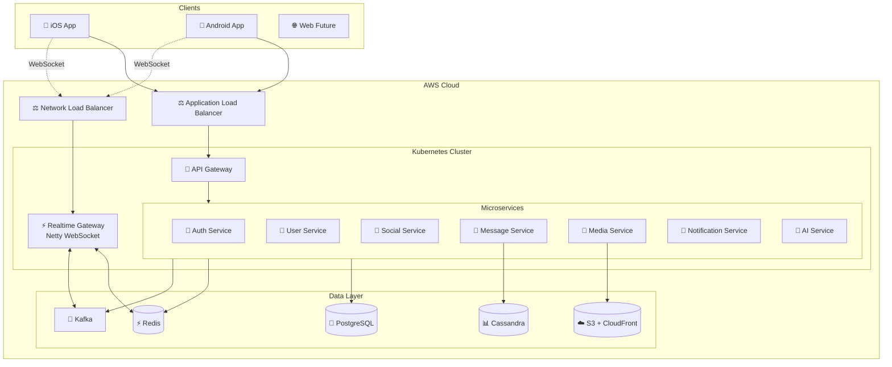

<div align="center">

# 💬 CNM Zalo Clone

### Enterprise-Grade Real-Time Messaging Platform

*Building the next generation of instant messaging with microservices architecture*

[](https://github.com/CNM-DHKTPM18A-2526/CNM-ZALO)
[](LICENSE)
[](CONTRIBUTING.md)
[](https://github.com/CNM-DHKTPM18A-2526/CNM-ZALO)

**[English](README.md)** | **[Tiếng Việt](README.vi.md)**

[📖 Documentation](docs/OTT_AI_Agent_Project_Docs.md) • [🚀 Quick Start](#-quick-start) • [🏗️ Architecture](#-architecture) • [🤝 Contributing](#-contributing)

---

### 🎯 Core Features

```
🔐 Phone Authentication    💬 Real-time Messaging    👥 Social Graph
📱 Multi-device Sync       🎥 Media Sharing          🔔 Push Notifications  
🤖 AI Assistant            📊 Analytics Dashboard    🌐 Cloud-Native
```

</div>

---

## 📋 Table of Contents

- [✨ Highlights](#-highlights)
- [🛠️ Tech Stack](#️-tech-stack)
- [🏗️ Architecture](#️-architecture)
- [🚀 Quick Start](#-quick-start)
- [📁 Project Structure](#-project-structure)
- [🔧 Development](#-development)
- [🚢 Deployment](#-deployment)
- [📖 Documentation](#-documentation)
- [🤝 Contributing](#-contributing)
- [📄 License](#-license)

---

## ✨ Highlights

<div align="center">

| 🎨 Modern UI/UX | ⚡ High Performance | 🔒 Secure | 📈 Scalable |
|:---:|:---:|:---:|:---:|
| React Native 0.76+ | Netty WebSocket | End-to-end Encryption | Microservices Architecture |
| NativeWind/Tailwind | Event-Driven (Kafka) | Firebase Auth | Kubernetes Ready |
| Smooth Animations | Redis Caching | JWT Tokens | Auto-scaling |

</div>

### 🌟 What Makes Us Different

- **🎯 Production-Ready**: Built with enterprise-grade microservices architecture
- **⚡ Real-Time Everything**: Sub-second message delivery with WebSocket
- **🤖 AI-Powered**: Hybrid AI assistant with Gemini + Ollama fallback
- **📱 Cross-Platform**: Single codebase for iOS & Android
- **🔧 Developer-Friendly**: Comprehensive documentation & modern tooling
- **☁️ Cloud-Native**: Designed for AWS EKS with auto-scaling

---

## 🛠️ Tech Stack

<div align="center">

### Backend Architecture


### Data Layer


### Frontend & Mobile


### DevOps & Infrastructure


### Monitoring & AI


</div>

<details>
<summary><b>📦 Complete Technology Stack</b></summary>

#### Backend Services
- **Framework**: Spring Boot 3.x (Java 21)
- **WebSocket**: Netty 4.1
- **Security**: Spring Security + Firebase Admin SDK
- **Event Streaming**: Apache Kafka (MSK)
- **API Gateway**: Spring Cloud Gateway

#### Databases
- **RDBMS**: PostgreSQL 16 (Users, Profiles, Social Graph)
- **NoSQL**: Apache Cassandra/ScyllaDB (Message History)
- **Cache**: Redis 7 (Session, Presence, Rate Limiting)
- **Search**: Elasticsearch (Future)

#### Frontend
- **Mobile**: React Native 0.76+
- **State**: Zustand + React Query
- **Styling**: NativeWind (TailwindCSS for RN)
- **Navigation**: React Navigation 6

#### Infrastructure
- **Containerization**: Docker + Docker Compose
- **Orchestration**: Kubernetes (AWS EKS)
- **Load Balancing**: ALB (REST) + NLB (WebSocket)
- **Storage**: AWS S3 + CloudFront CDN
- **CI/CD**: GitHub Actions + ArgoCD

</details>

---

## 🏗️ Architecture

<div align="center">

### High-Level System Design



</div>

### 🎯 Microservices Overview

| Service | Responsibility | Port | Database |
|---------|---------------|------|----------|
| 🔐 **Auth Service** | Firebase verification, JWT issuance | 8081 | PostgreSQL |
| 👤 **User Service** | Profile management, privacy settings | 8082 | PostgreSQL |
| 👥 **Social Service** | Friends, contacts, blocking | 8083 | PostgreSQL |
| 💬 **Conversation Service** | Chat rooms, participants, groups | 8084 | PostgreSQL |
| 📨 **Message Service** | Message persistence, history | 8085 | Cassandra |
| 📎 **Media Service** | File uploads, presigned URLs | 8086 | PostgreSQL + S3 |
| 🔔 **Notification Service** | Push notifications (FCM) | 8087 | PostgreSQL |
| 📊 **Analytics Service** | Metrics, usage tracking | 8088 | PostgreSQL |
| 🤖 **AI Service** | Assistant, quick reply, summary | 8089 | - |
| ⚡ **Realtime Gateway** | WebSocket connections, routing | 8090 | Redis |

### 🔄 Message Flow

```
┌────────┐    WSS     ┌─────────────┐   Kafka    ┌──────────┐
│ Client │ ──────────▶│   Gateway   │ ─────────▶ │  Message │
│        │◀────ACK────│   (Netty)   │            │  Service │
└────────┘            └─────────────┘            └──────────┘
                             │                         │
                             ▼                         ▼
                       ┌──────────┐            ┌───────────┐
                       │  Redis   │            │ Cassandra │
                       │ (Cache)  │            │ (History) │
                       └──────────┘            └───────────┘
```

**Key Design Decisions:**
- 📊 **serverSeq per conversation**: Monotonic ordering without timestamp collisions
- 👥 **User-level receipts**: Delivered/Seen when any device receives/reads
- 🔄 **Event-driven**: Kafka for async processing (persistence, notifications, analytics)
- ⚡ **Fast ACK**: Gateway responds immediately after Kafka publish
- 🔐 **Idempotency**: `clientMessageId` + Cassandra lookup table

---

## 🚀 Quick Start

### Prerequisites

```bash
# Required
☑️  Java 21+
☑️  Node.js 20+
☑️  Docker & Docker Compose
☑️  Git

# Optional (for mobile development)
📱  Android Studio (for Android)
🍎  Xcode (for iOS - macOS only)
```

### ⚡ Installation

```bash
# 1. Clone the repository
git clone https://github.com/CNM-DHKTPM18A-2526/CNM-ZALO.git
cd CNM-ZALO

# 2. Start infrastructure services
docker compose up -d

# 3. Backend setup (coming soon)
cd backend
./gradlew clean build
./gradlew bootRun

# 4. Mobile app setup (coming soon)
cd frontend/mobile
npm install

# Run on Android
npm run android

# Run on iOS (macOS only)
npm run ios
```

### 🐳 Docker Services

```bash
# Start all services
docker compose up -d

# View logs
docker compose logs -f

# Stop all services
docker compose down

# Reset everything
docker compose down -v && docker compose up -d
```

**Available Services:**
- PostgreSQL: `localhost:5432`
- Redis: `localhost:6379`
- Kafka: `localhost:9092`
- MinIO (S3): `localhost:9000`

---

## 📁 Project Structure

```
cnm-zalo-clone/
├── 📄 README.md                    # You are here
├── 📄 docker-compose.yml           # Local development stack
├── 📄 .gitignore
│
├── 📂 docs/                        # Documentation
│   ├── OTT_AI_Agent_Project_Docs.md         # Main architecture docs
│   └── OTT_Zalo_Database_Design_By_Service.md
│
├── 📂 backend/                     # Backend services
│   ├── services/
│   │   ├── auth-service/           # Authentication & JWT
│   │   ├── user-service/           # User profiles
│   │   ├── social-service/         # Friends & contacts
│   │   ├── conversation-service/   # Chat rooms
│   │   ├── message-service/        # Message persistence
│   │   ├── media-service/          # File uploads
│   │   ├── notification-service/   # Push notifications
│   │   ├── analytics-service/      # Metrics & tracking
│   │   └── ai-service/             # AI assistant
│   ├── realtime-gateway/           # Netty WebSocket server
│   ├── shared/                     # Shared libraries
│   │   ├── common-dto/
│   │   ├── common-security/
│   │   └── common-kafka/
│   └── build.gradle
│
├── 📂 frontend/                    # Frontend applications
│   ├── mobile/                     # React Native app
│   │   ├── src/
│   │   │   ├── screens/            # App screens
│   │   │   ├── components/         # Reusable components
│   │   │   ├── navigation/         # Navigation setup
│   │   │   ├── stores/             # Zustand stores
│   │   │   ├── services/           # API clients
│   │   │   ├── hooks/              # Custom hooks
│   │   │   └── utils/              # Utilities
│   │   ├── android/
│   │   ├── ios/
│   │   └── package.json
│   └── web/                        # Web app (future)
│
├── 📂 k8s/                         # Kubernetes manifests
│   ├── base/
│   ├── staging/
│   └── production/
│
├── 📂 terraform/                   # Infrastructure as Code
│   ├── modules/
│   └── environments/
│
└── 📂 scripts/                     # Utility scripts
    ├── setup-local.sh
    └── seed-data.sh
```

---

## 🔧 Development

### Backend Development

```bash
# Run single service
cd backend/services/auth-service
./gradlew bootRun

# Run tests
./gradlew test

# Build Docker image
docker build -t cnm-zalo/auth-service .
```

### Frontend Development

```bash
cd frontend/mobile

# Start Metro bundler
npm start

# Run on specific device
npm run android -- --deviceId=<device_id>

# Debug mode
npm run android -- --variant=debug

# Build release
npm run android -- --variant=release
```

### Database Migrations

```bash
# PostgreSQL
flyway migrate

# Cassandra
cqlsh -f schema/cassandra/init.cql
```

---

## 🚢 Deployment

### AWS EKS Deployment

```bash
# 1. Build and push Docker images
./scripts/build-and-push.sh

# 2. Apply Kubernetes manifests
kubectl apply -f k8s/production/

# 3. Verify deployment
kubectl get pods -n cnm-zalo
kubectl get svc -n cnm-zalo
```

### Environment Variables

<details>
<summary>View Configuration</summary>

```bash
# Auth Service
FIREBASE_PROJECT_ID=your-project
JWT_SECRET=your-secret-key
JWT_TTL_SECONDS=3600

# Database
DB_URL=jdbc:postgresql://localhost:5432/cnm_zalo
DB_USER=admin
DB_PASS=password

# Redis
REDIS_HOST=localhost
REDIS_PORT=6379

# Kafka
KAFKA_BOOTSTRAP_SERVERS=localhost:9092

# AWS S3
S3_BUCKET=cnm-zalo-media
S3_REGION=ap-southeast-1

# AI Service
GEMINI_API_KEY=your-gemini-key
OLLAMA_BASE_URL=http://localhost:11434
```

</details>

---

## 📖 Documentation

| Document | Description |
|----------|-------------|
| [📘 Project Documentation](docs/OTT_AI_Agent_Project_Docs.md) | Complete architecture & implementation guide |
| [🗄️ Database Design](docs/OTT_Zalo_Database_Design_By_Service.md) | Schema design per service |
| [🔌 API Reference](docs/API_REFERENCE.md) | REST & WebSocket API specs (coming soon) |
| [📱 Mobile Guide](docs/MOBILE_GUIDE.md) | React Native development guide (coming soon) |
| [🚀 Deployment Guide](docs/DEPLOYMENT.md) | AWS EKS deployment steps (coming soon) |

---

## 🗺️ Roadmap

<div align="center">

### Development Timeline

| Phase | Timeline | Status | Features |
|-------|----------|--------|----------|
| **Phase 1** | Weeks 1-4 | ✅ Completed | Project setup, Auth, User profiles |
| **Phase 2** | Weeks 5-8 | 🔄 In Progress | Social graph, Conversations |
| **Phase 3** | Weeks 9-12 | 📅 Planned | Real-time messaging, WebSocket |
| **Phase 4** | Weeks 13-16 | 📅 Planned | Media sharing, Groups |
| **Phase 5** | Weeks 17-20 | 📅 Planned | Notifications, AI assistant |
| **Phase 6** | Weeks 21-24 | 📅 Planned | Testing, Production deployment |

</div>

### 🎯 Feature Progress

- [x] Project architecture & documentation
- [x] Database schema design
- [ ] **Phase 2** (Current)
  - [ ] Auth Service (Firebase + JWT)
  - [ ] User Service (Profile CRUD)
  - [ ] Social Service (Friends, Contacts)
  - [ ] Conversation Service
- [ ] **Phase 3**
  - [ ] Netty WebSocket Gateway
  - [ ] Message Service (Cassandra)
  - [ ] Real-time 1:1 chat
- [ ] **Phase 4**
  - [ ] Group chat functionality
  - [ ] Media Service (S3 uploads)
  - [ ] Image/Video sharing
- [ ] **Phase 5**
  - [ ] Push notifications (FCM)
  - [ ] AI assistant (Gemini + Ollama)
  - [ ] Analytics dashboard
- [ ] **Future**
  - [ ] Voice/Video calls (WebRTC)
  - [ ] End-to-end encryption
  - [ ] Stories feature

---

## 🤝 Contributing

We welcome contributions! Please follow these guidelines:

### 📝 Commit Convention

We use [Conventional Commits](https://www.conventionalcommits.org/):

```
feat:     ✨ New feature
fix:      🐛 Bug fix
docs:     📝 Documentation
style:    💎 Code style (formatting)
refactor: ♻️  Code refactoring
test:     ✅ Tests
chore:    🔧 Maintenance
```

### 🔀 Workflow

```bash
# 1. Fork the repository
# 2. Create your feature branch
git checkout -b feature/amazing-feature

# 3. Commit your changes
git commit -m 'feat: add amazing feature'

# 4. Push to the branch
git push origin feature/amazing-feature

# 5. Open a Pull Request
```

### 👥 Team Structure

| Role | Responsibilities | Members |
|------|-----------------|---------|
| **Backend Lead** | Auth, User, Social Services | TBD |
| **Backend Dev** | Message, Media, Notification | TBD |
| **Fullstack** | Realtime Gateway, Infrastructure | TBD |
| **Frontend Lead** | React Native, UI/UX | TBD |

---

## 📊 Project Stats

<div align="center">


</div>

---

## 📄 License

This project is licensed under the **MIT License** - see the [LICENSE](LICENSE) file for details.

---

## 🙏 Acknowledgments

<div align="center">

**Inspired by**
- [Zalo](https://zalo.me) - Vietnam's leading messaging platform
- [WhatsApp](https://whatsapp.com) - End-to-end encryption
- [Telegram](https://telegram.org) - Speed and reliability

**Built with**
- ☕ Lots of coffee
- 💻 Modern technologies
- ❤️ Passion for great software

---

### 📬 Contact & Support

**Project Repository**: [github.com/CNM-DHKTPM18A-2526/CNM-ZALO](https://github.com/CNM-DHKTPM18A-2526/CNM-ZALO)

**Report Issues**: [GitHub Issues](https://github.com/CNM-DHKTPM18A-2526/CNM-ZALO/issues)

---

<sub>Made with ❤️ by the CNM-DHKTPM18A-2526 Team | January 2026</sub>

**[⬆ Back to Top](#-cnm-zalo-clone)**

</div>
      </ul>
    </td>
    <td>
      <h3>👥 Social</h3>
      <ul>
        <li>Phone number authentication</li>
        <li>Friend requests</li>
        <li>User profiles</li>
        <li>Online/Offline status</li>
        <li>Block/Unblock users</li>
        <li>Contact sync</li>
      </ul>
    </td>
  </tr>
  <tr>
    <td>
      <h3>👨‍👩‍👧‍👦 Groups</h3>
      <ul>
        <li>Create groups</li>
        <li>Add/Remove members</li>
        <li>Admin roles</li>
        <li>Group settings</li>
        <li>@Mention members</li>
      </ul>
    </td>
    <td>
      <h3>🔔 Notifications</h3>
      <ul>
        <li>Push notifications (FCM)</li>
        <li>Mute conversations</li>
        <li>Unread badges</li>
        <li>Sound settings</li>
      </ul>
    </td>
  </tr>
</table>

---

## 🛠 Tech Stack

### Backend
| Technology | Purpose |
|------------|---------|
| **Java 21** | Core language |
| **Spring Boot 3.x** | Microservices framework |
| **Spring Security** | Authentication & Authorization |
| **Netty** | WebSocket realtime gateway |
| **Apache Kafka** | Event streaming |
| **PostgreSQL** | Primary database |
| **Apache Cassandra** | Message storage |
| **Redis** | Caching & Presence |
| **Firebase Admin** | Phone OTP verification |
| **AWS S3** | Media storage |

### Frontend
| Technology | Purpose |
|------------|---------|
| **React Native 0.76+** | Cross-platform mobile |
| **TypeScript** | Type safety |
| **Zustand** | State management |
| **React Query** | Server state |
| **React Navigation** | Navigation |
| **NativeWind** | Styling (TailwindCSS) |

### DevOps
| Technology | Purpose |
|------------|---------|
| **Docker** | Containerization |
| **Kubernetes (EKS)** | Orchestration |
| **GitHub Actions** | CI/CD |
| **Terraform** | Infrastructure as Code |
| **Prometheus + Grafana** | Monitoring |

---

## 🏗 Architecture

```
┌─────────────────────────────────────────────────────────────────┐
│                         CLIENTS                                  │
│              iOS    Android    Web (Future)                     │
└───────────────────────────┬─────────────────────────────────────┘
                            │
              ┌─────────────┴─────────────┐
              │      AWS Cloud            │
              │  ┌─────────┐ ┌─────────┐  │
              │  │   ALB   │ │   NLB   │  │
              │  │ (REST)  │ │  (WS)   │  │
              │  └────┬────┘ └────┬────┘  │
              │       │           │       │
              │  ┌────┴───────────┴────┐  │
              │  │   Kubernetes (EKS)  │  │
              │  │                     │  │
              │  │  ┌──────────────┐   │  │
              │  │  │ API Gateway  │   │  │
              │  │  └──────┬───────┘   │  │
              │  │         │           │  │
              │  │  ┌──────┴───────┐   │  │
              │  │  │ Microservices│   │  │
              │  │  │ • Auth       │   │  │
              │  │  │ • User       │   │  │
              │  │  │ • Social     │   │  │
              │  │  │ • Message    │   │  │
              │  │  │ • Media      │   │  │
              │  │  │ • Notify     │   │  │
              │  │  └──────────────┘   │  │
              │  │                     │  │
              │  │  ┌──────────────┐   │  │
              │  │  │Realtime GW   │   │  │
              │  │  │  (Netty)     │   │  │
              │  │  └──────────────┘   │  │
              │  └─────────────────────┘  │
              │                           │
              │  ┌─────┐ ┌─────┐ ┌─────┐  │
              │  │ RDS │ │Redis│ │Kafka│  │
              │  └─────┘ └─────┘ └─────┘  │
              │                           │
              │  ┌─────────┐ ┌─────────┐  │
              │  │Cassandra│ │   S3    │  │
              │  └─────────┘ └─────────┘  │
              └───────────────────────────┘
```

---

## 🚀 Getting Started

### Prerequisites

- Java 21+
- Node.js 20+
- Docker & Docker Compose
- Android Studio / Xcode (for mobile development)

### Quick Start

```bash
# Clone the repository
git clone https://github.com/your-username/cnm-zalo-clone.git
cd cnm-zalo-clone

# Start infrastructure services
docker compose up -d

# Backend (coming soon)
cd backend
./gradlew bootRun

# Mobile app (coming soon)
cd frontend/mobile
npm install
npm run android  # or npm run ios
```

---

## 📁 Project Structure

```
cnm-zalo-clone/
├── 📂 docs/                    # Documentation
│   └── OTT_AI_Agent_Project_Docs.md
├── 📂 backend/                 # Backend services
│   ├── services/               # Microservices
│   ├── realtime-gateway/       # Netty WebSocket server
│   └── shared/                 # Shared libraries
├── 📂 frontend/                # Frontend applications
│   ├── mobile/                 # React Native app
│   └── web/                    # Web app (future)
├── 📂 k8s/                     # Kubernetes manifests
├── 📂 terraform/               # Infrastructure as Code
├── 📂 scripts/                 # Utility scripts
├── 📄 docker-compose.yml       # Local development
├── 📄 .gitignore
└── 📄 README.md
```

---

## 📖 Documentation

| Document | Description |
|----------|-------------|
| [Project Documentation](docs/OTT_AI_Agent_Project_Docs.md) | Comprehensive project documentation |
| API Reference | Coming soon |
| Mobile App Guide | Coming soon |
| Deployment Guide | Coming soon |

---

## 🗺 Roadmap

- [x] Project setup & documentation
- [ ] **Phase 1**: Authentication & User Profile
- [ ] **Phase 2**: Social Graph (Friends, Contacts)
- [ ] **Phase 3**: 1:1 Chat with realtime messaging
- [ ] **Phase 4**: Group Chat
- [ ] **Phase 5**: Media sharing (Images, Videos, Files)
- [ ] **Phase 6**: Push Notifications
- [ ] **Phase 7**: Polish & Performance
- [ ] **Future**: Voice/Video calls, AI Assistant

---

## 🤝 Contributing

Contributions are welcome! Please read our contributing guidelines before submitting a PR.

1. Fork the repository
2. Create your feature branch (`git checkout -b feature/amazing-feature`)
3. Commit your changes (`git commit -m 'feat: add amazing feature'`)
4. Push to the branch (`git push origin feature/amazing-feature`)
5. Open a Pull Request

### Commit Convention

We use [Conventional Commits](https://www.conventionalcommits.org/):

```
feat:     New feature
fix:      Bug fix
docs:     Documentation changes
style:    Code style changes (formatting, etc)
refactor: Code refactoring
test:     Adding tests
chore:    Maintenance tasks
```

---

## 👥 Team

| Role | Responsibility |
|------|----------------|
| **Backend Lead** | Auth, User, Social Services |
| **Backend Dev** | Message, Media, Notification Services |
| **Fullstack/Realtime** | Netty Gateway, WebSocket, Infrastructure |
| **Frontend Lead** | React Native App, UI/UX |

---

## 📄 License

This project is licensed under the MIT License - see the [LICENSE](LICENSE) file for details.

---

## 🙏 Acknowledgments

- Inspired by [Zalo](https://zalo.me)
- Built with modern technologies and best practices
- Special thanks to all contributors

---

<p align="center">
  Made with ❤️ by the ZaloClone Team
</p>

<p align="center">
  <a href="#top">⬆️ Back to Top</a>
</p>
