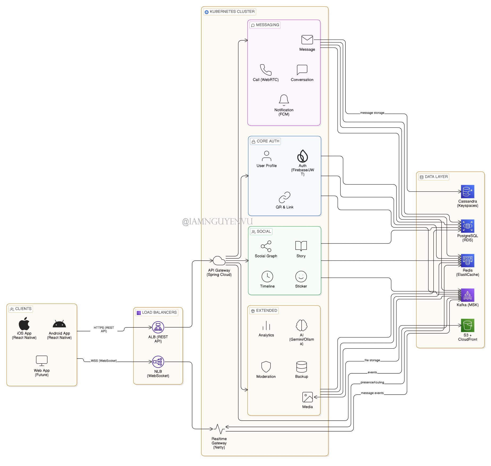
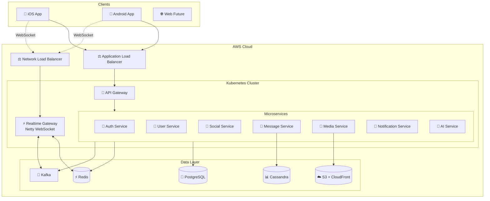

<div align="center">

# 💬 VNALO

### Enterprise-Grade Real-Time Messaging Platform

*Building the next generation of instant messaging with modern microservices architecture*

<p align="center">
  <a href="https://github.com/CNM-DHKTPM18A-2526/CNM-ZALO">
    
  </a>
  <a href="LICENSE">
    
  </a>
  <a href="https://openjdk.org/">
    
  </a>
  <a href="https://spring.io/projects/spring-boot">
    
  </a>
</p>

<p align="center">
  <a href="https://nodejs.org/">
    
  </a>
  <a href="https://www.postgresql.org/">
    
  </a>
  <a href="https://redis.io/">
    
  </a>
  <a href="https://www.docker.com/">
    
  </a>
</p>

<p align="center">
  <strong><a href="README.md">English</a></strong> • 
  <strong><a href="README.vi.md">Tiếng Việt</a></strong>
</p>

<p align="center">
  <a href="docs/">📖 Documentation</a> •
  <a href="#-quick-start">🚀 Quick Start</a> •
  <a href="#️-architecture">🏗️ Architecture</a> •
  <a href="#-team">👥 Team</a> •
  <a href="#-contributing">🤝 Contributing</a>
</p>

---

### 🎯 Core Features

<table>
<tr>
<td align="center">🔐<br/><strong>Authentication</strong><br/>Phone-based Auth</td>
<td align="center">💬<br/><strong>Real-time Chat</strong><br/>WebSocket Messaging</td>
<td align="center">👥<br/><strong>Social Network</strong><br/>Friends & Groups</td>
</tr>
<tr>
<td align="center">📱<br/><strong>Cross-platform</strong><br/>iOS & Android</td>
<td align="center">🎥<br/><strong>Media Sharing</strong><br/>Images & Videos</td>
<td align="center">🔔<br/><strong>Push Notifications</strong><br/>Real-time Alerts</td>
</tr>
<tr>
<td align="center">⚡<br/><strong>WebSocket</strong><br/>Sub-second Delivery</td>
<td align="center">📊<br/><strong>Analytics</strong><br/>Insights & Metrics</td>
<td align="center">🌐<br/><strong>Microservices</strong><br/>Scalable Architecture</td>
</tr>
</table>

</div>

---

## 📋 Table of Contents

- [✨ Highlights](#-highlights)
- [🛠️ Tech Stack](#️-tech-stack)
- [🏗️ Architecture](#️-architecture)
- [🚀 Quick Start](#-quick-start)
- [📁 Project Structure](#-project-structure)
- [🔧 Development](#-development)
- [🚢 Deployment](#-deployment)
- [📖 Documentation](#-documentation)
- [🤝 Contributing](#-contributing)
- [📄 License](#-license)

---

## ✨ Highlights

<div align="center">

| 🎨 Modern UI/UX | ⚡ High Performance | 🔒 Secure | 📈 Scalable |
|:---:|:---:|:---:|:---:|
| React Native 0.76+ | Netty WebSocket | End-to-end Encryption | Microservices Architecture |
| NativeWind/Tailwind | Event-Driven (Kafka) | Firebase Auth | Kubernetes Ready |
| Smooth Animations | Redis Caching | JWT Tokens | Auto-scaling |

</div>

### 🌟 What Makes Us Different

- **🎯 Production-Ready**: Built with enterprise-grade microservices architecture
- **⚡ Real-Time Everything**: Sub-second message delivery with WebSocket
- **🤖 AI-Powered**: Hybrid AI assistant with Gemini + Ollama fallback
- **📱 Cross-Platform**: Single codebase for iOS & Android
- **🔧 Developer-Friendly**: Comprehensive documentation & modern tooling
- **☁️ Cloud-Native**: Designed for AWS EKS with auto-scaling

---

## 🛠️ Tech Stack

<div align="center">

### Backend Architecture

<p>


</p>

### Data Layer

<p>


</p>

### Frontend & Mobile

<p>


</p>

### DevOps & Infrastructure

<p>


</p>

</div>

<details>
<summary><b>📦 Complete Technology Stack</b></summary>

#### Backend Services
- **Framework**: Spring Boot 3.x (Java 21)
- **WebSocket**: Netty 4.1
- **Security**: Spring Security + Firebase Admin SDK
- **Event Streaming**: Apache Kafka (MSK)
- **API Gateway**: Spring Cloud Gateway

#### Databases
- **RDBMS**: PostgreSQL 16 (Users, Profiles, Social Graph)
- **NoSQL**: Apache Cassandra/ScyllaDB (Message History)
- **Cache**: Redis 7 (Session, Presence, Rate Limiting)
- **Search**: Elasticsearch (Future)

#### Frontend
- **Mobile**: React Native 0.76+
- **State**: Zustand + React Query
- **Styling**: NativeWind (TailwindCSS for RN)
- **Navigation**: React Navigation 6

#### Infrastructure
- **Containerization**: Docker + Docker Compose
- **Orchestration**: Kubernetes (AWS EKS)
- **Load Balancing**: ALB (REST) + NLB (WebSocket)
- **Storage**: AWS S3 + CloudFront CDN
- **CI/CD**: GitHub Actions + ArgoCD

</details>

---

## 🏗️ Architecture

<div align="center">

### 🎨 System Architecture Diagram



*Comprehensive microservices architecture with Spring Boot, Node.js, and cloud-native infrastructure*

</div>

---

<div align="center">

### High-Level System Design



</div>

### 🎯 Microservices Overview

| Service | Responsibility | Port | Technology | Database |
|---------|---------------|------|------------|----------|
| 🔐 **core-service** | Auth, Users, Social Features | 8081 | Spring Boot | PostgreSQL (auth, users, social) |
| 💬 **messaging-service** | Conversations, Messages, Chat | 8082 | Spring Boot | PostgreSQL (messaging) |
| 📎 **media-service** | File Upload, Cloudinary, Stickers | 8083 | Spring Boot | PostgreSQL (media) |
| 📰 **content-service** | Stories, Timeline Posts | 8084 | Spring Boot | PostgreSQL (content) |
| ⚡ **realtime-gateway** | WebSocket, Real-time Delivery | 8085 | Node.js/NestJS | Redis |
| 🔔 **notification-service** | Push Notifications (FCM) | 8086 | Spring Boot | PostgreSQL |
| 🛡️ **moderation-service** | Reports, Content Moderation | 8087 | Spring Boot | PostgreSQL |
| 📊 **analytics-service** | Metrics, Logs, Analytics | 8088 | Spring Boot | PostgreSQL |

**Status**: ✅ Infrastructure Ready | 🚧 core-service In Development | ⏳ Others Planned

### 🔄 Message Flow

```
┌────────┐    WSS     ┌─────────────┐   Kafka    ┌──────────┐
│ Client │ ──────────▶│   Gateway   │ ─────────▶ │  Message │
│        │◀────ACK────│   (Netty)   │            │  Service │
└────────┘            └─────────────┘            └──────────┘
                             │                         │
                             ▼                         ▼
                       ┌──────────┐            ┌───────────┐
                       │  Redis   │            │ Cassandra │
                       │ (Cache)  │            │ (History) │
                       └──────────┘            └───────────┘
```

**Key Design Decisions:**
- 📊 **serverSeq per conversation**: Monotonic ordering without timestamp collisions
- 👥 **User-level receipts**: Delivered/Seen when any device receives/reads
- 🔄 **Event-driven**: Kafka for async processing (persistence, notifications, analytics)
- ⚡ **Fast ACK**: Gateway responds immediately after Kafka publish
- 🔐 **Idempotency**: `clientMessageId` + Cassandra lookup table

---

## 🚀 Quick Start

### Prerequisites

```bash
# Required
☑️  Java 21+ (JDK)
☑️  Docker & Docker Compose
☑️  Git

# Optional (for mobile development)
📱  Node.js 20+
📱  Android Studio (for Android)
🍎  Xcode (for iOS - macOS only)
```

### ⚡ Backend Setup (core-service)

```bash
# 1. Clone the repository
git clone https://github.com/CNM-DHKTPM18A-2526/CNM-ZALO.git
cd CNM-ZALO

# 2. Get Firebase credentials from team lead
# Place file: backend/java-services/services/core-service/src/main/resources/
# Filename: iuh-cnm-vnalo-firebase-adminsdk-fbsvc-5008b7c5eb.json

# 3. Start Docker containers
cd docker
docker-compose up -d postgres redis

# 4. Build and run core-service
cd ../backend/java-services/services/core-service

# Windows
.\mvnw.cmd clean install -DskipTests
.\mvnw.cmd spring-boot:run

# Linux/Mac
./mvnw clean install -DskipTests
./mvnw spring-boot:run

# 5. Access Swagger UI
# http://localhost:8081/api/v1/swagger-ui.html
```

> **Note:** Dev profile có sẵn JWT secret mặc định, OTP disabled. Chỉ cần Firebase file là chạy được!

### 🐳 Docker Services

```bash
# Start all services
docker compose up -d

# View logs
docker compose logs -f

# Stop all services
docker compose down

# Reset everything
docker compose down -v && docker compose up -d
```

**Available Services:**
- PostgreSQL: `localhost:5432` (database: vnalo_core)
- Redis: `localhost:6379`

---

## 📁 Project Structure

```
CNM-ZALO/
├── 📄 README.md                    # English documentation
├── 📄 README.vi.md                 # Vietnamese documentation
├── 📄 CONTRIBUTING.md              # Contribution guidelines
├── 📄 .gitignore
│
├── 📂 docs/                        # Project documentation
│
├── 📂 backend/
│   ├── java-services/               # Spring Boot microservices
│   │   ├── pom.xml                      # Parent POM
│   │   ├── common/                      # Shared modules
│   │   │   └── common-domain/           # Common entities
│   │   └── services/
│   │       └── core-service/            # ✅ Auth, Users, Social (READY)
│   │           └── src/main/
│   │
│   └── node-services/               # NestJS services
│       └── messaging-workspace/     # NestJS monorepo
│           ├── apps/
│           │   └── message-service/ # 🔧 Real-time messaging (IN PROGRESS)
│           └── package.json
│
├── 📂 docker/
│   ├── docker-compose.yml           # PostgreSQL + Redis
│   └── init-db.sql                  # Database initialization
│
├── 📂 frontend/
│   └── mobile/                      # 📦 Flutter mobile app
│       ├── lib/                     # Dart source code
│       ├── android/                 # Android platform
│       ├── ios/                     # iOS platform
│       └── pubspec.yaml             # Dependencies
│
├── 📂 assets/                      # Project images
│
└── 📂 config/                      # Configuration files
```

---

## 🔧 Development

### Backend Development (core-service)

```bash
cd backend/java-services/services/core-service

# Build
./mvnw clean install -DskipTests

# Run (dev profile - default)
./mvnw spring-boot:run

# Run tests
./mvnw test

# Build Docker image
docker build -t vnalo/core-service .
```

### Frontend Development (Flutter)

```bash
cd frontend/mobile

# Get dependencies
flutter pub get

# Run on Android/iOS
flutter run

# Run on specific device
flutter run -d <device_id>

# Build APK
flutter build apk --release
```

### Database Migrations

```bash
# PostgreSQL
flyway migrate

# Cassandra
cqlsh -f schema/cassandra/init.cql
```

---

## 🚢 Deployment

### AWS EKS Deployment

```bash
# 1. Build and push Docker images
./scripts/build-and-push.sh

# 2. Apply Kubernetes manifests
kubectl apply -f k8s/production/

# 3. Verify deployment
kubectl get pods -n cnm-zalo
kubectl get svc -n cnm-zalo
```

### Environment Variables

<details>
<summary>View Configuration</summary>

```bash
# Auth Service
FIREBASE_PROJECT_ID=your-project
JWT_SECRET=your-secret-key
JWT_TTL_SECONDS=3600

# Database
DB_URL=jdbc:postgresql://localhost:5432/cnm_zalo
DB_USER=admin
DB_PASS=password

# Redis
REDIS_HOST=localhost
REDIS_PORT=6379

# Kafka
KAFKA_BOOTSTRAP_SERVERS=localhost:9092

# AWS S3
S3_BUCKET=cnm-zalo-media
S3_REGION=ap-southeast-1

# AI Service
GEMINI_API_KEY=your-gemini-key
OLLAMA_BASE_URL=http://localhost:11434
```

</details>

---

## 📖 Documentation

| Document | Description |
|----------|-------------|
| [📘 Documentation Index](docs/README.md) | Complete documentation index |
| [🏗️ Architecture](docs/system/architecture.md) | System architecture & service map |
| [🗄️ Database Schema](docs/system/database-schema.md) | Complete database schema design |
| [📡 API Reference](docs/system/api-reference.md) | All REST endpoints & WebSocket events |
| [📋 Changelog](docs/project/changelog.md) | Version history & notable changes |
| [📊 Status](docs/project/status.md) | Current implementation status |
| [👥 Team Assignment](docs/project/team-assignment.md) | Team task distribution |
| [📝 Contributing](docs/contributing.md) | Code standards & conventions |

---

## ✅ Current Status

| Service | Status | Features |
|---------|--------|----------|
| **core-service** | ✅ Ready | Auth (register, login, logout), User profiles, Friend management, Block list |
| **messaging-service** | 🚧 Next | Conversations, Messages |
| **media-service** | 📅 Planned | File uploads, Cloudinary |
| **realtime-gateway** | 📅 Planned | WebSocket, Real-time delivery |

---

## 🤝 Contributing

We welcome contributions! Please follow these guidelines:

### 📝 Commit Convention

We use [Conventional Commits](https://www.conventionalcommits.org/):

```
feat:     ✨ New feature
fix:      🐛 Bug fix
docs:     📝 Documentation
style:    💎 Code style (formatting)
refactor: ♻️  Code refactoring
test:     ✅ Tests
chore:    🔧 Maintenance
```

### 🔀 Workflow

```bash
# 1. Fork the repository
# 2. Create your feature branch
git checkout -b feature/amazing-feature

# 3. Commit your changes
git commit -m 'feat: add amazing feature'

# 4. Push to the branch
git push origin feature/amazing-feature

# 5. Open a Pull Request
```

### 👥 Team Structure

<div align="center">

#### CNM-DHKTPM18A-2526 Development Team

<table>
<tr>
<td align="center">
<a href="https://github.com/iamnguyenvu">

<br />
<sub><b>Nguyễn Hoàng Nguyên Vũ</b></sub>
</a>
<br />
<sub>👑 Team Leader</sub>
<br />
<sub>📋 22003185</sub>
<br />
<a href="https://github.com/iamnguyenvu">

</a>
<br />
<a href="mailto:iamnguyenvu.gm@gmail.com">

</a>
</td>
<td align="center">
<a href="https://github.com/datle0910">

<br />
<sub><b>Lê Văn Đạt</b></sub>
</a>
<br />
<sub>💻 Developer</sub>
<br />
<sub>📋 22001605</sub>
<br />
<a href="https://github.com/datle0910">

</a>
</td>
<td align="center">
<a href="https://github.com/pnwang1704">

<br />
<sub><b>Phan Nhật Quang</b></sub>
</a>
<br />
<sub>💻 Developer</sub>
<br />
<sub>📋 22684961</sub>
<br />
<a href="https://github.com/pnwang1704">

</a>
</td>
<td align="center">
<a href="https://github.com/thaibaotb">

<br />
<sub><b>Đặng Thái Bảo</b></sub>
</a>
<br />
<sub>💻 Developer</sub>
<br />
<sub>📋 22686331</sub>
<br />
<a href="https://github.com/thaibaotb">

</a>
</td>
</tr>
</table>

**Organization**: [CNM-DHKTPM18A-2526](https://github.com/CNM-DHKTPM18A-2526) | **Course**: Công Nghệ Mới - DHKTPM18A

</div>

**Project Responsibilities**:
- **Nguyễn Hoàng Nguyên Vũ** (Team Leader): Architecture, core-service, Project Management
- **Lê Văn Đạt**: messaging-service, Database Design
- **Phan Nhật Quang**: media-service, Cloud Integration
- **Đặng Thái Bảo**: realtime-gateway, Frontend Integration

---

## 📊 Project Stats

<div align="center">

<p>
<a href="https://github.com/CNM-DHKTPM18A-2526/CNM-ZALO/stargazers">

</a>
<a href="https://github.com/CNM-DHKTPM18A-2526/CNM-ZALO/network/members">

</a>
<a href="https://github.com/CNM-DHKTPM18A-2526/CNM-ZALO/watchers">

</a>
</p>

<p>
<a href="https://github.com/CNM-DHKTPM18A-2526/CNM-ZALO/issues">

</a>
<a href="https://github.com/CNM-DHKTPM18A-2526/CNM-ZALO/pulls">

</a>
<a href="https://github.com/CNM-DHKTPM18A-2526/CNM-ZALO/commits">

</a>
</p>

<p>
<a href="https://github.com/CNM-DHKTPM18A-2526/CNM-ZALO/graphs/contributors">

</a>
<a href="https://github.com/CNM-DHKTPM18A-2526/CNM-ZALO">

</a>
<a href="LICENSE">

</a>
</p>

</div>

---

## 📄 License

This project is licensed under the **MIT License** - see the [LICENSE](LICENSE) file for details.

---

## 🙏 Acknowledgments

<div align="center">

**Inspired by**
- [Zalo](https://zalo.me) - Vietnam's leading messaging platform
- [WhatsApp](https://whatsapp.com) - End-to-end encryption
- [Telegram](https://telegram.org) - Speed and reliability

**Built with**
- ☕ Lots of coffee
- 💻 Modern technologies
- ❤️ Passion for great software

---

### 📬 Contact & Support

**Project Repository**: [github.com/CNM-DHKTPM18A-2526/CNM-ZALO](https://github.com/CNM-DHKTPM18A-2526/CNM-ZALO)

**Report Issues**: [GitHub Issues](https://github.com/CNM-DHKTPM18A-2526/CNM-ZALO/issues)

---

<sub>Made with ❤️ by the CNM-DHKTPM18A-2526 Team | January 2026</sub>

**[⬆ Back to Top](#-vnalo)**

</div>
