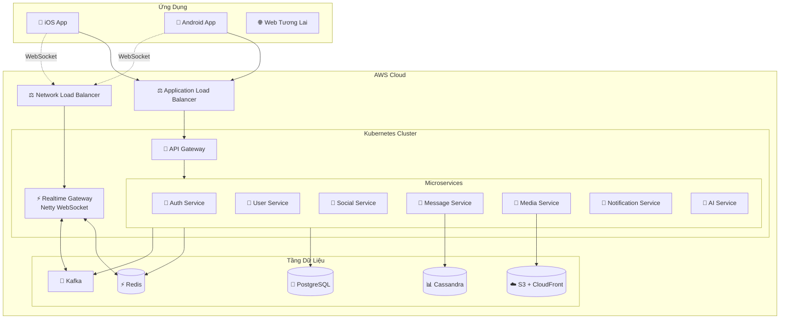

<div align="center">

# 💬 VNALO

### Nền Tảng Nhắn Tin Thời Gian Thực Cấp Doanh Nghiệp

*Xây dựng thế hệ mới của ứng dụng nhắn tin tức thời với kiến trúc microservices*

[](https://github.com/CNM-DHKTPM18A-2526/CNM-ZALO)
[](LICENSE)
[](https://openjdk.org/)
[](https://spring.io/projects/spring-boot)
[](CONTRIBUTING.md)

**[English](README.md)** | **[Tiếng Việt](README.vi.md)**

[📖 Tài Liệu](docs/) • [🚀 Bắt Đầu Nhanh](#-bắt-đầu-nhanh) • [🏗️ Kiến Trúc](#️-kiến-trúc) • [🤝 Đóng Góp](#-đóng-góp)

---

### 🎯 Tính Năng Cốt Lõi

```
🔐 Xác Thực Số Điện Thoại    💬 Chat Thời Gian Thực       👥 Mạng Xã Hội
📱 Mobile Đa Nền Tảng        🎥 Chia Sẻ Media             🔔 Thông Báo Push  
⚡ WebSocket Real-time        📊 Phân Tích & Insights      🌐 Microservices
```

</div>

---

## 📋 Mục Lục

- [✨ Điểm Nổi Bật](#-điểm-nổi-bật)
- [🛠️ Công Nghệ](#️-công-nghệ)
- [🏗️ Kiến Trúc](#️-kiến-trúc)
- [🚀 Bắt Đầu Nhanh](#-bắt-đầu-nhanh)
- [📁 Cấu Trúc Dự Án](#-cấu-trúc-dự-án)
- [🔧 Phát Triển](#-phát-triển)
- [🚢 Triển Khai](#-triển-khai)
- [📖 Tài Liệu](#-tài-liệu)
- [🤝 Đóng Góp](#-đóng-góp)
- [📄 Giấy Phép](#-giấy-phép)

---

## ✨ Điểm Nổi Bật

<div align="center">

| 🎨 UI/UX Hiện Đại | ⚡ Hiệu Năng Cao | 🔒 Bảo Mật | 📈 Khả Năng Mở Rộng |
|:---:|:---:|:---:|:---:|
| React Native 0.76+ | Netty WebSocket | Mã Hóa End-to-end | Kiến Trúc Microservices |
| NativeWind/Tailwind | Event-Driven (Kafka) | Firebase Auth | Sẵn Sàng Kubernetes |
| Hiệu Ứng Mượt Mà | Redis Caching | JWT Tokens | Tự Động Mở Rộng |

</div>

### 🌟 Điểm Khác Biệt

- **🎯 Sẵn Sàng Sản Xuất**: Xây dựng với kiến trúc microservices cấp doanh nghiệp
- **⚡ Mọi Thứ Theo Thời Gian Thực**: Gửi tin nhắn dưới 1 giây với WebSocket
- **🤖 Hỗ Trợ AI**: Trợ lý AI lai với Gemini + Ollama fallback
- **📱 Đa Nền Tảng**: Một mã nguồn cho cả iOS & Android
- **🔧 Thân Thiện Với Lập Trình Viên**: Tài liệu đầy đủ & công cụ hiện đại
- **☁️ Cloud-Native**: Thiết kế cho AWS EKS với tự động mở rộng

---

## 🛠️ Công Nghệ

<div align="center">

### Kiến Trúc Backend


### Tầng Dữ Liệu


### Frontend & Mobile


### DevOps & Hạ Tầng


### Giám Sát & AI


</div>

<details>
<summary><b>📦 Ngăn Xếp Công Nghệ Đầy Đủ</b></summary>

#### Backend Services
- **Framework**: Spring Boot 3.x (Java 21)
- **WebSocket**: Netty 4.1
- **Bảo mật**: Spring Security + Firebase Admin SDK
- **Event Streaming**: Apache Kafka (MSK)
- **API Gateway**: Spring Cloud Gateway

#### Cơ Sở Dữ Liệu
- **RDBMS**: PostgreSQL 16 (Users, Profiles, Social Graph)
- **NoSQL**: Apache Cassandra/ScyllaDB (Lịch sử tin nhắn)
- **Cache**: Redis 7 (Session, Presence, Rate Limiting)
- **Tìm kiếm**: Elasticsearch (Tương lai)

#### Frontend
- **Mobile**: React Native 0.76+
- **State**: Zustand + React Query
- **Styling**: NativeWind (TailwindCSS cho RN)
- **Điều hướng**: React Navigation 6

#### Hạ Tầng
- **Container hóa**: Docker + Docker Compose
- **Orchestration**: Kubernetes (AWS EKS)
- **Cân bằng tải**: ALB (REST) + NLB (WebSocket)
- **Lưu trữ**: AWS S3 + CloudFront CDN
- **CI/CD**: GitHub Actions + ArgoCD

</details>

---

## 🏗 ️ Kiến Trúc

<div align="center">

### 🎨 Sơ Đồ Kiến Trúc Hệ Thống


*Kiến trúc microservices toàn diện với Spring Boot, Node.js và hạ tầng cloud-native*

</div>

---

<div align="center">

### Thiết Kế Hệ Thống Tổng Quan



</div>

### 🎯 Tổng Quan Microservices

| Service | Trách Nhiệm | Port | Công Nghệ | Cơ Sở Dữ Liệu |
|---------|-------------|------|-----------|----------------|
| 🔐 **core-service** | Auth, Users, Tính Năng Xã Hội | 8081 | Spring Boot | PostgreSQL (auth, users, social) |
| 💬 **messaging-service** | Hội Thoại, Tin Nhắn, Chat | 8082 | Spring Boot | PostgreSQL (messaging) |
| 📎 **media-service** | Tải File, Cloudinary, Stickers | 8083 | Spring Boot | PostgreSQL (media) |
| 📰 **content-service** | Stories, Bài Đăng Timeline | 8084 | Spring Boot | PostgreSQL (content) |
| ⚡ **realtime-gateway** | WebSocket, Gửi Thời Gian Thực | 8085 | Node.js/NestJS | Redis |
| 🔔 **notification-service** | Thông Báo Push (FCM) | 8086 | Spring Boot | PostgreSQL |
| 🛡️ **moderation-service** | Báo Cáo, Kiểm Duyệt Nội Dung | 8087 | Spring Boot | PostgreSQL |
| 📊 **analytics-service** | Số Liệu, Logs, Phân Tích | 8088 | Spring Boot | PostgreSQL |

**Trạng Thái**: ✅ Hạ Tầng Sẵn Sàng | 🚧 core-service Đang Phát Triển | ⏳ Các Service Khác Đã Lên Kế Hoạch

### 🔄 Luồng Tin Nhắn

```
┌────────┐    WSS     ┌─────────────┐   Kafka    ┌──────────┐
│ Client │ ──────────▶│   Gateway   │ ─────────▶ │  Message │
│        │◀────ACK────│   (Netty)   │            │  Service │
└────────┘            └─────────────┘            └──────────┘
                             │                         │
                             ▼                         ▼
                       ┌──────────┐            ┌───────────┐
                       │  Redis   │            │ Cassandra │
                       │ (Cache)  │            │ (Lịch sử) │
                       └──────────┘            └───────────┘
```

**Quyết Định Thiết Kế Chính:**
- 📊 **serverSeq per conversation**: Sắp xếp đơn điệu không xung đột timestamp
- 👥 **Biên lai cấp người dùng**: Đã gửi/Đã xem khi bất kỳ thiết bị nào nhận/đọc
- 🔄 **Event-driven**: Kafka cho xử lý bất đồng bộ (lưu trữ, thông báo, phân tích)
- ⚡ **ACK nhanh**: Gateway phản hồi ngay sau khi publish Kafka
- 🔐 **Idempotency**: `clientMessageId` + bảng tra cứu Cassandra

---

## 🚀 Bắt Đầu Nhanh

### Yêu Cầu

```bash
# Bắt buộc
☑️  Java 21+
☑️  Node.js 20+
☑️  Docker & Docker Compose
☑️  Git

# Tùy chọn (cho phát triển mobile)
📱  Android Studio (cho Android)
🍎  Xcode (cho iOS - chỉ macOS)
```

### ⚡ Cài Đặt

```bash
# 1. Clone repository
git clone https://github.com/CNM-DHKTPM18A-2526/CNM-ZALO.git
cd CNM-ZALO

# 2. Khởi động các dịch vụ hạ tầng
docker compose up -d

# 3. Thiết lập Backend (sắp ra mắt)
cd backend
./gradlew clean build
./gradlew bootRun

# 4. Thiết lập ứng dụng Mobile (sắp ra mắt)
cd frontend/mobile
npm install

# Chạy trên Android
npm run android

# Chạy trên iOS (chỉ macOS)
npm run ios
```

### 🐳 Dịch Vụ Docker

```bash
# Khởi động tất cả dịch vụ
docker compose up -d

# Xem logs
docker compose logs -f

# Dừng tất cả dịch vụ
docker compose down

# Đặt lại mọi thứ
docker compose down -v && docker compose up -d
```

**Dịch Vụ Có Sẵn:**
- PostgreSQL: `localhost:5432`
- Redis: `localhost:6379`
- Kafka: `localhost:9092`
- MinIO (S3): `localhost:9000`

---

## 📁 Cấu Trúc Dự Án

```
cnm-zalo-clone/
├── 📄 README.md                    # Tài liệu tiếng Anh
├── 📄 README.vi.md                 # Bạn đang ở đây
├── 📄 docker-compose.yml           # Stack phát triển local
├── 📄 .gitignore
│
├── 📂 docs/                        # Tài liệu
│   ├── OTT_AI_Agent_Project_Docs.md         # Tài liệu kiến trúc chính
│   └── OTT_Zalo_Database_Design_By_Service.md
│
├── 📂 backend/                     # Backend services
│   ├── services/
│   │   ├── auth-service/           # Xác thực & JWT
│   │   ├── user-service/           # Hồ sơ người dùng
│   │   ├── social-service/         # Bạn bè & liên hệ
│   │   ├── conversation-service/   # Phòng chat
│   │   ├── message-service/        # Lưu trữ tin nhắn
│   │   ├── media-service/          # Tải file
│   │   ├── notification-service/   # Thông báo đẩy
│   │   ├── analytics-service/      # Số liệu & theo dõi
│   │   └── ai-service/             # Trợ lý AI
│   ├── realtime-gateway/           # Netty WebSocket server
│   ├── shared/                     # Thư viện dùng chung
│   │   ├── common-dto/
│   │   ├── common-security/
│   │   └── common-kafka/
│   └── build.gradle
│
├── 📂 frontend/                    # Ứng dụng Frontend
│   ├── mobile/                     # React Native app
│   │   ├── src/
│   │   │   ├── screens/            # Màn hình ứng dụng
│   │   │   ├── components/         # Component tái sử dụng
│   │   │   ├── navigation/         # Thiết lập điều hướng
│   │   │   ├── stores/             # Zustand stores
│   │   │   ├── services/           # API clients
│   │   │   ├── hooks/              # Custom hooks
│   │   │   └── utils/              # Tiện ích
│   │   ├── android/
│   │   ├── ios/
│   │   └── package.json
│   └── web/                        # Web app (tương lai)
│
├── 📂 k8s/                         # Kubernetes manifests
│   ├── base/
│   ├── staging/
│   └── production/
│
├── 📂 terraform/                   # Infrastructure as Code
│   ├── modules/
│   └── environments/
│
└── 📂 scripts/                     # Script tiện ích
    ├── setup-local.sh
    └── seed-data.sh
```

---

## 🔧 Phát Triển

### Phát Triển Backend

```bash
# Chạy một service
cd backend/services/auth-service
./gradlew bootRun

# Chạy tests
./gradlew test

# Build Docker image
docker build -t cnm-zalo/auth-service .
```

### Phát Triển Frontend

```bash
cd frontend/mobile

# Khởi động Metro bundler
npm start

# Chạy trên thiết bị cụ thể
npm run android -- --deviceId=<device_id>

# Chế độ debug
npm run android -- --variant=debug

# Build release
npm run android -- --variant=release
```

### Migrations Cơ Sở Dữ Liệu

```bash
# PostgreSQL
flyway migrate

# Cassandra
cqlsh -f schema/cassandra/init.cql
```

---

## 🚢 Triển Khai

### Triển Khai AWS EKS

```bash
# 1. Build và push Docker images
./scripts/build-and-push.sh

# 2. Apply Kubernetes manifests
kubectl apply -f k8s/production/

# 3. Xác minh triển khai
kubectl get pods -n cnm-zalo
kubectl get svc -n cnm-zalo
```

### Biến Môi Trường

<details>
<summary>Xem Cấu Hình</summary>

```bash
# Auth Service
FIREBASE_PROJECT_ID=your-project
JWT_SECRET=your-secret-key
JWT_TTL_SECONDS=3600

# Database
DB_URL=jdbc:postgresql://localhost:5432/cnm_zalo
DB_USER=admin
DB_PASS=password

# Redis
REDIS_HOST=localhost
REDIS_PORT=6379

# Kafka
KAFKA_BOOTSTRAP_SERVERS=localhost:9092

# AWS S3
S3_BUCKET=cnm-zalo-media
S3_REGION=ap-southeast-1

# AI Service
GEMINI_API_KEY=your-gemini-key
OLLAMA_BASE_URL=http://localhost:11434
```

</details>

---

## 📖 Tài Liệu

| Tài Liệu | Mô Tả |
|----------|-------|
| [📘 Tài Liệu Dự Án](docs/OTT_AI_Agent_Project_Docs.md) | Hướng dẫn kiến trúc & triển khai đầy đủ |
| [🗄️ Thiết Kế Database](docs/OTT_Zalo_Database_Design_By_Service.md) | Thiết kế schema theo từng service |
| [🔌 Tài Liệu API](docs/API_REFERENCE.md) | Đặc tả REST & WebSocket API (sắp ra mắt) |
| [📱 Hướng Dẫn Mobile](docs/MOBILE_GUIDE.md) | Hướng dẫn phát triển React Native (sắp ra mắt) |
| [🚀 Hướng Dẫn Triển Khai](docs/DEPLOYMENT.md) | Các bước triển khai AWS EKS (sắp ra mắt) |

---

## 🗺️ Lộ Trình

<div align="center">

### Tiến Độ Phát Triển

| Giai Đoạn | Thời Gian | Trạng Thái | Tính Năng |
|-----------|-----------|------------|-----------|
| **Giai đoạn 1** | Tuần 1-4 | ✅ Hoàn thành | Thiết lập dự án, Auth, Hồ sơ người dùng |
| **Giai đoạn 2** | Tuần 5-8 | 🔄 Đang tiến hành | Mạng xã hội, Hội thoại |
| **Giai đoạn 3** | Tuần 9-12 | 📅 Đã lên kế hoạch | Nhắn tin thời gian thực, WebSocket |
| **Giai đoạn 4** | Tuần 13-16 | 📅 Đã lên kế hoạch | Chia sẻ media, Nhóm |
| **Giai đoạn 5** | Tuần 17-20 | 📅 Đã lên kế hoạch | Thông báo, Trợ lý AI |
| **Giai đoạn 6** | Tuần 21-24 | 📅 Đã lên kế hoạch | Kiểm thử, Triển khai sản xuất |

</div>

### 🎯 Tiến Độ Tính Năng

- [x] Kiến trúc & tài liệu dự án
- [x] Thiết kế schema cơ sở dữ liệu
- [ ] **Giai đoạn 2** (Hiện tại)
  - [ ] Auth Service (Firebase + JWT)
  - [ ] User Service (CRUD hồ sơ)
  - [ ] Social Service (Bạn bè, Liên hệ)
  - [ ] Conversation Service
- [ ] **Giai đoạn 3**
  - [ ] Netty WebSocket Gateway
  - [ ] Message Service (Cassandra)
  - [ ] Chat 1:1 thời gian thực
- [ ] **Giai đoạn 4**
  - [ ] Chức năng nhóm chat
  - [ ] Media Service (S3 uploads)
  - [ ] Chia sẻ hình ảnh/video
- [ ] **Giai đoạn 5**
  - [ ] Thông báo đẩy (FCM)
  - [ ] Trợ lý AI (Gemini + Ollama)
  - [ ] Bảng điều khiển phân tích
- [ ] **Tương lai**
  - [ ] Gọi thoại/video (WebRTC)
  - [ ] Mã hóa end-to-end
  - [ ] Tính năng Stories

---

## 🤝 Đóng Góp

Chúng tôi hoan nghênh mọi đóng góp! Vui lòng tuân theo các hướng dẫn sau:

### 📝 Quy Ước Commit

Chúng tôi sử dụng [Conventional Commits](https://www.conventionalcommits.org/):

```
feat:     ✨ Tính năng mới
fix:      🐛 Sửa lỗi
docs:     📝 Tài liệu
style:    💎 Style code (định dạng)
refactor: ♻️  Tái cấu trúc code
test:     ✅ Tests
chore:    🔧 Bảo trì
```

### 🔀 Quy Trình

```bash
# 1. Fork repository
# 2. Tạo branch tính năng của bạn
git checkout -b feature/tinh-nang-tuyet-voi

# 3. Commit các thay đổi
git commit -m 'feat: thêm tính năng tuyệt vời'

# 4. Push lên branch
git push origin feature/tinh-nang-tuyet-voi

# 5. Mở Pull Request
```

### 👥 Cấu Trúc Nhóm

| Vai Trò | Trách Nhiệm | Thành Viên |
|---------|-------------|------------|
| **Backend Lead** | Auth, User, Social Services | TBD |
| **Backend Dev** | Message, Media, Notification | TBD |
| **Fullstack** | Realtime Gateway, Hạ tầng | TBD |
| **Frontend Lead** | React Native, UI/UX | TBD |

---

## 📊 Thống Kê Dự Án

<div align="center">


</div>

---

## 📄 Giấy Phép

Dự án này được cấp phép theo **Giấy phép MIT** - xem file [LICENSE](LICENSE) để biết chi tiết.

---

## 🙏 Lời Cảm Ơn

<div align="center">

**Lấy cảm hứng từ**
- [Zalo](https://zalo.me) - Nền tảng nhắn tin hàng đầu Việt Nam
- [WhatsApp](https://whatsapp.com) - Mã hóa end-to-end
- [Telegram](https://telegram.org) - Tốc độ và độ tin cậy

**Xây dựng với**
- ☕ Nhiều cà phê
- 💻 Công nghệ hiện đại
- ❤️ Đam mê phần mềm tuyệt vời

---

### 📬 Liên Hệ & Hỗ Trợ

**Repository Dự Án**: [github.com/CNM-DHKTPM18A-2526/CNM-ZALO](https://github.com/CNM-DHKTPM18A-2526/CNM-ZALO)

**Báo Cáo Vấn Đề**: [GitHub Issues](https://github.com/CNM-DHKTPM18A-2526/CNM-ZALO/issues)

---

<sub>Được tạo với ❤️ bởi nhóm CNM-DHKTPM18A-2526 | Tháng 1 năm 2026</sub>

**[⬆ Về Đầu Trang](#-cnm-zalo-clone)**

</div>
