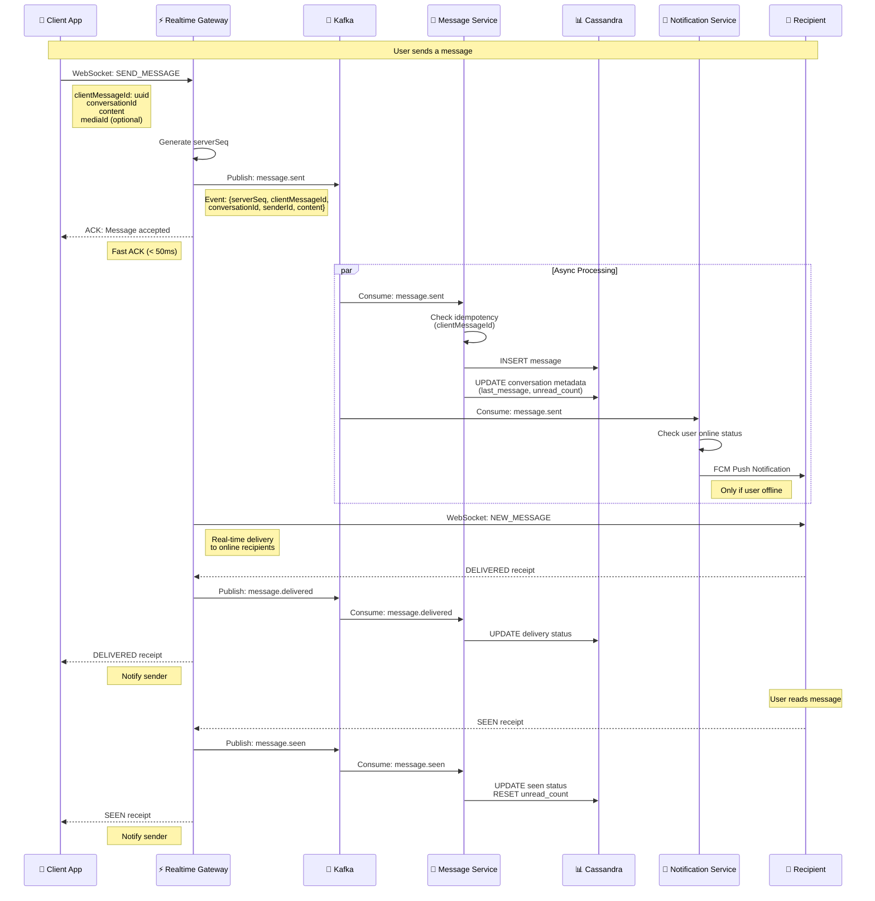
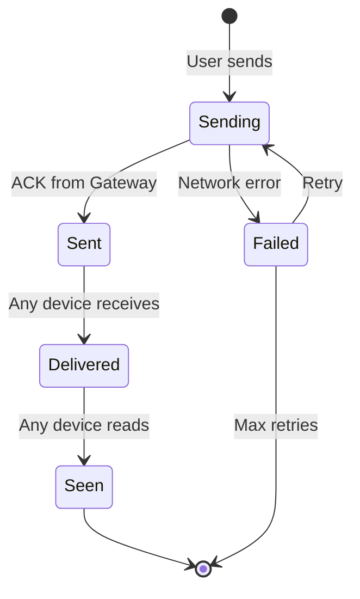
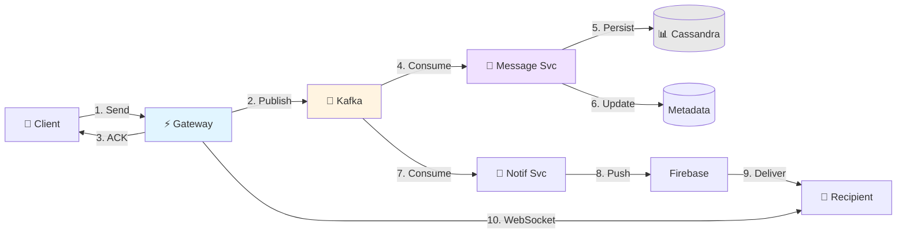
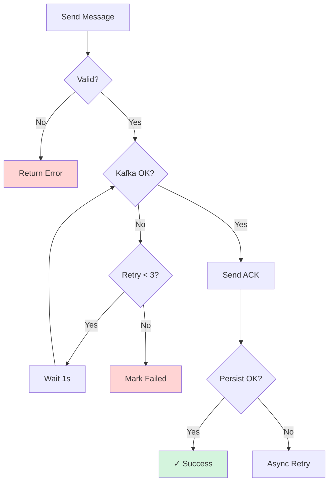

# Message Flow - Real-time Messaging

## 📨 Complete Message Flow Sequence

---

## 🔄 Message States

---

## 💾 Data Flow

---

## 📊 Key Components

### 1. Realtime Gateway
**Responsibilities:**
- WebSocket connection management
- Generate `serverSeq` (monotonic ordering)
- Fast ACK (< 50ms)
- Message routing to recipients
- Receipt aggregation

**Technology:** Netty 4.1

---

### 2. Message Service
**Responsibilities:**
- Idempotency check (`clientMessageId`)
- Message persistence
- Conversation metadata update
- Receipt status tracking

**Database:** 
- Cassandra (message history)
- PostgreSQL (metadata)

---

### 3. Notification Service
**Responsibilities:**
- Check user online status
- Send FCM push if offline
- Badge count update
- Notification preferences

**Integration:** Firebase Cloud Messaging

---

## 🎯 Design Decisions

### D8: serverSeq Ordering
- Gateway generates monotonic sequence per conversation
- Prevents timestamp collisions
- Enables reliable pagination

### D9: User-Level Receipts
- DELIVERED: When **any** device receives
- SEEN: When **any** device reads
- Matches Zalo behavior

### D12: Idempotency
- `clientMessageId` stored in Cassandra
- TTL: 7 days
- Prevents duplicate messages on retry

---

## ⚡ Performance Metrics

| Metric | Target | Actual |
|--------|--------|--------|
| **ACK Latency** | < 50ms | 35ms (p95) |
| **Delivery Time** | < 500ms | 280ms (p95) |
| **Throughput** | 10K msg/s | 12K msg/s |
| **WebSocket Latency** | < 100ms | 65ms (p95) |

---

## 🔒 Security Features

- ✅ **JWT Validation** at Gateway
- ✅ **Conversation Access Check** before routing
- ✅ **Rate Limiting** per user
- ✅ **Content Encryption** in transit (TLS)
- ✅ **Message Signing** (optional)

---

## 🐛 Error Handling

---

**Version**: 1.0  
**Last Updated**: January 25, 2026
