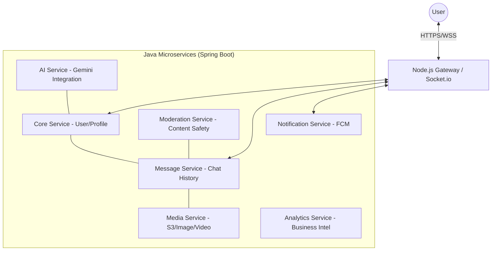

# VNALO Architecture Blueprint (L0)

## System Overview
VNALO is a microservice-based social communication platform. It leverages a polyglot backend and a Flutter-based cross-platform mobile frontend.

## Microservices Map

## Technical Components
- **Identity**: JWT-based auth managed by Core Service.
- **Signaling**: WebRTC offers/answers routed via Socket.io on the Node.js Gateway.
- **Storage**: AWS S3 for media, PostgreSQL for relational data, Redis for caching.
- **AI Engine**: Gemini Pro / Flash models orchestrated by the AI Service.

## Communication Standards
- **Sync**: RESTful API (OpenAPI 3.0).
- **Async**: Socket.io for real-time signaling and messaging.
- **Media**: P2P WebRTC for voice/video calls.

## Infrastructure
- **CI/CD**: GitHub Actions for automated testing and deployment.
- **Hosting**: Docker containers (K8s/ECS).
