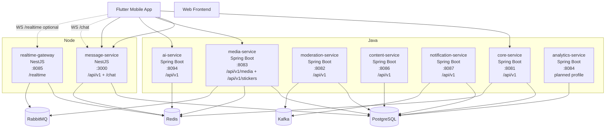
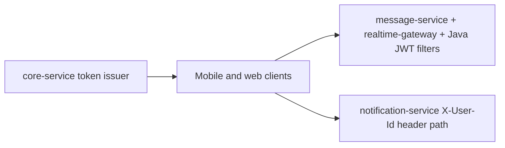
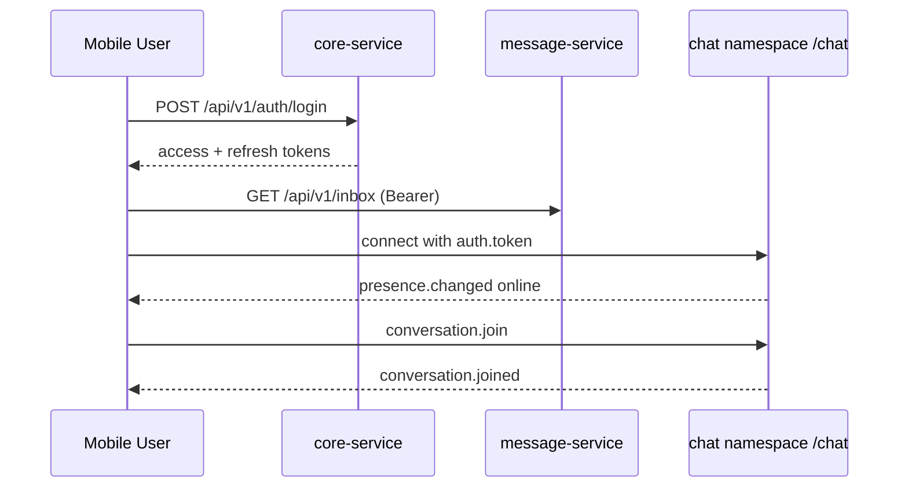
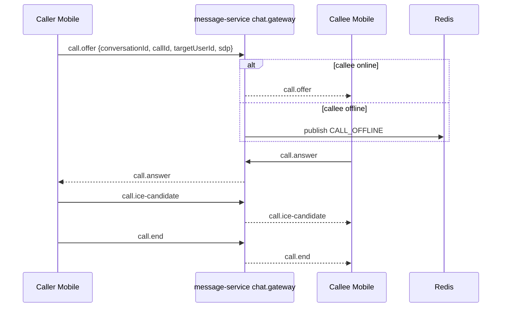

# ARCHITECTURE BLUEPRINT

> [!IMPORTANT]
> This blueprint reflects repository runtime behavior at the time of SDD generation.

## System Topology

## Runtime Service Contract Matrix

| Service | Port | Entry Contract | Primary Responsibility | Runtime Status |
| --- | --- | --- | --- | --- |
| core-service | 8081 | /api/v1 | Auth, users, social graph, QR auth | Active |
| message-service | 3000 | /api/v1 and WS namespace /chat | Conversations, messages, inbox, call signaling | Active |
| realtime-gateway | 8085 | WS namespace /realtime | Presence and typing federation | Active but secondary for mobile |
| media-service | 8083 | /api/v1/media and /api/v1/stickers | Media upload, sticker pack APIs | Active |
| moderation-service | 8082 | /api/v1 | Reports, cases, actions, appeals | Active in codebase |
| content-service | 8086 | /api/v1 | Stories, posts, comments, likes | Active in codebase |
| notification-service | 8087 | /api/v1 | Device registration and user notifications | Active in codebase |
| ai-service | 8094 | /api/v1/ai and /api/v1/chat | Assistant chat and history | Active |
| analytics-service | 8084 | /api/v1/analytics and /internal/events | Trend dashboards and event ingestion | Planned compose profile |

## Trust and Auth Boundaries

> [!WARNING]
> notification-service currently identifies users via X-User-Id request header in controller methods and does not show a service-local Spring Security filter chain in source.

## Canonical End-to-End Flows

### Login and Chat Start

### 1:1 Call Signaling

## Data Ownership

- core-service owns account and social canonical identity.
- message-service owns conversation and message canonical state.
- media-service owns media metadata and sticker catalogs.
- moderation-service owns moderation case lifecycle.
- analytics-service owns aggregate read models and event history.
- notification-service owns per-user notification feed and device token registrations.

## Constraints

- Shared JWT secret must remain synchronized across token issuer and validators.
- message-service and core-service currently share vnalo_core persistence domain.
- media-service uses dedicated vnalo_media DB and must integrate via API or events.
- Socket event names are part of client contract and must be versioned for breaking changes.
