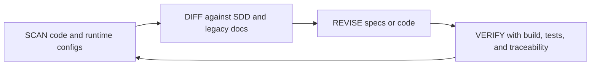

# CLAUDE

> [!IMPORTANT]
> This file defines how AI agents and engineers must operate on the VNALO codebase and spec stack.

## Mission

Keep VNALO in zero-delta alignment between implementation and specification.

Zero-delta means:

- Runtime behavior in code matches SDD contracts.
- SDD contracts are refreshed when behavior changes.
- Known deviations are tracked in Layer 4 with ownership and due date.

## Source of Truth Order

1. Runtime code in repository
2. This SDD tree under docs/sdd
3. Legacy docs under docs/system and docs/feedback

> [!NOTE]
> Legacy docs remain useful context, but if they conflict with code and this SDD tree, they are non-authoritative.

## Reconcile Loop

## Writing Contract

All SDD updates must follow:

- Atomic scope per file.
- Structured markdown with explicit sections.
- Evidence links to code files.
- Mermaid diagrams for architecture, flow, or data shape.
- No placeholder language.

## Change Control Rules

### Architecture changes

- Update ARCHITECTURE_BLUEPRINT.md.
- Add an entry in DECISION_LOG.md.
- Update impacted Layer 2 and Layer 3 contracts.

### API or Socket changes

- Update API_REFERENCE_CATALOG.md and or SOCKET_SIGNALING_SCHEMA.md.
- Update module specs consuming those contracts.

### Data model changes

- Update GLOBAL_DATABASE_ERD.md.
- Update ERROR_CODE_MATRIX.md if validation or exception mapping changes.

## Operational Guardrails

- Do not assume unstated auth or role requirements.
- Do not document endpoints not discoverable from code.
- Do not promote planned services as production-ready without verify evidence.
- Do not erase known risks; track them in Layer 4.

## Ownership

- Architecture and runtime contracts: backend and mobile leads.
- Reconcile governance and readiness gates: engineering management.
- Automated updates: AI agents must preserve this policy and decision traceability.
