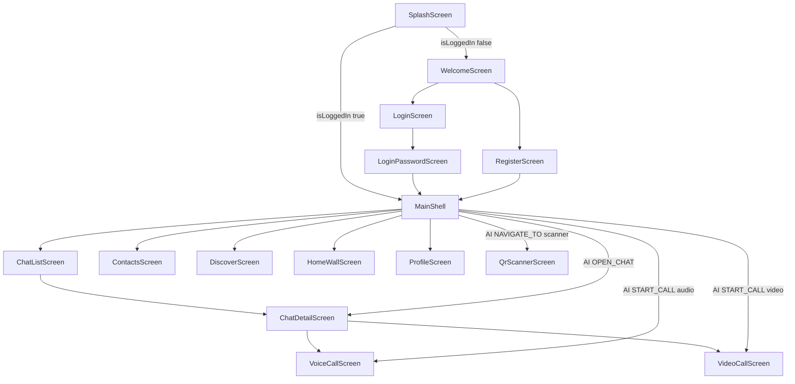

# NAVIGATION MASTER GRAPH

> [!IMPORTANT]
> This graph defines the live mobile navigation contract and AI-triggered transitions.

## Root Navigation Graph

## AI Navigation Contract

| AI Command | Required Params | Navigation Result | Guard Conditions |
| --- | --- | --- | --- |
| NAVIGATE_TO | page | switch tab or push scanner | page must be one of chat, timeline, profile, settings, scanner |
| OPEN_CHAT | target | push ChatDetailScreen | conversation must resolve by display name |
| SEND_MESSAGE | target, content | push ChatDetailScreen with prefilled text | conversation must resolve |
| START_CALL | target, callType | push VoiceCallScreen or VideoCallScreen | only DIRECT conversations with resolved peerUserId |
| NAVIGATE_TO_SCANNER | none | push QrScannerScreen | none |

> [!WARNING]
> START_CALL is explicitly blocked for non-1:1 conversations in MainShell action handler.

## Tab Index Contract

| Tab Index | Screen | Semantic Domain |
| --- | --- | --- |
| 0 | ChatListScreen | Messaging |
| 1 | ContactsScreen | Social |
| 2 | DiscoverScreen | Discovery |
| 3 | HomeWallScreen | Timeline |
| 4 | ProfileScreen | Identity and settings |

## Incoming Call Overlay Contract

- IncomingCallCoordinator is mounted globally in MaterialApp builder stack.
- It listens to SocketService onCallSignal stream and handles type offer.
- It deduplicates by conversationId:callId before presenting UI.
- If another call is already being presented, it sends endCall reason busy.

## Evidence

- frontend/mobile/lib/main.dart
- frontend/mobile/lib/features/auth/screens/splash_screen.dart
- frontend/mobile/lib/features/auth/screens/welcome_screen.dart
- frontend/mobile/lib/features/auth/screens/login_screen.dart
- frontend/mobile/lib/features/auth/screens/login_password_screen.dart
- frontend/mobile/lib/features/auth/screens/register_screen.dart
- frontend/mobile/lib/navigation/main_shell.dart
- frontend/mobile/lib/features/call/widgets/incoming_call_coordinator.dart
