# NAVIGATION MASTER GRAPH

> [!IMPORTANT]
> This graph defines the live mobile navigation contract and AI-triggered transitions.

## Root Navigation Graph

```mermaid
flowchart TD
    Splash[SplashScreen]
    Welcome[WelcomeScreen]
    LoginPhone[LoginScreen]
    LoginPass[LoginPasswordScreen]
    Register[RegisterScreen]
    MainShell[MainShell]

    ChatList[ChatListScreen]
    Contacts[ContactsScreen]
    Discover[DiscoverScreen]
    Wall[HomeWallScreen]
    Profile[ProfileScreen]

    ChatDetail[ChatDetailScreen]
    VoiceCall[VoiceCallScreen]
    VideoCall[VideoCallScreen]
    Scanner[QrScannerScreen]

    GroupSettings[GroupSettingsScreen]
    GroupMembers[GroupMembersScreen]
    GroupChatOptions[GroupChatOptionsScreen]
    DirectChatOptions[DirectChatOptionsScreen]
    AddGroupMembers[AddGroupMembersScreen]
    GroupJoinRequests[GroupJoinRequestsScreen]
    JoinGroup[JoinGroupScreen]
    CreateGroup[CreateGroupScreen]
    Forward[ForwardScreen]
    WallpaperSelection[WallpaperSelectionScreen]
    MyDocuments[MyDocumentsScreen]
    ReactionDetail[ReactionDetailScreen]

    AiConversation[AiConversationScreen]
    MascotGallery[MascotGalleryScreen]
    AiBubble([AI Floating Bubble — global overlay])

    ProfileDetail[ProfileDetailScreen]
    PersonalInfo[PersonalInfoScreen]
    EditPersonalInfo[EditPersonalInfoScreen]
    Settings[SettingsScreen]
    AppearanceSettings[AppearanceSettingsScreen]
    AccountSecurity[AccountSecurityScreen]
    UpdatePassword[UpdatePasswordScreen]

    Splash -->|isLoggedIn false| Welcome
    Splash -->|isLoggedIn true| MainShell

    Welcome --> LoginPhone
    Welcome --> Register

    LoginPhone --> LoginPass
    LoginPass --> MainShell
    Register --> MainShell

    MainShell --> ChatList
    MainShell --> Contacts
    MainShell --> Discover
    MainShell --> Wall
    MainShell --> Profile
    MainShell --> AiBubble

    ChatList --> ChatDetail
    ChatList --> CreateGroup
    ChatList --> JoinGroup
    ChatDetail --> VoiceCall
    ChatDetail --> VideoCall
    ChatDetail --> GroupChatOptions
    ChatDetail --> DirectChatOptions
    ChatDetail --> Forward
    ChatDetail --> ReactionDetail
    ChatDetail --> MyDocuments
    GroupChatOptions --> GroupSettings
    GroupChatOptions --> GroupMembers
    GroupChatOptions --> WallpaperSelection
    GroupMembers --> AddGroupMembers
    GroupMembers --> GroupJoinRequests

    Profile --> ProfileDetail
    Profile --> PersonalInfo
    ProfileDetail --> EditPersonalInfo
    Profile --> Settings
    Settings --> AppearanceSettings
    Settings --> AccountSecurity
    AccountSecurity --> UpdatePassword
    Settings --> MascotGallery

    AiBubble -->|long press| AiConversation
    AiConversation --> MascotGallery

    MainShell -->|AI NAVIGATE_TO scanner| Scanner
    MainShell -->|AI OPEN_CHAT| ChatDetail
    MainShell -->|AI START_CALL audio| VoiceCall
    MainShell -->|AI START_CALL video| VideoCall
    MainShell -->|AI NAVIGATE_TO timeline| Wall
    MainShell -->|AI NAVIGATE_TO settings| Settings
```



## AI Navigation Contract

| AI Command | Required Params | Navigation Result | Guard Conditions |
| --- | --- | --- | --- |
| NAVIGATE_TO | page | switch tab (chat/contacts/discover/timeline/profile/settings/scanner) | page must be resolvable |
| NAVIGATE_TO_SETTINGS | none | switch to settings | none |
| NAVIGATE_TO_CHAT | none | switch to chat tab | none |
| NAVIGATE_TO_SCANNER | none | push QrScannerScreen | none |
| NAVIGATE_TO_TIMELINE | none | switch to timeline/wall tab | none |
| OPEN_CHAT | target: string | push ChatDetailScreen | conversation must resolve by display name |
| SEND_MESSAGE | target: string, content: string | push ChatDetailScreen with prefilled text | conversation must resolve |
| START_CALL | target: string, callType: 'audio'\|'video' | push VoiceCallScreen or VideoCallScreen | only DIRECT conversations; `_isCallScreenActive` must be false |

> [!WARNING]
> START_CALL is explicitly blocked for non-1:1 conversations in MainShell action handler.
> Concurrent call screens are prevented by `_isCallScreenActive` flag.

## Tab Index Contract

| Tab Index | Screen | Semantic Domain |
| --- | --- | --- |
| 0 | ChatListScreen | Messaging |
| 1 | ContactsScreen | Social |
| 2 | DiscoverScreen | Discovery |
| 3 | HomeWallScreen | Timeline |
| 4 | ProfileScreen | Identity and settings |

## Incoming Call Overlay Contract

- IncomingCallCoordinator is mounted globally in MaterialApp builder stack.
- It listens to SocketService onCallSignal stream and handles type offer.
- It deduplicates by conversationId:callId before presenting UI.
- If another call is already being presented, it sends endCall reason busy.

## Web App Navigation

The web app (React + React Router v6) uses path-based navigation, not tab-based:

```
/login              → LoginPage (unauthenticated only)
/login/qr           → QrLoginPage (unauthenticated only)
/register           → RegisterPage (unauthenticated only)
/forgot-password    → ForgotPasswordPage (unauthenticated only)
/                   → redirect to /chat
/chat               → ChatPage (inbox, no conversation selected)
/chat/:id           → ChatPage (conversation open)
/contacts           → ContactsPage
/documents          → DocumentsPage
/profile            → ProfilePage
* (fallback)        → redirect to /chat
```

All authenticated routes are wrapped in `ProtectedRoute` + `MainLayout`.

## Evidence

- frontend/mobile/lib/main.dart
- frontend/mobile/lib/features/auth/screens/splash_screen.dart
- frontend/mobile/lib/features/auth/screens/welcome_screen.dart
- frontend/mobile/lib/features/auth/screens/login_screen.dart
- frontend/mobile/lib/features/auth/screens/login_password_screen.dart
- frontend/mobile/lib/features/auth/screens/register_screen.dart
- frontend/mobile/lib/navigation/main_shell.dart
- frontend/mobile/lib/features/call/widgets/incoming_call_coordinator.dart
