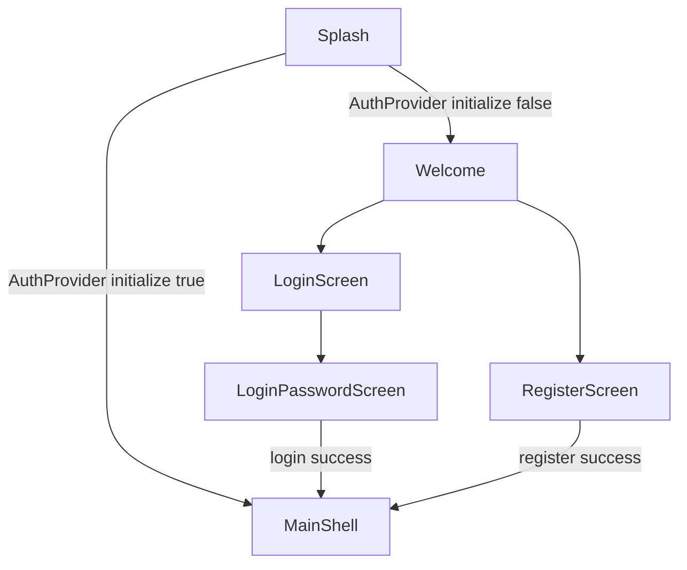

# SCREEN SPEC AUTH FLOW

> [!IMPORTANT]
> Scope: Splash, Welcome, Login phone/password, Register multi-step.

## Outcome

Provide deterministic entry into authenticated MainShell with robust fallback behavior for OTP policy and partial registration failures.

## Screen Set

- SplashScreen
- WelcomeScreen
- LoginScreen
- LoginPasswordScreen
- RegisterScreen

## Flow Graph

## UI Contract

### SplashScreen

- Full-screen brand text VNALO on primary color.
- Waits for both AuthProvider.initialize and 1500ms minimum display.
- Replaces route stack with MainShell or WelcomeScreen.

### WelcomeScreen

- Language switch sheet.
- Carousel onboarding with page indicator.
- Primary CTA to login, secondary CTA to register.

### LoginScreen and LoginPasswordScreen

- Step 1: collect normalized phone with country code.
- Step 2: password form with visibility toggle and forgot password route.
- On success, clear navigation stack and open MainShell.

### RegisterScreen

- Multi-step wizard with optional OTP step.
- OTP requirement fetched at runtime from backend status endpoint.
- Supports avatar, gender, dob optional profile payload.
- Handles partial success path where auth session exists but avatar upload fails.

## Error and Recovery States

| State | Trigger | UX Behavior |
| --- | --- | --- |
| kickout dialog | AuthProvider kickoutReason set | modal alert on LoginScreen |
| OTP send fail | sendRegisterOtp throws | error snackbar with mapped message |
| OTP invalid | non 6-digit input | inline snackbar, cannot continue |
| registration partial success | register returns session but profile warning | warning snackbar then continue to contacts prompt |
| login fail | invalid password or network | error snackbar, remain on password step |

## Data Dependencies

- AuthProvider
- AppConfig environment initialization
- LanguageProvider
- NotificationService background init side-effect from app root

## Acceptance Criteria

1. Splash must not navigate before auth initialize resolves.
2. Login success must clear old stack history.
3. Register must adapt step count when OTP is disabled by backend.
4. Warning path in register must still land in authenticated experience.

## Evidence

- frontend/mobile/lib/main.dart
- frontend/mobile/lib/features/auth/screens/splash_screen.dart
- frontend/mobile/lib/features/auth/screens/welcome_screen.dart
- frontend/mobile/lib/features/auth/screens/login_screen.dart
- frontend/mobile/lib/features/auth/screens/login_password_screen.dart
- frontend/mobile/lib/features/auth/screens/register_screen.dart
