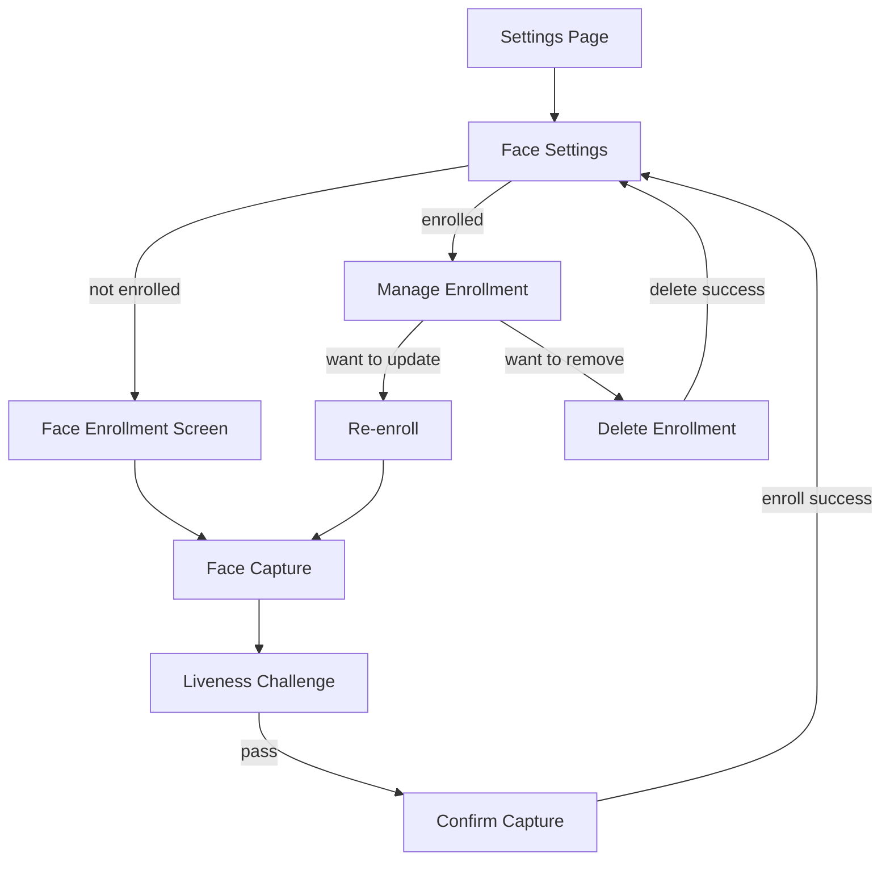

# SCREEN SPEC - FACE AUTHENTICATION

> [!IMPORTANT]
> Scope: Face enrollment, verification, and management screens on Web. Mobile screens are out of scope for this worktree.

## Outcome

Enable users to enroll their face for biometric authentication, verify their identity using face recognition, and manage their face enrollment. Face auth serves as an alternative or supplementary factor to password-based authentication.

## Screen Set

- FaceEnrollmentScreen (wizard-style enrollment flow)
- FaceVerificationScreen (capture and verify)
- FaceSettingsScreen (manage enrollment: view status, re-enroll, delete)
- FaceLivenessChallengeScreen (inline during enrollment/verification)

## User Flow

## UI Contract

### FaceEnrollmentScreen

**Route:** `/settings/face-auth/enroll`

**Layout:**
- Step indicator: 1. Capture > 2. Verify > 3. Complete
- Face camera viewfinder (centered, rounded corners 16px, aspect ratio 4:3)
- Overlay guide: oval face outline (dashed, white, 2px)
- Instruction text below viewfinder: "Position your face within the oval"
- Capture button: 64px diameter, primary color, centered below viewfinder
- Progress ring around capture button during processing

**States:**

| State | Trigger | UI Behavior |
|---|---|---|
| Initial | Screen load | Camera preview active, guide visible, button enabled |
| Capturing | Button tap | Button shows spinner, disable capture |
| Processing | Image captured | Processing overlay with text "Analyzing..." |
| Liveness check | During processing | Inline liveness challenge if enabled |
| Success | Enrollment complete | Success animation, auto-navigate to settings |
| Error | API error | Error toast with message, remain on screen |

### FaceVerificationScreen

**Route:** `/settings/face-auth/verify`

**Layout:**
- Face camera viewfinder (same as enrollment)
- Target user display: avatar + name
- Verify button: primary CTA
- Cancel: secondary text button

**States:**

| State | Trigger | UI Behavior |
|---|---|---|
| Initial | Screen load | Camera active, user info visible |
| Verifying | Button tap | Button shows spinner |
| Processing | Image captured | "Verifying..." overlay |
| Verified | Match success | Success animation + navigate |
| Rejected | Match failed | Error animation + retry option |
| Error | API error | Error toast, remain on screen |

### FaceSettingsScreen

**Route:** `/settings/face-auth`

**Layout:**
- Header: "Face Authentication"
- Status card:
  - If enrolled: green checkmark, "Face enrolled", enrolled date, version
  - If not enrolled: gray icon, "Face not enrolled"
- Action buttons:
  - If enrolled: "Update Face" (primary), "Remove Face" (danger/secondary)
  - If not enrolled: "Set Up Face Auth" (primary)

**States:**

| State | Trigger | UI Behavior |
|---|---|---|
| Loading | On mount | Skeleton card |
| Enrolled | Status returns enrolled | Show enrolled card + update/remove |
| Not enrolled | Status returns not enrolled | Show setup button |
| Error | Status API fails | Error card with retry |

### FaceLivenessChallengeScreen

**Inline within enrollment/verification flow:**

| Challenge Type | Instruction | Duration |
|---|---|---|
| Blink | "Please blink" | 2 seconds |
| Look left | "Look to your left" | 2 seconds |
| Look right | "Look to your right" | 2 seconds |
| Smile | "Please smile" | 2 seconds |

Visual feedback: Real-time face overlay on camera preview showing detected landmarks.

## Design Token Usage

Follow `UI_DESIGN_SYSTEM.md` tokens:

- Viewfinder background: `overlay.background`
- Guide oval: `border.default` dashed 2px
- Primary button: `button.primary.bg` + `button.primary.text`
- Danger button: `feedback.danger.bg` + `feedback.danger.text`
- Success indicator: `feedback.success.bg`
- Card radius: 16px
- Button height: 48-50px
- Viewfinder corner radius: 16px

## Data Dependencies

- `FaceAuthContext` (React context): provides enrollment status, capture methods
- `useFaceAuth()` hook: wraps API calls
- AuthProvider (existing): JWT token management
- Camera access: browser MediaDevices API

## Acceptance Criteria

1. User can enroll face in 3 steps: capture, liveness, confirm
2. User can view current enrollment status in settings
3. User can re-enroll (update) existing face enrollment
4. User can delete face enrollment
5. Verification returns ACCEPT/REJECT with confidence score
6. Camera permission is requested gracefully with fallback message
7. All error states are handled with user-friendly messages
8. Loading states are visible during API calls
9. Success/error animations provide clear feedback

## Evidence

- `frontend/web/src/features/face-auth/`
- `frontend/web/src/pages/Settings/FaceAuthPage.tsx`
- `frontend/web/src/features/face-auth/components/`
- `frontend/web/src/hooks/useFaceAuth.ts`
