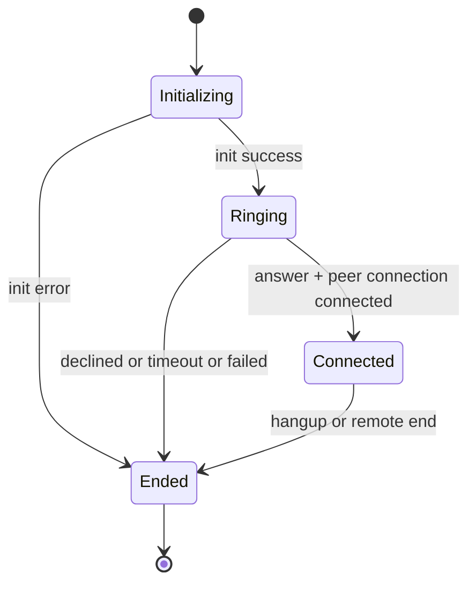

# SCREEN SPEC VOICE CALL

> [!IMPORTANT]
> Scope: VoiceCallScreen lifecycle, call state UX, proximity handling, and call log emission.

## Outcome

Provide resilient voice call UX for caller and callee roles with accurate call state transitions and deterministic teardown.

## State Machine

## UX Contract

- Caller starts dialing ringtone.
- Callee starts ringing ringtone.
- Duration timer starts only when connected.
- Proximity sensor black overlay is active in non-web runtime.
- Wakelock is enabled during active call session and released on dispose.

## Action Buttons

- Decline and accept shown for inbound call before acceptance.
- End call always available once accepted or connected.
- Upgrade to video triggers end reason upgrade-to-video and route replacement to VideoCallScreen with new callId.

## Messaging Side Effect

- Caller emits CALL_LOG_MESSAGE text payload after call end.
- Outcome derives from connection and end reason:
  - answered, declined, busy, missed, failed

## Failure Contract

- Init errors map to readable string and trigger safe teardown.
- no-answer-timeout returns to previous screen faster than normal end path.

## Acceptance Criteria

1. Duplicate endCall calls must not crash.
2. Call log is sent once only for caller side.
3. Ringtone is always stopped on end.
4. Proximity stream and timer are disposed.

## Evidence

- frontend/mobile/lib/features/call/screens/voice_call_screen.dart
- frontend/mobile/lib/features/call/services/webrtc_call_service.dart
- frontend/mobile/lib/features/call/services/ringtone_service.dart
