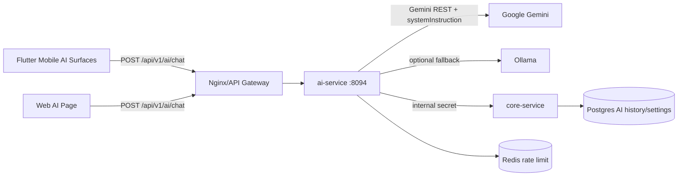

# MODULE SPEC - AI ASSISTANT

> Status: Implemented + guarded expansion in progress  
> Last reconciled: 2026-05-22  
> Source-of-truth scan: ai-service, mobile AI provider/widgets, mobile action dispatcher, web AI page, docker compose

## 1. Purpose

The VNALO AI Assistant provides conversational help plus guarded in-app actions. It is not an autonomous agent that may mutate user data without confirmation. The backend may return an allow-listed `actionCommand`; clients must still resolve targets, disambiguate ambiguous names, ask for confirmation on risky actions, and execute only commands supported by that client surface.

## 2. Runtime Topology



### 2.1 Environment Contract

| Variable | Owner | Required | Notes |
|---|---|---:|---|
| `GEMINI_API_KEY` | ai-service container | yes for live AI | Backend-only. Never expose to web/mobile clients. |
| `GEMINI_MODEL` | ai-service container | no | Default can be overridden in docker env. |
| `OLLAMA_ENABLED` | ai-service container | no | Default false on constrained EC2. |
| `OLLAMA_URL` | ai-service container | no | Only valid when Ollama service is enabled and reachable. |
| `AI_INTERNAL_SECRET` | ai-service + core-service | yes | Used for AI/core internal endpoints. |
| `JWT_SECRET` | protected services | yes | Must be valid base64/base64url consistently with service implementation. |

`config/environments/.env` does not need to contain every AI secret if the active docker `.env` supplies them and `docker-compose config` resolves them into the service environment. Do not commit live API keys.

## 3. Public API Contract

### 3.1 Chat

`POST /api/v1/ai/chat`

Request body:

```json
{
  "prompt": "string",
  "contextId": "string | null",
  "analyzeIntent": true,
  "enableDeepSummary": false,
  "history": [
    { "role": "user|assistant", "content": "string", "createdAt": "ISO8601", "clientEntryId": "uuid" }
  ],
  "clientUserEntryId": "uuid",
  "clientAssistantEntryId": "uuid"
}
```

Response body is wrapped by `ApiResponse.ok(data)`:

```json
{
  "success": true,
  "data": {
    "textReply": "string",
    "actionCommand": "string | null",
    "actionParams": {},
    "emotion": "neutral|thinking|joyful|...",
    "estimatedTokens": 0,
    "degraded": false,
    "providerStatus": "LIVE_PROVIDER_ACTIVE|FALLBACK_PROVIDER_ACTIVE|AI_PROVIDER_UNAVAILABLE",
    "conversationId": "uuid",
    "userEntryId": "uuid",
    "assistantEntryId": "uuid"
  }
}
```

Accepted LLM aliases are normalized before returning to clients, for example `SEND_MESSAGE -> COMPOSE_MESSAGE`, `ADD_FRIEND -> SEND_FRIEND_REQUEST`, and `RENAME_GROUP -> CHANGE_GROUP_NAME`.

### 3.2 Health

Correct health path:

`GET /api/v1/ai/actuator/health`

A healthy container only means Spring Boot is up. Gemini/Ollama availability must be inferred from chat response `providerStatus`, `degraded`, and service logs.

## 4. Provider Behavior

| Condition | Expected behavior |
|---|---|
| Gemini success | Return response with `providerStatus=LIVE_PROVIDER_ACTIVE`, `degraded=false`. |
| Gemini fails and Ollama enabled/reachable | Fall back to Ollama with `providerStatus=FALLBACK_PROVIDER_ACTIVE`, `degraded=true`. |
| Gemini fails and Ollama disabled/unreachable | Return graceful emergency response with `providerStatus=AI_PROVIDER_UNAVAILABLE`, `degraded=true`. |
| Provider outage + obvious local intent | Preserve safe local actions such as opening chat/call intent when schema is valid. |

The EC2 t3.large deployment should not run `llama3.1:8b` in the same stack by default because memory pressure can destabilize other services.

## 5. Rate Limit and History

| Item | Runtime default |
|---|---:|
| Per-user AI chat rate limit | `ai.chat.rate-limit-per-user:5` per minute |
| Global Gemini rate limit | `ai.chat.rate-limit-global:10` per minute |
| Web request history window | latest 20 messages |
| Mobile listening idle timeout target | at least 10 seconds before auto-stop when no speech is captured |

The full AI conversation should optimistically append the user's message immediately, then show assistant typing until the response arrives.

## 6. Client Surfaces

### 6.1 Mobile Floating Bubble Board

Files:

- `frontend/mobile/lib/features/ai_assistant/widgets/ai_floating_bubble.dart`
- `frontend/mobile/lib/features/ai_assistant/widgets/ai_chat_board.dart`

Required behavior:

- tap bubble once to open board; tap again to close
- listening state must not auto-close before the 10-second idle timeout
- listening visual must stay inside the mascot/bubble bounds
- compact board should show recent turns, degraded/provider status, quick chips, copy feedback, and full conversation entry
- placeholder controls must be hidden until implemented

### 6.2 Mobile Full AI Conversation

File: `frontend/mobile/lib/features/ai_assistant/screens/ai_conversation_screen.dart`

Required behavior:

- message list, background, typography, and composer must align with normal chat design grammar
- user message appears immediately after send; assistant typing appears while waiting
- mic action is explicit and stateful
- status banner reflects provider availability and local/cloud history mode
- action confirmations use bottom sheets with recipient cards and clear primary/secondary actions

### 6.3 Web AI Page

Files:

- `frontend/web/src/pages/AiChatPage.tsx`
- `frontend/web/src/features/chat/chat.api.ts`
- `frontend/web/src/features/chat/components/ChatWindow.tsx`
- `frontend/web/src/features/chat/components/MessageInput.tsx`
- `frontend/web/src/styles/chat.css`

Current behavior:

- standalone AI chat page with localStorage history
- consumes `textReply`, `actionCommand`, `actionParams`, `degraded`, and `providerStatus`
- displays provider/degraded status
- supports guarded navigation/open-chat/compose draft flow
- stores compose draft in `localStorage` and injects it into the normal chat composer after navigation

Web does not directly perform destructive or high-risk actions. Unsupported commands must show a recoverable message and direct the user to mobile/manual flow.

## 7. System Action Commands

### 7.1 Backend Allow-Listed Commands

| Command | Minimum params | Risk | Client execution policy |
|---|---|---|---|
| `NAVIGATE_TO` | `page` | low | Route only to allow-listed pages. |
| `NAVIGATE_TO_SETTINGS` | none | low | Open settings/profile surface. |
| `NAVIGATE_TO_CHAT` | none | low | Open chat tab/page. |
| `NAVIGATE_TO_CONTACTS` | none | low | Open contacts tab/page. |
| `NAVIGATE_TO_SCANNER` | none | medium | Mobile only; camera permission still required. |
| `NAVIGATE_TO_TIMELINE` | none | low | Mobile only unless web route exists. |
| `OPEN_CHAT` | `target` | medium | Resolve exact conversation; disambiguate if needed. |
| `COMPOSE_MESSAGE` | `recipient`, `content` | medium | Open chat and prefill; sending requires user action/confirmation. |
| `START_CALL` | `target`, optional `callType` | high | Confirm target and call type before starting. |
| `RECALL_MESSAGE` | context/last message | destructive | Confirm before recalling. |
| `CREATE_GROUP` | `groupName`, `memberNames[]` | high | Confirm members and name before creating. |
| `MUTE_CONVERSATION` / `UNMUTE_CONVERSATION` | target/current chat | medium | Confirm when target is inferred. |
| `PIN_MESSAGE` / `UNPIN_MESSAGE` | message/current context | medium | Confirm exact message. |
| `OPEN_GROUP_SETTINGS` | target/current group | low | Open settings only. |
| `OPEN_PROFILE` | `target` | low | Resolve exact user then open profile. |
| `SEND_FRIEND_REQUEST` | `target` | medium | Confirm recipient before sending. |
| `BLOCK_USER` / `UNBLOCK_USER` | `target` | destructive | Strong confirmation required. |
| `CHANGE_GROUP_NAME` | `title` | high | Admin permission + confirmation. |
| `ADD_GROUP_MEMBER` / `REMOVE_GROUP_MEMBER` | `memberNames[]` | high/destructive | Admin permission + confirmation. |
| `TRANSFER_GROUP_OWNER` | `memberNames[]` | destructive | Strong confirmation required. |
| `LEAVE_GROUP` / `DISBAND_GROUP` | target/current group | destructive | Strong confirmation required. |

### 7.2 Client Coverage

| Capability | Mobile | Web |
|---|---:|---:|
| Navigation commands | supported where routes exist | supported for chat/contacts/profile/settings |
| Open chat | supported with resolver | supported by inbox-name lookup |
| Compose draft | supported; confirmation first | supported by draft injection into normal chat composer |
| Start call | supported with confirmation | opens chat; user manually confirms call |
| Group/admin/destructive actions | roadmap/guarded | not directly executed |
| Send message immediately | not default | not supported |

The backend prompt must not list commands that are absent from the backend allow-list. Clients must not execute commands they do not support.

## 8. Recipient Resolution Policy

| Situation | Required UX |
|---|---|
| No target provided | Ask for target; do not execute. |
| No match found | Show recoverable error and suggest contacts/search. |
| One exact direct match | Continue to confirmation for risky actions. |
| Multiple matches | Show disambiguation sheet before confirmation. |
| Group and direct matches share name | Explicitly label direct/group and member count. |
| More than five matches | Provide search/filter in disambiguation sheet. |

## 9. Compose Message Policy

Default safe behavior:

1. Resolve recipient.
2. If ambiguous, ask user to choose.
3. Show confirmation with recipient card and message preview.
4. Default CTA: `Mở và điền sẵn`.
5. Open chat and inject draft; user presses Send manually.

Optional future behavior:

- `Gửi ngay` may be offered only when recipient is unambiguous, content is explicit, and the user confirms in a high-emphasis modal.
- `Gửi ngay` must never be the only or default action.

## 10. Modal and Input Design Contract

| Component | Required geometry |
|---|---|
| Bottom sheet top radius | 22-24 |
| Drag handle | width 40-56, height 4-6, radius 999 or 2+ |
| Primary/secondary CTA | min height 48-50, radius 12 |
| Form/input field | radius 12, focused border width about 1.5 |
| Pills/chips/handles | radius 999 |
| Detail card inside modal | radius 12-16 unless intentionally card-like |

AI confirmation sheets must show action type, recipient, target conversation type, and content preview as separate labeled sections. Destructive actions use error color and explicit destructive copy. Call confirmations must align text vertically with the call icon and show voice/video type.

## 11. Observability

AI action logs must redact message content and include:

- command
- commandId/traceId when available
- normalized command
- target resolution outcome
- confirmation/cancel outcome
- degraded/provider status

## 12. Verification Checklist

| Check | Required command/manual test |
|---|---|
| AI backend contract | `./mvnw clean test "-Dtest=GeminiAiServiceTest,ChatServiceTest"` in `services/ai-service` |
| Web TypeScript build | `npm run build` in `frontend/web` |
| Web lint | `npm run lint` in `frontend/web`; currently fails on pre-existing broad lint debt, so targeted files/build must still pass |
| Mobile provider syntax | `flutter analyze lib/features/ai_assistant/providers/ai_assistant_provider.dart` |
| Compose ambiguous recipient | Manual: request message to duplicated display name |
| Compose exact recipient | Manual: request message to exact friend, verify draft only |
| Call direct recipient | Manual: request voice/video call, verify confirmation |
| Group/destructive guard | Manual: request high-risk group/admin action, verify confirmation or unsupported guard |

## 13. Current Remediation Backlog

| Priority | Item |
|---|---|
| P0 | Keep branch hygiene: mobile-only on `ai-mobile-assistant`; backend/web/docs on `nguyenvu`. |
| P0 | Ensure mobile listening idle timeout is at least 10 seconds and bubble state remains consistent. |
| P0 | Ensure web/mobile AI text has no mojibake. |
| P0 | Render degraded/provider status across mobile and web. |
| P1 | Upgrade AI action confirmation and disambiguation sheets to design contract. |
| P1 | Keep AI input bars aligned with normal chat/auth visual grammar. |
| P1 | Hide placeholder image controls until implemented. |
| P2 | Add richer recent transcript and retry/regenerate/copy-toast actions. |
| P2 | Add client-side telemetry for action resolution and confirmation outcomes. |
| P3 | Enable additional high-risk commands only after client dispatcher, permission checks, and confirmation UX are complete. |
