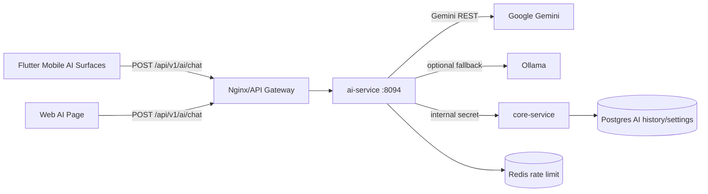

# MODULE SPEC - AI ASSISTANT

> Status: Implemented + remediation in progress  
> Last reconciled: 2026-05-21  
> Source-of-truth scan: ai-service, mobile AI provider/widgets, MainShell action dispatcher, web AI page, docker compose

## 1. Purpose

The VNALO AI Assistant provides conversational help plus guarded in-app actions. It is not an autonomous agent that may mutate user data without confirmation. The assistant may suggest and prepare actions, while the mobile client validates targets, asks for confirmation on risky actions, and executes only allow-listed commands.

## 2. Runtime Topology



### 2.1 Environment Contract

| Variable | Owner | Required | Notes |
|---|---|---:|---|
| `GEMINI_API_KEY` | ai-service container | yes for live AI | Backend-only. Never expose to web/mobile clients. |
| `GEMINI_MODEL` | ai-service container | no | Default can be overridden in docker env. |
| `OLLAMA_ENABLED` | ai-service container | no | Default false on constrained EC2. |
| `OLLAMA_URL` | ai-service container | no | Only valid when Ollama service is enabled and reachable. |
| `AI_INTERNAL_SECRET` | ai-service + core-service | yes | Used for AI/core internal endpoints. |
| `JWT_SECRET` | all protected services | yes | Must match gateway/auth service expectations. |

`config/environments/.env` does not need to contain every AI secret if the active docker `.env` supplies them and `docker-compose config` resolves them into the service environment.

## 3. Public API Contract

### 3.1 Chat

`POST /api/v1/ai/chat`

Request body:

```json
{
  "prompt": "string",
  "contextId": "string | null",
  "analyzeIntent": true,
  "enableDeepSummary": false,
  "history": [
    { "role": "user|assistant", "content": "string", "createdAt": "ISO8601", "clientEntryId": "uuid" }
  ],
  "clientUserEntryId": "uuid",
  "clientAssistantEntryId": "uuid"
}
```

Response body is wrapped by `ApiResponse.ok(data)`:

```json
{
  "success": true,
  "data": {
    "textReply": "string",
    "actionCommand": "string | null",
    "actionParams": {},
    "emotion": "neutral|thinking|joyful|...",
    "estimatedTokens": 0,
    "degraded": false,
    "providerStatus": "LIVE_PROVIDER_ACTIVE|FALLBACK_PROVIDER_ACTIVE|AI_PROVIDER_UNAVAILABLE",
    "conversationId": "uuid",
    "userEntryId": "uuid",
    "assistantEntryId": "uuid"
  }
}
```

### 3.2 Health

Correct health path:

`GET /api/v1/ai/actuator/health`

A healthy container does not imply Gemini is usable. Provider status must be inferred from chat response metadata/logs.

## 4. Provider Behavior

| Condition | Expected behavior |
|---|---|
| Gemini success | Return LLM response with `providerStatus=LIVE_PROVIDER_ACTIVE`. |
| Gemini fails and Ollama enabled/reachable | Fall back to Ollama with `degraded=true`, `providerStatus=FALLBACK_PROVIDER_ACTIVE`. |
| Gemini fails and Ollama disabled/unreachable | Return graceful emergency response with `degraded=true`, `providerStatus=AI_PROVIDER_UNAVAILABLE`. |
| Provider outage + local call intent | Preserve local `START_CALL` when intent is obvious, including Vietnamese diacritics such as `gọi`. |

The EC2 t3.large deployment should not run `llama3.1:8b` in the same stack by default because memory pressure can destabilize other services.

## 5. Mobile Surfaces

### 5.1 Floating Bubble Board

Files:

- `frontend/mobile/lib/features/ai_assistant/widgets/ai_floating_bubble.dart`
- `frontend/mobile/lib/features/ai_assistant/widgets/ai_chat_board.dart`

Current role:

- quick assistant overlay
- compact input
- latest prompt/response display
- quick chips
- open full conversation

Required UX behavior:

- show provider/degraded status when response is degraded
- show a small recent transcript window instead of only the latest turn when space allows
- show copy feedback after copying
- avoid placeholder controls that do nothing

### 5.2 Full AI Conversation

File: `frontend/mobile/lib/features/ai_assistant/screens/ai_conversation_screen.dart`

Current role:

- full transcript backed by local/cloud AI history
- uses normal chat `MessageBubble`
- has AI-specific input bar

Required UX behavior:

- input visual grammar must match project chat/auth standards
- mic action must be explicit and stateful
- image/attachment controls must be hidden until implemented
- status banner must reflect provider availability and cloud/local history mode

## 6. Web Surface

Files:

- `frontend/web/src/pages/AiChatPage.tsx`
- `frontend/web/src/features/chat/chat.api.ts`
- `frontend/web/src/styles/chat.css`

Current role:

- standalone AI chat page
- localStorage history
- simple input + send button

Required UX behavior:

- render degraded/provider state in header and message area
- use textarea-like composer behavior for multiline prompts
- preserve API-provided error messages
- collapse sidebar on small screens

## 7. System Action Commands

### 7.1 Implemented End-to-End

| Command | Params | Client behavior | Confirmation |
|---|---|---|---|
| `NAVIGATE_TO` | `page` | route to allowed tab/screen | no for low-risk navigation |
| `NAVIGATE_TO_SETTINGS` | none | settings/profile area | no |
| `NAVIGATE_TO_CHAT` | none | chat tab | no |
| `NAVIGATE_TO_CONTACTS` | none | contacts tab | no |
| `NAVIGATE_TO_SCANNER` | none | QR scanner | no |
| `NAVIGATE_TO_TIMELINE` | none | timeline tab | no |
| `OPEN_CHAT` | `target` | resolve conversation, open chat | disambiguate if needed |
| `COMPOSE_MESSAGE` | `recipient`, `content` | resolve conversation, open chat, prefill text | yes |
| `START_CALL` | `target`, `callType` | resolve direct conversation, open call screen | yes |
| `RECALL_MESSAGE` | `last=true` | recall latest recallable own message in active chat | yes, destructive |

### 7.2 Not Implemented / Must Not Be Claimed

| Capability | Current app support | AI support | Required before enabling |
|---|---:|---:|---|
| Create group | yes | no | group member picker + confirmation + permissions |
| Send friend request | yes | no | user search + recipient confirmation + optional note preview |
| Global search | yes | no end-to-end | add backend allow-list + mobile route |
| Send message immediately | app can send | AI no | explicit `SEND_MESSAGE_CONFIRMED` flow + strict confirmation |
| Add/remove group members | partial/manual | no | admin permission checks + destructive confirmations |
| Send media/file by AI | manual only | no | AI vision/upload/product policy |

The backend prompt must not list commands that are absent from both backend allow-list and mobile dispatcher.

## 8. Recipient Resolution Policy

| Situation | Required UX |
|---|---|
| No target provided | Ask for target; do not execute. |
| No match found | Show recoverable error and suggest opening contacts/search. |
| One exact direct match | Continue to confirmation for risky actions. |
| Multiple matches | Show disambiguation sheet before confirmation. |
| Group and direct matches share name | Explicitly label direct/group and member count. |
| More than five matches | Provide search/filter in disambiguation sheet. |

## 9. Compose Message Policy

Default safe behavior:

1. Resolve recipient.
2. If ambiguous, ask user to choose.
3. Show confirmation with recipient card and message preview.
4. Default CTA: `Mở và điền sẵn`.
5. Open chat and inject draft; user presses Send manually.

Optional future behavior:

- `Gửi ngay` may be offered only when recipient is unambiguous, content is explicit, and the user confirms in a high-emphasis modal.
- `Gửi ngay` must never be the only or default action.

## 10. Modal and Input Design Contract

### 10.1 Geometry Tokens

| Component | Required geometry |
|---|---|
| Bottom sheet top radius | 22-24 |
| Drag handle | width 40-56, height 4-6, radius 999 or 2+ |
| Primary/secondary CTA | min height 48-50, radius 12 |
| Form/input field | radius 12, focused border width about 1.5 |
| Pills/chips/handles | radius 999 |
| Detail card inside modal | radius 12-16 unless intentionally card-like |

### 10.2 AI Confirmation Sheet Requirements

- Show action type, recipient, target conversation type, and content preview as separate labeled sections.
- For compose, primary CTA is `Mở và điền sẵn`.
- For destructive actions, use error color and destructive copy.
- For call, show voice/video and target direct user.
- Do not use mojibake text.

## 11. Observability

AI action logs must redact message content and include:

- command
- commandId
- traceId
- normalized command
- target resolution outcome
- confirmation/cancel outcome
- degraded/provider status when available

## 12. Verification Checklist

| Check | Required command/manual test |
|---|---|
| AI controller fallback | `./mvnw "-Dtest=AiInteractionControllerTest,ChatServiceTest" test` |
| Mobile provider syntax | `flutter analyze lib/features/ai_assistant/providers/ai_assistant_provider.dart` |
| Web build | `npm run build` in `frontend/web` |
| Compose ambiguous recipient | Manual: request message to duplicated display name |
| Compose exact recipient | Manual: request message to exact friend, verify draft only |
| Call direct recipient | Manual: request voice/video call, verify confirmation |
| Group call guard | Manual: request call to group, verify blocked |

## 13. Current Remediation Backlog

| Priority | Item |
|---|---|
| P0 | Remove mojibake from AI mobile copy and prompts. |
| P0 | Render degraded/provider status across mobile and web. |
| P1 | Upgrade AI action confirmation and disambiguation sheets to design contract. |
| P1 | Hide placeholder image controls until implemented. |
| P1 | Upgrade AI input bars to match chat/auth design grammar. |
| P2 | Add recent transcript to floating board. |
| P2 | Add retry/regenerate/copy-toast actions. |
| P3 | Add future commands only after backend allow-list and client dispatcher support. |
