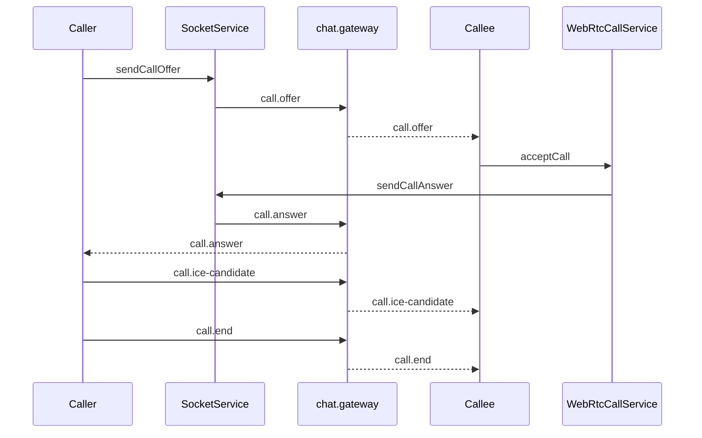

# MODULE SPEC CALL

> [!IMPORTANT]
> Module owner: Flutter call feature plus message-service signaling gateway.

## Outcomes

- Support 1:1 voice and video calls with WebRTC negotiation.
- Ensure call signaling reliability for offer, answer, ice-candidate, and end.
- Provide deterministic UX for timeout, busy, decline, and remote end paths.

## Scope

### In Scope

- Socket signaling events in /chat namespace.
- WebRtcCallService state machine and stream lifecycle.
- IncomingCallCoordinator and call screens.
- AI START_CALL action path in MainShell.

### Out of Scope

- Group call support.
- PSTN gateway or telecom integration.
- Call recording and storage.

## Constraints

- Calls are supported only for DIRECT conversations in current UX contract.
- Both sender and target must be members of conversation before signal forwarding.
- Candidate queueing is required until remote description exists.
- Ring timeout default is 38 seconds unless overridden.

## Decisions

1. Use SocketService call.* events as signaling transport.
2. Keep callId generated client-side with deterministic helper.
3. Keep callee dedupe using conversationId:callId key in IncomingCallCoordinator.
4. Emit CALL_OFFLINE Redis message when call.offer target is offline.

## Task Breakdown

| Task | Status | Notes |
| --- | --- | --- |
| Add AI command guard for non-direct START_CALL | Done | MainShell blocks group call |
| Add call.error stream and UI surface | Done | SocketService + MainShell snackbar |
| Add offline offer fallback publish | Done | chat.gateway emits CALL_OFFLINE |
| Implement offline push consumer from CALL_OFFLINE channel | Open | no consumer in repository |
| Introduce end-to-end call telemetry | Open | only chat message log side effect exists |

## Verification

### Functional

- Caller sends offer and callee receives offer when online.
- Callee accept path sends answer and both peers reach connected state.
- ICE candidates flow both directions without premature addCandidate failure.
- Timeout path triggers no-answer-timeout and closes UI.

### UX

- Caller and callee ringtone start and stop logic is deterministic.
- Voice proximity blackout activates only on non-web runtime.
- Video local preview remains draggable within viewport limits.

### Safety

- Group call attempts are blocked in UI entry points.
- Invalid payload without conversationId or callId returns call.error.

## Flow Reference

## Evidence

- frontend/mobile/lib/features/call/services/webrtc_call_service.dart
- frontend/mobile/lib/features/call/widgets/incoming_call_coordinator.dart
- frontend/mobile/lib/features/call/screens/voice_call_screen.dart
- frontend/mobile/lib/features/call/screens/video_call_screen.dart
- frontend/mobile/lib/navigation/main_shell.dart
- backend/node-services/apps/message-service/src/gateway/chat.gateway.ts
