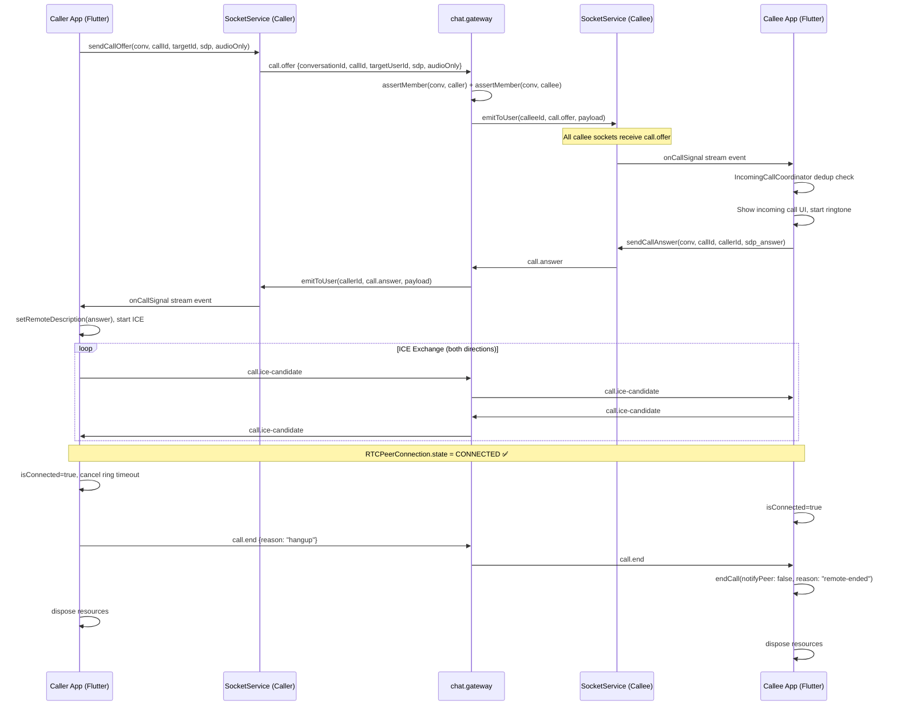

# MODULE SPEC CALL

> [!IMPORTANT]
> Module owner: Flutter call feature + message-service chat.gateway signaling.
> Last audited: 2026-05-01. All rules derived from code-first scan unless marked `[SPEC_ONLY]`.

---

## Outcomes

- Support 1:1 voice and video calls with WebRTC negotiation over Socket.IO signaling.
- Deterministic call lifecycle: offer → ring → accept/decline/timeout → connected → end.
- Accurate UX state across caller and callee for all termination paths.
- Correct cross-platform behaviour: mobile-to-mobile, mobile-to-web, web-to-mobile.
- Offline callee is handled via Redis CALL_OFFLINE (FCM delivery pending).

---

## Scope

### In Scope

- 1:1 voice call (audioOnly=true).
- 1:1 video call (audioOnly=false).
- Cross-platform call: Flutter mobile ↔ Flutter mobile, Flutter mobile ↔ Web browser.
- Multi-device incoming call: callee has N sockets (phone + tablet + web).
- Call signaling transport: `/chat` Socket.IO namespace.
- WebRtcCallService state machine (Flutter).
- IncomingCallCoordinator deduplication (Flutter).
- Offline callee fallback: Redis CALL_OFFLINE publish.

### Out of Scope (Current Release)

- **Group call** — explicitly blocked at all entry points. `[SPEC_ONLY]` for future milestone.
- PSTN / telecom gateway.
- Call recording or storage.
- Screen sharing.
- Background call while app is killed (FCM push → background accept not wired).

---

## Constraints

- Calls are scoped to **DIRECT conversations only**. Group conversation `callId` attempts are blocked.
- Both caller and callee must be active members of the conversation (`leftAt IS NULL`).
- ICE candidates must be queued until remote description is set.
- Ring timeout: **38 seconds** default (configurable via `CALL_RING_TIMEOUT_SECONDS` env).
- `callId` is generated client-side; gateway uses `conversationId:callId` as dedup key.
- Audio constraints: echo cancellation, noise suppression, auto gain control enabled by default.
- Video constraints: 1280×720 @ 30fps, front camera default.
- ICE: unified-plan SDP semantics; ICE servers from `CallConfig.getIceServers()`.

---

## 1. Call Types

| Type | `audioOnly` | Tracks | Permission Required |
|---|---|---|---|
| Voice Call | `true` | Audio only | Microphone |
| Video Call | `false` | Audio + Video | Microphone + Camera |

---

## 2. Call State Machine

```
IDLE
  │
  ├─ [Caller initiates] ──→ INITIALIZING
  │                              │
  │                    (permission OK, peer connection created, offer sent)
  │                              │
  │                         RINGING ──── [Timeout 38s] ──→ ENDED (no-answer-timeout)
  │                              │
  │              ┌───────────────┴────────────────┐
  │         [Callee accepts]               [Callee declines]
  │              │                                │
  │          CONNECTING                    ENDED (declined)
  │              │
  │    (ICE negotiation, remote stream)
  │              │
  │          CONNECTED ──── [Either party ends] ──→ ENDED (hangup / remote-ended)
  │              │
  │    (network drop: RTCFailed/Disconnected)
  │              │
  │          ENDED (network-error)
  │
  └─ [Callee path] ──→ INCOMING ─── [Accept] ──→ INITIALIZING ──→ CONNECTING ──→ CONNECTED
                              └─── [Decline] ──→ ENDED (declined)
                              └─── [Ignore timeout] ──→ ENDED (no-answer-timeout, caller side)
```

### State Fields (WebRtcCallService)

| Field | Description |
|---|---|
| `isInitializing` | Resources being acquired (permission, peer connection setup) |
| `isConnected` | RTCPeerConnectionState = Connected or RTCIceConnectionState = Connected/Completed |
| `isEnded` | Terminal state; all resources disposed |
| `isAccepted` | Callee has called `acceptCall()` |
| `errorMessage` | Non-null on initialization failure |
| `connectedAt` | DateTime when connection first became `isConnected` |
| `lastEndReason` | Last `endCall(reason:)` value |

---

## 3. Full Call Flow — 1:1

### 3.1 Happy Path (Both Online)



### 3.2 Callee Declines

```
Callee taps "Decline"
  → CB.endCall(reason: "declined")
  → sendCallEnd(reason: "declined") to caller
  → Caller receives call.end {reason: "declined"}
  → Caller UI shows "Call Declined"
  → Both dispose resources
```

### 3.3 Caller Cancels During Ring

```
Caller taps "End" before callee answers
  → CA.endCall(reason: "cancelled") 
  → sendCallEnd → callee receives call.end {reason: "cancelled"}
  → Callee ringtone stops, incoming call UI dismissed
```

### 3.4 Ring Timeout (No Answer — 38s)

```
Caller: ringTimeoutTimer fires after 38s
  → CA.endCall(reason: "no-answer-timeout")
  → sendCallEnd(reason: "no-answer-timeout") to callee
  → Callee: incoming call auto-dismissed
  → Caller UI: "No Answer"
```

### 3.5 Callee Offline (No Active Sockets)

```
GW: emitToUser(calleeId, call.offer, payload)
  → userSockets[calleeId].size === 0
  → Redis PUBLISH 'CALL_OFFLINE' {
      channel, targetUserId, event: 'call.offer', payload, createdAt
    }
  → [No FCM consumer — call silently lost]   ⚠️ Known Gap
  → Caller: ring timeout fires after 38s → call ends
```

> [!WARNING]
> No FCM push notification consumer exists for `CALL_OFFLINE`. Calls to offline users are **silently lost** after Redis publish. This must be implemented before production release.

### 3.6 Network Drop During Call

```
RTCPeerConnectionState → Failed | Disconnected | Closed
  → isConnected = false
  → notifyListeners (UI shows reconnecting or call ended)
  → No automatic reconnect attempt (current implementation)
  → Either party can call endCall() to clean up
```

---

## 4. Multi-Device Incoming Call

When a callee has **multiple active sockets** (e.g., phone + web), all devices receive `call.offer` simultaneously via `emitToUser()`.

### 4.1 Deduplication Rule

`IncomingCallCoordinator` (Flutter) deduplicates incoming calls using key:
```
key = "${conversationId}:${callId}"
```

Only the **first** call.offer with this key is processed per device. Subsequent duplicates are silently dropped.

### 4.2 Multi-Device Ring Behaviour

```
[Callee has Phone + Web]
  → Both receive call.offer
  → Both start ringing independently
  → User answers on Phone:
      Phone sends call.answer → caller connects to Phone
      Web still ringing ← receives call.end {reason: "answered-elsewhere"}  [SPEC_ONLY]
  → User answers on Web:
      Web sends call.answer → caller connects to Web
      Phone still ringing ← receives call.end {reason: "answered-elsewhere"}  [SPEC_ONLY]
```

> [!IMPORTANT]
> **Code gap**: When callee answers on one device, their other devices are NOT notified to stop ringing. Currently all devices ring until timeout. `call.end {reason: "answered-elsewhere"}` must be emitted by the answering device to all own sockets via `emitToUser(selfId)`.

### 4.3 Cross-Platform Call Matrix

| Caller Platform | Callee Platform | Status |
|---|---|---|
| Flutter Mobile | Flutter Mobile | ✅ Fully working |
| Flutter Mobile | Web Browser | ✅ Works if web is in `/chat` socket room |
| Web Browser | Flutter Mobile | ✅ Works if mobile socket connected |
| Web Browser | Web Browser | ✅ Standard WebRTC |
| Flutter Mobile | Offline (any) | ⚠️ CALL_OFFLINE published, FCM not wired |

> **Web note**: Web client must use the same Socket.IO `/chat` namespace with JWT auth. The same `call.*` signaling events apply. Web calls use browser's `navigator.mediaDevices.getUserMedia` (no `flutter_webrtc` SDK required).

---

## 5. ICE Candidate Handling

### 5.1 Queuing Strategy

Candidates may arrive before the remote description is set (race condition on fast networks).

```
_handleIceCandidate():
  if (!_hasRemoteDescription):
    _pendingCandidates.add(candidate)   // queue
  else:
    pc.addCandidate(candidate)           // apply immediately

_handleOffer() or _handleAnswer():
  _hasRemoteDescription = true
  → _flushPendingCandidates()           // drain queue
```

### 5.2 ICE Server Configuration

ICE servers are loaded from `CallConfig.getIceServers()`. Minimum recommended:
- 1 STUN server (Google: `stun:stun.l.google.com:19302`)
- 1 TURN server with credentials (required for symmetric NAT / cellular networks)

```
configuration = {
  'iceServers': CallConfig.getIceServers(),
  'sdpSemantics': 'unified-plan',
}
```

---

## 6. Media Constraints

### Audio (Voice + Video Calls)

| Constraint | Value |
|---|---|
| Echo Cancellation | ✅ enabled (software + hardware) |
| Noise Suppression | ✅ enabled |
| Auto Gain Control | ✅ enabled |
| High Pass Filter | ✅ enabled |
| Typing Noise Detection | ✅ enabled |

### Video (Video Calls Only)

| Constraint | Value |
|---|---|
| Facing Mode | `user` (front camera default) |
| Resolution | 1280 × 720 px |
| Frame Rate | 30 fps |
| Camera Toggle | Supported (`toggleCamera()`) |
| Camera Flip | Supported (`switchCamera()` via `Helper`) |

---

## 7. Speaker / Audio Routing

| Action | Behavior |
|---|---|
| Call starts | Speaker ON by default (`setSpeakerphoneOn(true)`) |
| `toggleSpeaker()` | Flips between speakerphone and earpiece |
| Proximity sensor | Earpiece auto-switch only on mobile (not on web) |

---

## 8. Call End Reasons

| Reason | Who Sets It | Meaning |
|---|---|---|
| `hangup` | Either party | Normal end by user action |
| `declined` | Callee | Callee rejected the call |
| `cancelled` | Caller | Caller cancelled before answer |
| `no-answer-timeout` | Caller (timer) | Callee didn't answer within 38s |
| `remote-ended` | Callee/Caller | Received `call.end` from peer |
| `network-error` | Auto (RTCFailed) | ICE/connection failure |
| `answered-elsewhere` | `[SPEC_ONLY]` | Another device answered the call |
| `permission-denied` | System | Mic/camera permission rejected |

---

## 9. Permissions

| Permission | Call Type | Blocking |
|---|---|---|
| `Permission.microphone` | Voice + Video | ✅ Yes — throws, ends call |
| `Permission.camera` | Video only | ✅ Yes — throws, ends call |

Permission failure triggers `_mapInitError()` → `_safeEndCall()` → UI shows error.

---

## 10. Voice Call Screen

Reference: `voice_call_screen.dart`

| Element | Details |
|---|---|
| Background | Dark gradient (`Color(0xFF0F172A)` navy base), blurred avatar |
| Callee avatar | Centered, pulse animation during ring |
| Status text | "Đang gọi...", "Đang kết nối...", "Đã kết nối", call duration timer |
| Controls bar | Floating bottom, no panel background (immersive) |
| Mic button | Toggle mute — icon changes |
| Speaker button | Toggle speakerphone |
| End call button | Solid red `#FF3B30`, 72×72 |
| Proximity sensor | Auto-earpiece when phone near face (mobile only) |

---

## 11. Video Call Screen

Reference: `video_call_screen.dart`

| Element | Details |
|---|---|
| Remote stream | Fullscreen background |
| Local preview | Draggable picture-in-picture, top-right default |
| Flip camera | AppBar action button |
| Camera toggle | Show/hide camera during call |
| Mini-call overlay | Back arrow → collapses to mini call overlay |
| Controls bar | Floating bottom: Speaker, Mic, Camera, End, More |
| Background when camera off | Dark navy + avatar |

---

## 12. Group Call `[SPEC_ONLY]`

> Group calls are **not implemented** in current release and are explicitly blocked at all entry points. This section defines the target spec for a future milestone.

### Architecture Target

Group calls would use a **SFU (Selective Forwarding Unit)** model rather than full mesh WebRTC, as full mesh is unscalable beyond 4–6 participants. Options:

| Approach | Complexity | Scalability | Note |
|---|---|---|---|
| Full-mesh WebRTC | Low | ❌ Max ~4 peers | Not suitable |
| SFU (mediasoup / Janus) | High | ✅ Scalable | Recommended |
| MCU | Very High | ✅ Scalable | Not recommended (CPU cost) |

### Business Rules `[SPEC_ONLY]`

- Minimum 3 participants to be considered a "group call".
- ADMIN or DEPUTY can initiate group call.
- Any member can join/leave without ending the call for others.
- Last participant leaving ends the call session.
- Max participants per group call: TBD (recommend 20 for V1).
- Recording: Out of scope.

---

## 13. Web Platform Considerations

| Feature | Mobile | Web Browser |
|---|---|---|
| Microphone access | Permission API | Browser permission prompt |
| Camera access | Permission API | Browser permission prompt |
| Proximity sensor (auto-earpiece) | ✅ | ❌ Not available |
| Speaker toggle | ✅ (`setSpeakerphoneOn`) | ❌ N/A (browser controls audio) |
| Background ringtone | ✅ | ⚠️ Tab must be active |
| Offline call receive | Via CALL_OFFLINE → FCM | ❌ Not possible (no service worker wired) |
| ICE / STUN/TURN | ✅ | ✅ Same config |

---

## 14. Decisions

1. Use SocketIO `call.*` events in `/chat` namespace as signaling transport — no separate signaling server.
2. CallId generated client-side; gateway uses `conversationId + callId` pair as dedup context.
3. ICE candidate queuing in service layer avoids race conditions without buffering at gateway.
4. Ring timeout is 38 seconds (configurable). No server-side timeout enforcement — client-driven.
5. Group call is explicitly out of scope for this release. Requires SFU infrastructure decision before implementation.
6. Multi-device "answered-elsewhere" notification is `[SPEC_ONLY]` — needs `emitToUser(selfId)` call from answering device.
7. CALL_OFFLINE Redis publish is implemented; FCM consumer is not — offline calls are silently dropped.

---

## 15. Task Breakdown

| Task | Status | Priority | Notes |
|---|---|---|---|
| FCM consumer for CALL_OFFLINE channel | Open | P0 | Calls to offline users silently lost |
| "Answered elsewhere" notification to own sockets | Open | P1 | Multi-device ring cleanup |
| TURN server credentials in CallConfig | Open | P0 | Cellular/symmetric NAT will fail without TURN |
| End-to-end call telemetry / logs | Open | P2 | Only socket log exists currently |
| Group call SFU infrastructure decision | Open | P3 | `[SPEC_ONLY]` |
| AI command guard for non-direct START_CALL | Done | — | MainShell blocks group call |
| call.error stream and snackbar UI | Done | — | SocketService + MainShell |
| CALL_OFFLINE Redis publish in gateway | Done | — | chat.gateway emitToUser fallback |
| ICE candidate queuing until remote description | Done | — | WebRtcCallService |
| Ring timeout timer (38s) | Done | — | WebRtcCallService |
| Permission guard (mic/camera) | Done | — | WebRtcCallService.initialize() |

---

## 16. Verification

### Functional

- Caller sends offer → callee (online) receives offer within 500ms.
- Callee accept → both peers reach `isConnected=true` state.
- ICE candidates queue when remote description not yet set; flush on setRemoteDescription.
- Ring timeout fires at 38s, `call.end {reason: "no-answer-timeout"}` sent to callee.
- Callee decline → `call.end {reason: "declined"}` received by caller.
- Callee with 2 active sockets: both receive `call.offer`.

### Cross-Platform

- Mobile caller + Web callee: call connects, audio bidirectional.
- Web caller + Mobile callee: incoming call UI appears on mobile.
- Video call: remote video stream renders fullscreen on callee within 3s of connect.

### Error Paths

- Permission denied → `errorMessage` set, `isEnded=true`, UI shows error.
- Network drop during call → `isConnected=false`, UI updates.
- Invalid payload (missing conversationId/callId) → `call.error` returned.

---

## 17. Evidence

- frontend/mobile/lib/features/call/services/webrtc_call_service.dart
- frontend/mobile/lib/features/call/widgets/incoming_call_coordinator.dart
- frontend/mobile/lib/features/call/screens/voice_call_screen.dart
- frontend/mobile/lib/features/call/screens/video_call_screen.dart
- frontend/mobile/lib/navigation/main_shell.dart
- frontend/mobile/lib/config/call_config.dart
- backend/node-services/apps/message-service/src/gateway/chat.gateway.ts (forwardCallSignal, emitToUser)
- docs/sdd/layer-3/SOCKET_SIGNALING_SCHEMA.md (call.* event contracts)
- docs/mobile/ui_spec/comm/call_system.md
