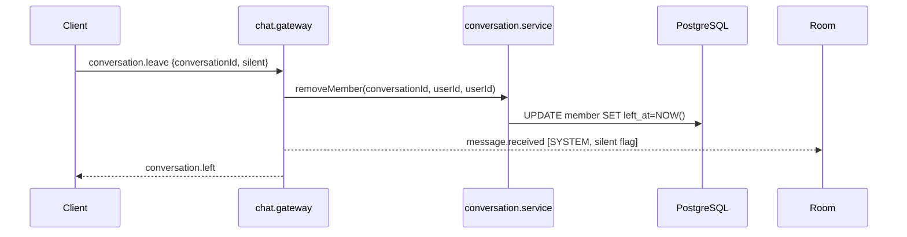
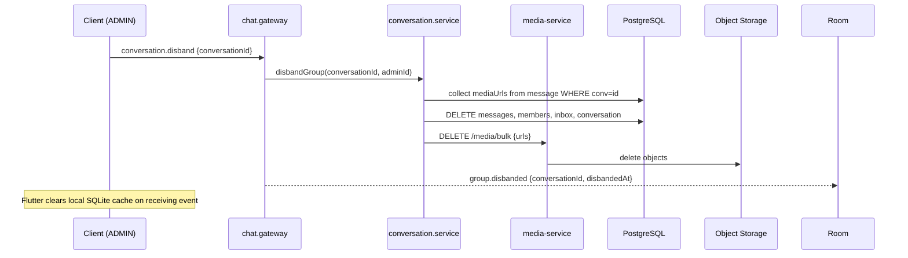

# MODULE SPEC CHAT

> [!IMPORTANT]
> Module owner: message-service plus Flutter chat provider stack.
> Last audited: 2026-04-22. All business rules below are owner-confirmed unless marked `[SPEC_ONLY]`.

---

## Outcomes

- Deterministic conversation and message lifecycle for direct and group chats.
- Real-time room-based propagation for send, read, typing, pin, and recall events.
- Consistent inbox read model for low-latency conversation list rendering.
- Enforced group governance rules: role hierarchy, disband cascade, announcement mode.

---

## Scope

### In Scope

- REST endpoints under /api/v1/conversations, /api/v1/messages, /api/v1/inbox.
- WS namespace /chat events in chat.gateway.
- Flutter ChatProvider and ChatService integration.
- Persistence entities in message-service TypeORM models.

### Out of Scope

- Media transcoding pipeline internals.
- Timeline and story feed behavior.
- Analytics aggregation consumers.

---

## Constraints

- JWT bearer authentication required for REST and WS.
- Conversation membership required for room join and message operations.
- Message server_seq monotonicity must hold per conversation (via Redis INCR).
- REST response shape wraps data through TransformInterceptor.
- Block state (from core-service block_list) must gate both send and query paths.

---

## 1. Role Taxonomy

> [!IMPORTANT]
> **Breaking change vs current code**: `MemberRole` enum must be renamed. `OWNER` → `ADMIN`, `ADMIN` → `DEPUTY`. See Decision Log D-011.

| Role (New) | Role (Old code) | Count | Vietnamese |
|---|---|---|---|
| `ADMIN` | `OWNER` | Exactly 1 per group | Trưởng nhóm |
| `DEPUTY` | `ADMIN` | 0..N per group | Phó nhóm |
| `MEMBER` | `MEMBER` | 0..N per group | Thành viên |

**Creator semantics**: The `createdBy` field in `Conversation` records the original creator. On group creation, creator is assigned `ADMIN`. After transferring admin role, creator becomes `MEMBER`; `createdBy` is kept for audit only and confers no runtime privilege.

### 1.1 Role Privilege Matrix

| Permission | ADMIN | DEPUTY | MEMBER |
|---|:---:|:---:|:---:|
| Send message (all modes) | ✅ | ✅ | ✅ (unless announcement mode) |
| Send message (announcement mode ON) | ✅ | ✅ | ❌ |
| Kick MEMBER | ✅ | ✅ | ❌ |
| Kick DEPUTY | ✅ | ❌ | ❌ |
| Kick ADMIN | ❌ | ❌ | ❌ |
| Approve / reject join requests | ✅ | ✅ | ❌ |
| Add members (direct invite) | ✅ | ✅ | depends on `allowMemberInvite` |
| Recall own messages | ✅ | ✅ | ✅ (within 24 h window) |
| Recall others' messages | ✅ | ✅ | ❌ |
| Pin / unpin (group) | ✅ | ✅ | depends on `allowMemberPin` |
| Edit group name / avatar / description | ✅ | ✅ | depends on `allowMemberEditInfo` |
| Change `joinMode` | ✅ | ❌ | ❌ |
| Toggle `onlyAdminCanPost` | ✅ | ❌ | ❌ |
| Toggle `allowMemberInvite` | ✅ | ❌ | ❌ |
| Toggle `allowMemberPin` | ✅ | ❌ | ❌ |
| Toggle `allowMemberEditInfo` | ✅ | ❌ | ❌ |
| Toggle `highlightAdminMessages` | ✅ | ❌ | ❌ |
| Toggle `showHistoryToNewMembers` | ✅ | ❌ | ❌ |
| Toggle `allowMemberCreateNote` | ✅ | ❌ | ❌ |
| Toggle `allowMemberCreatePoll` | ✅ | ❌ | ❌ |
| Promote / demote DEPUTY | ✅ | ❌ | ❌ |
| Transfer admin role | ✅ | ❌ | ❌ |
| Disband group | ✅ | ❌ | ❌ |

> **Note**: `allowMemberEditInfo` flag governs MEMBER only. DEPUTYs can always edit name/avatar/description regardless of this flag.

---

## 2. Group Membership Lifecycle

### 2.1 Create Group

```
Creator → ADMIN role assigned automatically.
createdBy field set to creator userId (audit only, no runtime privilege).
Default settings: joinMode=OPEN, memberLimit=100, onlyAdminCanPost=false,
  allowMemberInvite=true, allowMemberPin=true, allowMemberEditInfo=true,
  highlightAdminMessages=true, showHistoryToNewMembers=true,
  allowMemberCreateNote=true, allowMemberCreatePoll=true.
```

### 2.2 Leave Group (MEMBER or DEPUTY)

- Member sets `leftAt` (soft-delete), `removedBy = null`.
- System message emitted per leave mode:
  - **Regular leave** (`silent=false`): `SYSTEM` message visible to ALL members.
  - **Silent leave** (`silent=true`): `SYSTEM` message visible to ADMIN and DEPUTYs only.
- After leave: member loses access to conversation and history.



### 2.3 Leave Group (ADMIN — Trưởng nhóm)

**Rule: ADMIN cannot leave without first transferring admin role.**

```
Pre-condition: activeMembers > 1
Step 1: ADMIN selects a current active member (DEPUTY or MEMBER) as successor.
Step 2: System calls transferAdmin(conversationId, adminId, targetUserId).
  - targetUserId MUST be an active member (leftAt IS NULL). Backend enforces this.
  - targetUserId gets role=ADMIN.
  - Previous ADMIN gets role=MEMBER (never retains DEPUTY; always demoted to MEMBER).
  - System message emitted: "[Name] đã chuyển quyền trưởng nhóm cho [NewAdmin]."
Step 3: After successful transfer, ADMIN (now MEMBER) can call leave normally (§2.2).
```

> [!IMPORTANT]
> **Code gap**: `removeMember` currently has no guard blocking ADMIN self-removal when other members exist. Must add pre-check: if `requester.role === ADMIN && isSelf && activeCount > 1 → throw ForbiddenException('Transfer admin role before leaving')`.

### 2.4 Disband Group (Last Member Leaves)

**Trigger**: ADMIN is the only remaining active member AND calls leave/disband.

```
ADMIN can also explicitly call disband without leaving first.
Condition: caller.role === ADMIN.
```

**Disband Cascade (must be atomic / best-effort with saga):**

```
1. Set conversation.status = DISABLED (soft marker for audit log).
2. Hard-delete all Message rows for conversationId.
3. Hard-delete all ConversationMember rows for conversationId.
4. Hard-delete all ConversationInbox rows for conversationId.
5. Delete all media files (S3 / media-service) referenced by deleted messages.
6. Hard-delete Conversation row.
7. Emit WS event `group.disbanded` to all sockets in room conversation:{id}.
8. Frontend on receiving `group.disbanded`: delete local SQLite cache immediately.
```

> [!NOTE]
> **Implementation status**: Disband cascade and `group.disbanded` event are fully implemented as of 2026-04-26.



### 2.5 Admin Inactivity Transfer `[SPEC_ONLY]`

**Trigger**: ADMIN account is suspended/banned and shows no login activity for **14 days**.

```
Scheduled cron job (daily): scan groups where ADMIN.lastLoginAt < NOW() - 14d.
Transfer order:
  1. Oldest active DEPUTY (joinedAt ASC).
  2. If no DEPUTY: oldest active MEMBER (joinedAt ASC).
System message: "[Name] đã được tự động chỉ định làm trưởng nhóm."
```

> **Code gap**: No cron job or inactivity detection exists. Requires new scheduler in message-service or a dedicated group-management service.

---

## 3. Announcement Mode

**Field**: `onlyAdminCanPost` (boolean, default `false`) — `[SPEC_ONLY]` field, not yet in entity.

**Behaviour**:
- When `true`: only ADMIN and DEPUTY can call `sendMessage`. MEMBER attempts are rejected.
- Backend: `sendMessage` checks `conversation.onlyAdminCanPost && member.role === MEMBER → throw ForbiddenException`.
- Frontend: input bar replaced with banner — *"Chỉ trưởng và phó nhóm được gửi tin nhắn vào nhóm."* (no send button shown).

> [!NOTE]
> **Implementation status**: `onlyAdminCanPost` is fully implemented and enforced.

---

## 4. Message Rules

### 4.1 Recall

- **Who**: Sender can always recall own messages. ADMIN and DEPUTY can recall any member's message.
- **Window**: 24 hours from `createdAt` (hardcoded: `RECALL_TIME_LIMIT_MS = 86_400_000`).
- **Effect**: `status = RECALLED`, content/media fields nulled, pins and reactions deleted.
- **Inbox**: preview updated to previous non-recalled message.

### 4.2 Edit

- **Who**: Sender only.
- **Scope**: Text content only (`content` field). Media messages cannot be edited.
- **Constraint**: Cannot edit a `RECALLED` message.
- **No time limit** (no window enforced in current code).

### 4.3 Delete for Me (Xóa ở máy tôi)

- Appends `userId` to `hiddenByUsers` UUID array on the message row.
- Message not visible to this user but remains for all others.
- Does not affect inbox preview.

### 4.4 Pin / Unpin

- Direct (1:1): any member can pin. No flag check.
- Group: governed by `allowMemberPin`. If `false`, only ADMIN/DEPUTY can pin.
- Cannot pin a `RECALLED` message.

### 4.5 Block Filtering

> [!IMPORTANT]
> **Code gap**: `getMessages` query does not filter messages from blocked users.

When user A fetches messages: any message whose `senderId` is in A's block list (or who has blocked A) must be excluded from query results.

Required: join or subquery against `core-service` block_list, or maintain a Redis-cached block set per user consulted during message query.

---

## 5. System Messages

All group state transitions auto-emit a `MessageType.SYSTEM` message to the conversation.

| Event | System Message Text | Visibility |
|---|---|---|
| Member added | "[Adder] đã thêm [Member] vào nhóm." | All |
| Member kicked | "[Admin/Deputy] đã xóa [Member] khỏi nhóm." | All |
| Member left (regular) | "[Member] đã rời nhóm." | All |
| Member left (silent) | "[Member] đã rời nhóm." | ADMIN + DEPUTY only |
| Admin transferred | "[OldAdmin] đã chuyển quyền trưởng nhóm cho [NewAdmin]." | All |
| Group renamed | "[User] đã đổi tên nhóm thành "[NewName]"." | All |
| Group avatar changed | "[User] đã thay đổi ảnh nhóm." | All |
| Group disbanded | "Nhóm đã bị giải tán." | All (then socket event) |
| Admin inactivity transfer | "[NewAdmin] đã được tự động chỉ định làm trưởng nhóm." | All |

> **Code gap**: Silent leave visibility filter not implemented. Backend must pass `silent` flag to gateway and gate the broadcast accordingly.

---

## 6. Decisions

1. Keep CQRS-style `conversation_inbox` read model for inbox listing.
2. Keep Socket.IO room model as `conversation:{conversationId}`.
3. Keep REST and WS dual-write path for `message.send` compatibility.
4. Keep per-user multi-socket map for multi-device emission.
5. Rename MemberRole enum: `OWNER → ADMIN`, `ADMIN → DEPUTY` (see D-011).
6. Group disband performs immediate hard delete of messages and S3 media (no grace period).
7. `group.disbanded` is a new first-class WS event; clients must purge local cache on receipt.

---

## 7. Task Breakdown

| Task | Status | Priority | Notes |
|---|---|---|---|
| Rename `MemberRole.OWNER → ADMIN`, `ADMIN → DEPUTY` | Done | P0 | Aligned in Backend + Flutter |
| Guard ADMIN self-leave (must transfer first) | Open | P0 | Add check in removeMember |
| Implement `disbandGroup()` service method | Done | P0 | Atomic cascade: DB + S3 (partial) |
| Add `group.disbanded` WS event to chat.gateway | Done | P0 | Dispatched via event-emitter |
| Flutter: subscribe to `group.disbanded`, clear SQLite | Done | P0 | ChatProvider subscription |
| Add `onlyAdminCanPost` field to Conversation entity | Done | P1 | Implemented |
| Enforce `onlyAdminCanPost` in `sendMessage` | Done | P1 | Backend guard |
| Enforce ADMIN-only settings in `updateGroup` | Done | P0 | Whitelist implemented |
| Filter blocked-user messages in `getMessages` | Open | P1 | Core-service coordination |
| Implement silent leave broadcast filter | Open | P1 | Gateway role check |
| Admin inactivity transfer cron job (14-day) | Open | P2 | `[SPEC_ONLY]` |
| S3 bulk delete on disband | Open | P1 | Requires cross-service cleanup |
| Cleanup orphaned INBOX on leave/remove | Done | P0 | Implemented in removeMember |
| Harden conversation membership checks | Done | — | assertMember used in gateway |
| Enforce group role checks for pin/update | Done | — | service-level guards |

---

## 8. Verification

### Functional

- ADMIN cannot leave group with >1 active members without prior transfer.
- `disbandGroup` call from non-ADMIN returns 403.
- After disband: all rows purged from DB, `group.disbanded` emitted to room.
- Recall within 24 h succeeds; recall after 24 h returns 400.
- DEPUTY `sendMessage` succeeds in announcement mode; MEMBER returns 403.
- Block user: their messages excluded from `getMessages` response.

### Contract

- `MemberRole` enum values in DB, API responses, and Flutter models must align post-rename.
- `group.disbanded` event shape: `{ conversationId: string, disbandedAt: ISO8601 }`.

### Data

- `conversation_member` composite PK uniqueness holds.
- At most one row with `leftAt IS NULL` and `role = ADMIN` per group.

---

## 9. Sequence Reference

### Transfer Admin Role

```mermaid
sequenceDiagram
  participant C as ADMIN Client
  participant API as REST /conversations/:id/member/:targetId
  participant CS as conversation.service
  participant DB as PostgreSQL

  C->>API: PATCH {role: "ADMIN"}
  API->>CS: updateMember(id, adminId, targetId, {role: ADMIN})
  CS->>DB: find current ADMIN member
  CS->>DB: UPDATE current ADMIN role = MEMBER
  CS->>DB: UPDATE target role = ADMIN
  CS-->>API: updated member
  API-->>C: 200 OK
  Note over DB: targetId now ADMIN; previous ADMIN is MEMBER
```

---

## 10. Evidence

- backend/node-services/apps/message-service/src/conversation/conversation.service.ts
- backend/node-services/apps/message-service/src/conversation/conversation.controller.ts
- backend/node-services/apps/message-service/src/message/message.service.ts
- backend/node-services/apps/message-service/src/message/message.controller.ts
- backend/node-services/apps/message-service/src/gateway/chat.gateway.ts
- backend/node-services/apps/message-service/src/entities/conversation.entity.ts
- backend/node-services/apps/message-service/src/entities/conversation-member.entity.ts
- backend/node-services/apps/message-service/src/entities/message.entity.ts
- frontend/mobile/lib/features/chat/providers/chat_provider.dart
- frontend/mobile/lib/services/chat_service.dart
- frontend/mobile/lib/services/socket_service.dart
