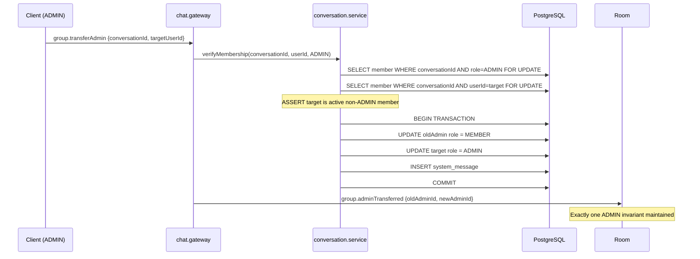
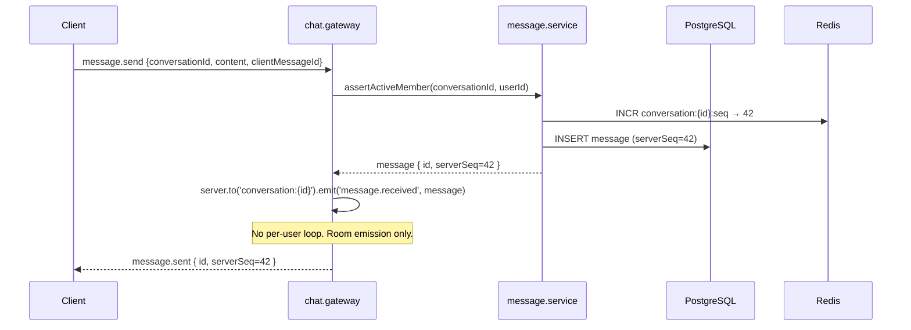

# MODULE SPEC CHAT — HARDENED

> **Authority:** This document is the **Source of Truth** for all chat-related behavior in VNALO. All statements using MUST, SHALL, and REQUIRED conform to RFC 2119. All code MUST comply with this spec. Deviations MUST be treated as security defects.

> **Module Owner:** message-service (NestJS/Node.js) + Flutter ChatProvider + Web ChatClient.
> **Status:** HARDENED — 2026-04-29. Previous unhardened drafts are superseded.

---

## PART I — SECURITY & AUTHZ: THE IRON GATE

### SG-1: Authorization Gate for All Socket.IO Events

Every signaling event MUST verify sender membership against the conversation room in real-time. Trust-by-default is **prohibited**.

**MUST Implement on Every Event:**

| Event | Authorization Check | Failure Action |
|---|---|---|
| `message.send` | Caller is active member (`leftAt IS NULL`) of `conversationId` | Emit `message.error` with code `AUTH_DENIED`, reject persistence |
| `message.typing` | Caller is active member | Silently drop — do NOT emit error to client |
| `message.read` | Caller is active member | Silently drop |
| `group.updateSettings` | Caller is active member AND role matches permission | Emit `conversation.error` with code `FORBIDDEN` |
| `group.addMembers` | Caller is active ADMIN or DEPUTY | Emit `conversation.error` with code `FORBIDDEN` |
| `group.removeMember` | Caller is active ADMIN or DEPUTY; target is MEMBER | Emit `conversation.error` with code `FORBIDDEN` |
| `group.transferAdmin` | Caller is active ADMIN only | Emit `conversation.error` with code `FORBIDDEN` |
| `group.disband` | Caller is active ADMIN only | Emit `conversation.error` with code `FORBIDDEN` |
| `conversation.join` | Caller is active member | Emit `conversation.error` with code `NOT_MEMBER` |
| `conversation.leave` | Caller is active member | No-op |
| `message.recall` | Caller is sender OR caller is ADMIN/DEPUTY | Emit `message.error` with code `FORBIDDEN` |
| `message.pin` / `message.unpin` | Caller is active member; role check if `allowMemberPin=false` | Emit `message.error` with code `FORBIDDEN` |
| `poll.create` | Caller is active ADMIN/DEPUTY OR `allowMemberCreatePoll=true` | Emit `message.error` with code `FORBIDDEN` |
| `poll.vote` | Caller is active member, has not voted | Emit `poll.error` with code `ALREADY_VOTED` or `NOT_MEMBER` |

**Implementation Pattern (MANDATORY):**

```typescript
// Every gateway handler MUST follow this pattern
@SubscribeMessage('message.send')
async handleMessageSend(@ConnectedSocket() client: Socket, @MessageBody() payload: SendMessageDto) {
  // STEP 1: Extract userId from authenticated socket
  const userId = client.data.userId;

  // STEP 2: MUST verify active membership in real-time DB query
  const membership = await this.conversationService.findActiveMember(
    payload.conversationId,
    userId,
  );

  // STEP 3: MUST reject if no active membership
  if (!membership) {
    client.emit('message.error', {
      code: 'AUTH_DENIED',
      message: 'You are not a member of this conversation.',
      conversationId: payload.conversationId,
    });
    return;
  }

  // STEP 4: MAY check additional role permissions for privileged operations
  if (requiresAdmin && membership.role !== 'ADMIN') {
    client.emit('conversation.error', { code: 'FORBIDDEN', ... });
    return;
  }

  // STEP 5: Proceed with operation
  ...
}
```

**SG-1 Anti-Patterns (PROHIBITED):**

- Caching membership in-memory without expiry
- Trusting `client.data.userId` without re-verifying on every event
- Checking membership once at `conversation.join` and assuming it persists
- Allowing `message.send` from a user who has `leftAt` set
- Allowing role-based operations without checking the current `role` field

---

### SG-2: JWT Validation Gate

**MUST be enforced at WebSocket handshake time:**

```
1. Client connects with auth.token in Socket.IO handshake
2. Gateway decodes JWT without synchronous call to core-service
3. Gateway MUST reject connection if token is:
   - Expired
   - Invalid signature
   - Missing required claims (userId, iat)
4. Gateway MUST NOT accept connections with effective `restrictedWebMode = true` from JWT unless
   explicitly allowed for the operation
```

---

## PART II — DATA INTEGRITY & TRANSACTIONAL INVARIANTS

### TI-1: Group Mutation Transactions

All group mutations that touch multiple entities MUST be executed within a single database transaction. Partial states are **prohibited**.

#### TI-1.1: Transfer Admin Role

```
REQUIRED TRANSACTION:
BEGIN
  1. SELECT * FROM conversation_member WHERE conversation_id = ? AND role = 'ADMIN' AND left_at IS NULL FOR UPDATE
  2. SELECT * FROM conversation_member WHERE conversation_id = ? AND user_id = ? AND left_at IS NULL FOR UPDATE
  3. ASSERT current admin count === 1
  4. ASSERT target is active member
  5. ASSERT target is not already ADMIN
  6. UPDATE conversation_member SET role = 'MEMBER' WHERE id = oldAdminId
  7. UPDATE conversation_member SET role = 'ADMIN' WHERE id = targetId
  8. INSERT system_message (conversation_id, type, content, sender_id, created_at)
COMMIT
```

**Invariant:** At all times, there MUST be exactly one ADMIN with `left_at IS NULL` per group conversation. This MUST be enforced by a DB unique constraint and application-level assertion.

#### TI-1.2: Remove Member

```
REQUIRED TRANSACTION:
BEGIN
  1. SELECT membership WHERE conversation_id = ? AND user_id = ? AND left_at IS NULL FOR UPDATE
  2. ASSERT caller role is ADMIN or DEPUTY
  3. ASSERT target role is not ADMIN (ADMINs cannot be removed)
  4. UPDATE conversation_member SET left_at = NOW(), removed_by = callerId WHERE id = targetId
  5. DELETE FROM conversation_inbox WHERE conversation_id = ? AND user_id = ?  (orphaned inbox)
  6. INSERT system_message (member_removed)
  7. ASSERT final active ADMIN count >= 1
COMMIT
```

**Invariant:** Removing the last ADMIN MUST leave the group in a state where another ADMIN or DEPUTY exists, or the group is immediately disbanded. This MUST be enforced atomically.

#### TI-1.3: Disband Group

```
REQUIRED TRANSACTION:
BEGIN
  1. SELECT conversation WHERE id = ? AND status IS NOT 'DISABLED' FOR UPDATE
  2. ASSERT caller role = ADMIN
  3. UPDATE conversation SET status = 'DISABLED', disbanded_at = NOW() WHERE id = ?
  4. DELETE FROM message WHERE conversation_id = ?          (cascade)
  5. DELETE FROM pinned_message WHERE conversation_id = ?     (cascade)
  6. DELETE FROM message_reaction WHERE message_id IN (SELECT id FROM message WHERE conversation_id = ?)
  7. DELETE FROM conversation_inbox WHERE conversation_id = ?
  8. DELETE FROM conversation_member WHERE conversation_id = ?
  9. DELETE FROM conversation WHERE id = ?
COMMIT
```

After transaction commits successfully:

```
10. ASYNC: Collect all media URLs from deleted messages (file references only, DB is already clean)
11. ASYNC: Publish Kafka event GROUP_DISBANDED_MEDIA_CLEANUP with URL list
12. ASYNC: media-service consumes event and deletes S3/local files
13. Emit WebSocket event 'group.disbanded' to conversation:{id} room
```

**Invariant:** No orphaned rows. No messages without a conversation. No conversation without exactly one ADMIN when members remain.

#### TI-1.4: Leave Group (ADMIN Transfer-First Rule)

```
PRE-CONDITION (enforced at API layer):
  IF caller.role === ADMIN AND activeMemberCount > 1:
    REJECT with code 'ADMIN_MUST_TRANSFER'
    client MUST call transferAdmin first

TRANSACTION (for non-ADMIN or last-member ADMIN):
BEGIN
  1. UPDATE conversation_member SET left_at = NOW() WHERE id = membershipId
  2. DELETE FROM conversation_inbox WHERE conversation_id = ? AND user_id = ?
  3. INSERT system_message (member_left, silent flag)
COMMIT
```

---

### TI-2: Message Sequence Integrity

**MUST be enforced per conversation:**

```
serverSeq generation:
  1. Redis INCR conversation:{id}:seq
  2. Result becomes message.serverSeq
  3. Idempotent: if same clientMessageId resubmitted, return existing serverSeq (duplicate guard)
```

**Invariant:** `serverSeq` MUST be monotonically increasing per conversation. No gaps are allowed in normal operation. Out-of-order delivery is a protocol error.

---

### TI-3: Block State Filtering

```
REQUIRED:
  getMessages(conversationId, userId):
    1. Build block_set = blocked_users + blockers (bidirectional union)
    2. SELECT * FROM message WHERE conversation_id = ? AND sender_id NOT IN (block_set)
    3. Enforce this for ALL message queries including inbox preview
```

**Implementation:** Maintain Redis-cached block set per user (`block_set:{userId}`). Invalidate on `block` / `unblock` events via Kafka. TTL: 1 hour. On cache miss, rebuild from PostgreSQL.

---

## PART III — REAL-TIME OPTIMIZATION: LATENCY ZERO

### LZ-1: Gateway Emission Strategy

**Room-based emission is the ONLY permitted broadcast strategy. Redundant per-user loops are PROHIBITED.**

#### LZ-1.1: Message Broadcast

```
SEND: message.send { conversationId }
  → Fetch conversation.members (active only)
  → Assign serverSeq via Redis INCR
  → Persist message to PostgreSQL
  → Emit to conversation room:
      server.to('conversation:{id}').emit('message.received', message)
  → No per-user loop. Room emission reaches ALL sockets in the room.
```

#### LZ-1.2: Typing / Read Indicators

```
SEND: message.typing { conversationId, isTyping }
  → Verify caller membership (SG-1)
  → Emit to room excluding the emitting socket:
      client.to('conversation:{id}').emit('message.typing', { userId, conversationId, isTyping })
  → PROHIBITED: Looping over members array and calling emitToUser() for each
```

#### LZ-1.3: Group Membership Events

```
SEND: group.member_added, group.member_removed, group.admin_transferred, group.updated
  → server.to('conversation:{id}').emit(event, payload)
  → PROHIBITED: Per-user loop emission
```

#### LZ-1.4: Anti-Patterns (PROHIBITED)

```typescript
// ❌ PROHIBITED: Per-user loop
for (const member of members) {
  this.server.to(member.userId).emit('message.received', message);
}

// ✅ REQUIRED: Room-based emission
this.server.to(`conversation:${conversationId}`).emit('message.received', message);
```

---

### LZ-2: Presence Broadcast Optimization

```
presence.changed MUST be scoped to mutual contact graph.
Global broadcast (server.emit without room) is PROHIBITED in production.
```

**Target implementation:**
```
1. Fetch mutual contacts of userId from Redis cache or DB
2. For each mutual contact: emitToUser(contactId, 'presence.changed', payload)
3. Maximum broadcast fanout: 1000 contacts per presence change
```

---

## PART IV — ERROR RESILIENCE & SESSION MANAGEMENT

### ER-1: Global Client-Side Error Handling

**Client-side interceptors MUST handle error responses by triggering a global logout flow and clearing local cache. Silent failures are PROHIBITED.**

#### ER-1.1: HTTP Interceptor (Flutter + Web)

```dart
// Flutter interceptor pattern (REQUIRED)
class AuthInterceptor extends Interceptor {
  @override
  void onError(DioException err, ErrorInterceptorHandler handler) {
    switch (err.response?.statusCode) {
      case 401:
        // MUST: Clear all local auth state
        AuthProvider.of(context).globalLogout(
          reason: 'UNAUTHORIZED',
          clearCache: true,
          clearTokens: true,
        );
        break;
      case 403:
        // MUST: Clear conversation state if banned/removed
        ChatProvider.of(context).evictConversation(err.response?.data['conversationId']);
        break;
      case 409:
        // MAY: Conflict resolution (e.g., duplicate message)
        handler.next(err);
        break;
      default:
        // MUST NOT silently swallow
        handler.next(err);
    }
  }
}
```

```typescript
// Web Axios interceptor pattern (REQUIRED)
mediaApi.interceptors.response.use(
  res => res,
  err => {
    if (err.response?.status === 401 || err.response?.status === 403) {
      window.dispatchEvent(new CustomEvent('vnalo:auth:revoked', {
        detail: { status: err.response.status, path: err.config.url }
      }));
    }
    return Promise.reject(err);
  }
);
```

#### ER-1.2: Socket.IO Error Events

```
Server MUST emit structured error events for all failure cases:
{
  code: string,      // REQUIRED: machine-readable error code
  message: string,  // REQUIRED: human-readable message
  details?: object  // OPTIONAL: additional context
}
```

**Client MUST handle these error events:**

| Event | Handler Action |
|---|---|
| `message.error` with `AUTH_DENIED` | Remove message from optimistic UI, show toast |
| `message.error` with `AUTH_DENIED` + recurring | Trigger re-authentication |
| `conversation.error` with `FORBIDDEN` | Refresh conversation state |
| `conversation.error` with `NOT_MEMBER` | Navigate away from conversation, clear local state |
| `poll.error` | Remove optimistic vote, show error |

---

## PART V — MEDIA CATEGORY & UPLOAD INTEGRITY

### MC-1: Media Category Enum Mapping (MANDATORY)

Frontend MUST send exact enum values matching Java `MediaCategory`. Invalid values MUST result in HTTP 400.

| File Type | Enum Value | Notes |
|---|---|---|
| `image/*` | `CHAT_IMAGE` | Only MIME type starting with `image/` |
| `video/*` | `CHAT_VIDEO` | Only MIME type starting with `video/` |
| Document | `CHAT_FILE` | Default fallback |
| User avatar | `AVATAR` | Profile picture uploads only |
| Group avatar | `COVER` | Group cover images |
| Sticker | `STICKER` | Chat sticker uploads |
| Emoji | `EMOJI` | Animated emoji/GIF |
| Story | `STORY` | Story/timeline uploads |
| Timeline | `TIMELINE` | Timeline post media |

**PROHIBITED values:** `'CHAT'`, `'MESSAGE'`, `'IMAGE'`, `'VIDEO'`, `'FILE'`, `'DEFAULT'`, any value not defined in Java enum.

### MC-2: Media URL Resolution

```
resolveMediaUrl(url):
  IF url starts with 'blob:' → return as-is (local preview)
  IF url starts with 'http://localhost' OR 'http://127.0.0.1' OR 'https://localhost' OR 'https://127.0.0.1':
    → replace hostname with window.location.origin
  IF url is relative path:
    → prefix with window.location.origin
  IF url is absolute S3/CDN URL:
    → return as-is
```

---

## PART VI — ROLE TAXONOMY & PRIVILEGE MATRIX

### Role Definitions

| Role | Vietnamese | Count per Group | Runtime Privilege |
|---|---|---|---|
| `ADMIN` | Trưởng nhóm | Exactly 1 | Full control |
| `DEPUTY` | Phó nhóm | 0..N | Delegated admin functions |
| `MEMBER` | Thành viên | 0..N | Send, recall own |

**Note:** `createdBy` field is audit-only and confers no runtime privilege.

### Privilege Matrix

| Permission | ADMIN | DEPUTY | MEMBER |
|---|---|---|---|
| Send message (normal mode) | ✅ | ✅ | ✅ |
| Send message (`onlyAdminCanPost=true`) | ✅ | ✅ | ❌ |
| Recall own message (24h window) | ✅ | ✅ | ✅ |
| Recall others' messages | ✅ | ✅ | ❌ |
| Kick MEMBER | ✅ | ✅ | ❌ |
| Kick DEPUTY | ✅ | ❌ | ❌ |
| Kick ADMIN | ❌ | ❌ | ❌ |
| Transfer admin role | ✅ | ❌ | ❌ |
| Disband group | ✅ | ❌ | ❌ |
| Edit group name/avatar | ✅ | ✅ | If `allowMemberEditInfo=true` |
| Pin / unpin | ✅ | ✅ | If `allowMemberPin=true` |
| Toggle `onlyAdminCanPost` | ✅ | ❌ | ❌ |
| Toggle `joinMode` | ✅ | ❌ | ❌ |
| Create poll | ✅ | ✅ | If `allowMemberCreatePoll=true` |
| Vote in poll | ✅ | ✅ | ✅ |
| Approve join requests | ✅ | ✅ | ❌ |

---

## PART VII — TRANSACTIONAL STATE MACHINE

### Group State Transitions

```
                    [Group Created]
                          │
                          ▼
                   ┌──────────────┐
     ┌─────────────│    ACTIVE    │────────────┐
     │             └──────────────┘            │
     │  [ADMIN transfers] │ [ADMIN leaves]     │ [Disband]
     ▼                   ▼                     ▼
[ADMIN changed]    [Transfer + Leave]    ┌─────────┐
     │                   │                │DISABLED│
     │                   ▼                └─────────┘
     └──────────► [ADMIN transfers] ───────►┘
```

---

## PART VIII — SEQUENCE DIAGRAMS

### Transfer Admin Role



### Send Message (Room Emission)



---

## PART IX — AUDIT REFERENCE

### Existing Code Evidence

| Component | File | SG Compliance |
|---|---|---|
| Chat gateway handlers | `message-service/src/gateway/chat.gateway.ts` | Partial — SG-1 MUST be enforced on all events |
| Conversation service | `message-service/src/conversation/conversation.service.ts` | Partial — transaction wrapping required |
| JWT strategy | `message-service/src/auth/jwt.strategy.ts` | SG-2 compliant |
| Message service | `message-service/src/message/message.service.ts` | TI-2 compliant |
| Media category | `media-service/src/.../MediaCategory.java` | MC-1 authoritative source |

### Open Security Gaps (MUST REMEDIATE)

| Gap | Severity | Section | Owner |
|---|---|---|---|
| `message.typing` silent drop without SG-1 check | CRITICAL | SG-1 | message-service |
| Per-user loop in `message.send` broadcast | HIGH | LZ-1 | message-service |
| `presence.changed` global broadcast | HIGH | LZ-2 | message-service |
| Block filtering missing in `getMessages` | CRITICAL | TI-3 | message-service |
| `group.member_added/removed/left` events not emitted | HIGH | SG-1 | message-service |
| Redis block cache not implemented | HIGH | TI-3 | message-service |
| `restrictedWebMode` forced to `false` | MEDIUM | SG-2 | message-service |

---

## PART X — COMMANDMENTS (RFC 2119 Summary)

1. **EVERY** Socket.IO event handler **MUST** verify active membership in real-time (SG-1)
2. **EVERY** group mutation **MUST** execute within a single database transaction (TI-1)
3. **EVERY** broadcast **MUST** use room-based emission; per-user loops are **PROHIBITED** (LZ-1)
4. **EVERY** 401/403 response **MUST** trigger global logout flow; silent failures are **PROHIBITED** (ER-1)
5. **EVERY** message **MUST** receive a monotonically increasing `serverSeq` via Redis INCR (TI-2)
6. **EVERY** `getMessages` call **MUST** filter blocked users bidirectionally (TI-3)
7. Media category **MUST** match Java `MediaCategory` enum exactly; no invented values (MC-1)
8. Presence broadcast **MUST** be scoped to mutual contacts; global broadcast is **PROHIBITED** (LZ-2)
9. `createdBy` field **MUST NOT** confer runtime privilege; `role` field **IS** the runtime authority
10. Exactly one ADMIN with `left_at IS NULL` **MUST** exist per active group at all times (TI-1 invariant)
