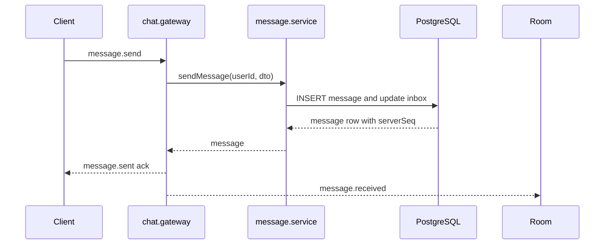

# MODULE SPEC CHAT

> [!IMPORTANT]
> Module owner: message-service plus Flutter chat provider stack.

## Outcomes

- Deterministic conversation and message lifecycle for direct and group chats.
- Real-time room-based propagation for send, read, typing, pin, and recall events.
- Consistent inbox read model for low-latency conversation list rendering.

## Scope

### In Scope

- REST endpoints under /api/v1/conversations, /api/v1/messages, /api/v1/inbox.
- WS namespace /chat events in chat.gateway.
- Flutter ChatProvider and ChatService integration.
- Persistence entities in message-service TypeORM models.

### Out of Scope

- Media transcoding pipeline internals.
- Timeline and story feed behavior.
- Analytics aggregation consumers.

## Constraints

- JWT bearer authentication required for REST and WS.
- Conversation membership required for room join and message operations.
- Message server_seq monotonicity must hold per conversation.
- REST response shape wraps data through TransformInterceptor.

## Decisions

1. Keep CQRS-style conversation_inbox read model for inbox listing.
2. Keep Socket.IO room model as conversation:{conversationId}.
3. Keep REST and WS dual-write path for message.send compatibility.
4. Keep per-user multi-socket map for multi-device emission.

## Task Breakdown

| Task | Status | Notes |
| --- | --- | --- |
| Harden conversation membership checks | Done | assertMember used in gateway and services |
| Enforce group role checks for member update and pin policy | Done | service-level guards in conversation.service |
| Ensure call offer offline publish fallback | Done | CALL_OFFLINE publish in chat.gateway emitToUser |
| Add structured domain error codes for Node service | Open | still using plain Nest exceptions/messages |
| Reduce global presence over-broadcast in chat.gateway | Open | currently uses server.emit on connect and disconnect |

## Verification

### Functional

- Send message via WS message.send and verify message.received in joined room.
- Recall message and verify message.recalled broadcast.
- Pin and unpin path reflected in pinned list and WS events.
- Join group as non-member should fail with error event.

### Contract

- API endpoints and payloads match Layer 3 API and Socket schemas.
- Message status transitions preserve SENT, DELIVERED, RECALLED semantics.

### Data

- conversation_member composite PK uniqueness holds.
- message unique constraints for conversationId+serverSeq and senderId+clientMessageId hold.

## Sequence Reference

## Evidence

- backend/node-services/apps/message-service/src/conversation/conversation.controller.ts
- backend/node-services/apps/message-service/src/conversation/conversation.service.ts
- backend/node-services/apps/message-service/src/message/message.controller.ts
- backend/node-services/apps/message-service/src/message/message.service.ts
- backend/node-services/apps/message-service/src/gateway/chat.gateway.ts
- frontend/mobile/lib/features/chat/providers/chat_provider.dart
- frontend/mobile/lib/services/chat_service.dart
- frontend/mobile/lib/services/socket_service.dart
