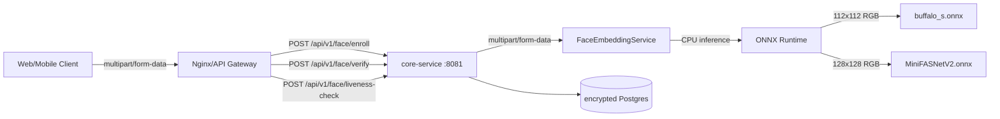

# MODULE SPEC - FACE AUTHENTICATION

> Status: Implemented (backend Phase 1)
> Last reconciled: 2026-05-23
> Source-of-truth: FaceAuthController, FaceEnrollmentService, FaceVerificationService, FaceEmbeddingService

## 1. Purpose

Face authentication provides biometric enrollment and verification for VNALO Lite. It enables users to enroll their face once, then verify their identity on subsequent logins using face recognition instead of password. Anti-spoofing via liveness detection prevents replay attacks with photos or videos.

## 2. Architecture



### 2.1 ONNX Models

| Model | Input Shape | Output | Latency | Purpose |
|---|---|---|---|---|
| buffalo_s.onnx | [1][3][112][112] | 512-D L2-normalized ArcFace embedding | ~15-35ms t3.large | Face embedding extraction |
| MiniFASNetV2.onnx | [1][3][128][128] | Binary liveness score (0=spoof, 1=live) | ~5-10ms t3.large | Anti-spoofing detection |

Both models run CPU-only via ONNX Runtime. No GPU required.

## 3. Configuration

### 3.1 Environment Variables

| Variable | Required | Default | Description |
|---|---|---|---|
| `FACE_AUTH_ENABLED` | yes before enable | `false` | Master toggle for face auth feature |
| `FACE_ENCRYPTION_KEY` | yes before enable | - | 32-byte hex key for AES-256-GCM encryption |
| `FACE_MODEL_PATH` | no | `classpath:models` | Path to ONNX model files |
| `FACE_VERIFICATION_THRESHOLD` | no | `0.65` | Cosine similarity threshold for verification |
| `FACE_LIVENESS_THRESHOLD` | no | `0.70` | Score threshold for liveness pass |
| `FACE_ENROLLMENT_ENABLED` | no | `true` | Allow new enrollments |
| `FACE_VERIFICATION_ENABLED` | no | `true` | Allow verification requests |

### 3.2 Database Schema

**Table: `face_enrollments`**

| Column | Type | Constraints |
|---|---|---|
| `id` | UUID | PK |
| `user_id` | UUID | FK, unique, not null |
| `embedding_data` | TEXT | not null (AES-256-GCM encrypted JSON) |
| `enrolled_at` | TIMESTAMPTZ | not null, default now() |
| `updated_at` | TIMESTAMPTZ | not null |
| `is_active` | BOOLEAN | not null, default true |
| `version` | INTEGER | not null, default 1 |
| `liveness_score` | DOUBLE PRECISION | nullable |
| `quality_score` | DOUBLE PRECISION | nullable |
| `device_info` | JSONB | nullable |

**Table: `face_verification_logs`**

| Column | Type | Constraints |
|---|---|---|
| `id` | UUID | PK |
| `user_id` | UUID | FK, nullable (null for public verification) |
| `verified` | BOOLEAN | not null |
| `confidence` | DOUBLE PRECISION | not null |
| `liveness_score` | DOUBLE PRECISION | nullable |
| `threshold` | DOUBLE PRECISION | not null |
| `decision` | VARCHAR(20) | not null |
| `ip_address` | VARCHAR(45) | nullable |
| `device_id` | VARCHAR(255) | nullable |
| `app_version` | VARCHAR(50) | nullable |
| `inference_time_ms` | BIGINT | nullable |
| `created_at` | TIMESTAMPTZ | not null, default now() |

Indexes: `face_enrollments(user_id, is_active)`, `face_verification_logs(user_id, created_at)`.

## 4. API Contract

### 4.1 Enroll Face

`POST /api/v1/face/enroll`
Auth: JWT required

Request: `multipart/form-data`

| Param | Type | Required | Default | Description |
|---|---|---|---|---|
| `image` | file | yes | - | Face image (JPEG/PNG, max 10MB) |
| `livenessScore` | double | no | 1.0 | Client-reported liveness score |
| `qualityScore` | double | no | 1.0 | Client-reported quality score |
| `deviceInfo` | string | no | - | JSON device metadata |

Response `200 OK`:

```json
{
  "success": true,
  "data": {
    "success": true,
    "enrolledAt": "2026-05-23T15:30:00Z",
    "livenessScore": 0.85,
    "version": 1
  }
}
```

Error codes: FACE_001, FACE_002, FACE_003, FACE_004, FACE_006, FACE_007, FACE_008, FACE_009.

### 4.2 Verify Face

`POST /api/v1/face/verify`
Auth: Public (no JWT required for verification of any user)

Request: `multipart/form-data`

| Param | Type | Required | Description |
|---|---|---|---|
| `image` | file | yes | Face image (JPEG/PNG, max 10MB) |
| `userId` | UUID | yes | Target user to verify against |
| `livenessScore` | double | no | Client-reported liveness score |

Response `200 OK`:

```json
{
  "success": true,
  "data": {
    "verified": true,
    "confidence": 0.82,
    "threshold": 0.65,
    "decision": "ACCEPT",
    "inferenceTimeMs": 45
  }
}
```

Error codes: FACE_001, FACE_002, FACE_003, FACE_004, FACE_005, FACE_006, FACE_008, FACE_009, FACE_010.

### 4.3 Liveness Check

`POST /api/v1/face/liveness-check`
Auth: Public

Request: `multipart/form-data`

| Param | Type | Required | Description |
|---|---|---|---|
| `image` | file | yes | Face image (JPEG/PNG, max 10MB) |

Response `200 OK`:

```json
{
  "success": true,
  "data": {
    "isLive": true,
    "score": 0.85,
    "threshold": 0.70,
    "pass": true
  }
}
```

Error codes: FACE_001, FACE_002, FACE_008, FACE_009.

### 4.4 Get Enrollment Status

`GET /api/v1/face/status`
Auth: JWT required

Response `200 OK` (enrolled):

```json
{
  "success": true,
  "data": {
    "enrolled": true,
    "enrolledAt": "2026-05-23T15:30:00Z",
    "version": 1
  }
}
```

Response `200 OK` (not enrolled):

```json
{
  "success": true,
  "data": {
    "enrolled": false
  }
}
```

### 4.5 Delete Enrollment

`DELETE /api/v1/face/enrollment`
Auth: JWT required

Response `200 OK`:

```json
{
  "success": true,
  "message": "Face enrollment deleted",
  "data": null
}
```

### 4.6 Service Health

`GET /api/v1/face/health`
Auth: Public

Response `200 OK`:

```json
{
  "success": true,
  "data": {
    "enabled": true,
    "modelReady": true,
    "timestamp": "2026-05-23T15:30:00Z"
  }
}
```

## 5. Error Codes

| Code | Name | HTTP Status | Description |
|---|---|---|---|
| FACE_001 | `FACE_NO_FACE_DETECTED` | 400 | No face found in image |
| FACE_002 | `FACE_MULTIPLE_FACES` | 400 | Multiple faces detected |
| FACE_003 | `FACE_LOW_QUALITY` | 400 | Image quality too low |
| FACE_004 | `FACE_LIVENESS_FAILED` | 400 | Anti-spoofing check failed |
| FACE_005 | `FACE_MISMATCH` | 401 | Face does not match enrolled |
| FACE_006 | `FACE_NOT_ENROLLED` | 404 | User has not enrolled |
| FACE_007 | `FACE_ALREADY_ENROLLED` | 409 | User already enrolled (use re-enroll instead) |
| FACE_008 | `FACE_MODEL_ERROR` | 500 | ONNX inference failed |
| FACE_009 | `FACE_SERVICE_UNAVAILABLE` | 503 | Feature disabled or model not ready |
| FACE_010 | `FACE_RATE_LIMITED` | 429 | Too many requests |

## 6. Security Design

### 6.1 Embedding Encryption

Face embeddings are stored using AES-256-GCM encryption:

- Algorithm: AES/GCM/NoPadding (256-bit key)
- IV: 12 bytes, randomly generated per encryption
- Stored format: `base64(IV + ciphertext + authTag)`
- Key: provisioned via `FACE_ENCRYPTION_KEY` environment variable

Encryption/decryption happens in `FaceEncryptionService`. The raw embedding vector is never stored unencrypted.

### 6.2 Verification Flow

```
1. Client captures face image from camera
2. Client optionally performs client-side liveness check (e.g., blink detection)
3. Client sends image + liveness score to /face/verify
4. Server extracts embedding via ArcFace ONNX model
5. Server loads encrypted enrollment from DB
6. Server decrypts enrolled embedding
7. Server computes cosine similarity between probe and enrolled embedding
8. Server applies threshold (default 0.65)
9. Server logs result to face_verification_logs
10. Server returns verification decision
```

### 6.3 Enrollment Flow

```
1. Client captures face image from camera
2. Client optionally performs client-side quality check
3. Client sends image + scores to /face/enroll
4. Server validates no existing active enrollment (or allows re-enroll to update)
5. Server extracts embedding via ArcFace ONNX model
6. Server encrypts embedding with AES-256-GCM
7. Server stores in face_enrollments table
8. Server returns enrollment confirmation
```

## 7. Deployment Requirements

### 7.1 ONNX Model Files

The following files must be available on the classpath or filesystem:

| File | Location | Size |
|---|---|---|
| buffalo_s.onnx | `classpath:models/buffalo_s.onnx` | ~6 MB |
| MiniFASNetV2.onnx | `classpath:models/MiniFASNetV2.onnx` | ~600 KB |

In Docker, mount models as a volume:

```yaml
volumes:
  - ./models:/app/models:ro
environment:
  FACE_MODEL_PATH: file:/app/models
```

### 7.2 Startup Checklist

1. Set `FACE_AUTH_ENABLED=true`
2. Generate and set `FACE_ENCRYPTION_KEY` (32-byte hex = 64 characters)
3. Verify ONNX model files are accessible
4. Verify database migration V27 has run
5. Call `GET /api/v1/face/health` to confirm `modelReady: true`

## 8. Future Considerations

| Item | Priority | Notes |
|---|---|---|
| Client-side face detection/cropping | P1 | Reduces bandwidth, improves privacy |
| Rate limiting per user/IP | P1 | FACE_010 is defined but not yet enforced |
| S3 storage for embedding backup | P2 | Currently encrypted in Postgres only |
| GPU acceleration | P2 | ONNX supports CUDA, currently CPU-only |
| Multiple face templates | P2 | Allow enrollment of multiple angles |
| Face liveness challenge-response | P2 | e.g., "turn head left", "blink" |
| Re-enrollment versioning | P2 | Currently re-enroll overwrites; version counter tracks updates |

## 9. Verification Checklist

| Check | Command / Method |
|---|---|
| Backend unit tests pass | `./mvnw test -pl services/core-service -Dtest=Face*Test` |
| Enrollment flow | Manual: enroll face, verify status returns enrolled |
| Verification flow | Manual: enroll face, verify with matching image = ACCEPT |
| Mismatch flow | Manual: enroll face A, verify with face B = REJECT |
| Delete flow | Manual: delete enrollment, verify status returns not enrolled |
| Service health | `curl /api/v1/face/health` returns modelReady=true |
| Encryption integrity | Verify embeddings in DB are not human-readable |

## 10. Evidence

- `backend/java-services/services/core-service/src/main/java/iuh/cnm/vnalo/core_service/controller/FaceAuthController.java`
- `backend/java-services/services/core-service/src/main/java/iuh/cnm/vnalo/core_service/service/face/FaceEnrollmentService.java`
- `backend/java-services/services/core-service/src/main/java/iuh/cnm/vnalo/core_service/service/face/FaceVerificationService.java`
- `backend/java-services/services/core-service/src/main/java/iuh/cnm/vnalo/core_service/service/face/FaceEmbeddingService.java`
- `backend/java-services/services/core-service/src/main/java/iuh/cnm/vnalo/core_service/service/face/FaceEncryptionService.java`
- `backend/java-services/services/core-service/src/main/java/iuh/cnm/vnalo/core_service/service/face/FaceImageProcessingService.java`
- `backend/java-services/services/core-service/src/main/java/iuh/cnm/vnalo/core_service/config/FaceAuthProperties.java`
- `backend/java-services/services/core-service/src/main/resources/db/migration/V27__add_face_auth.sql`
- `backend/java-services/services/core-service/src/main/resources/application.yml`
- `backend/java-services/services/core-service/src/test/java/iuh/cnm/vnalo/core_service/service/face/`
