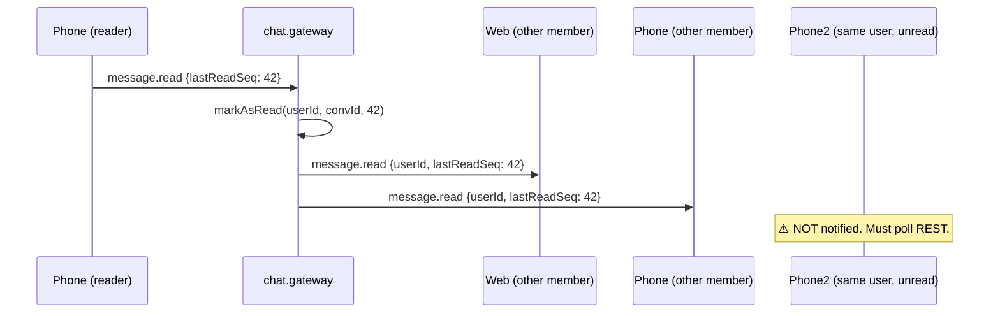
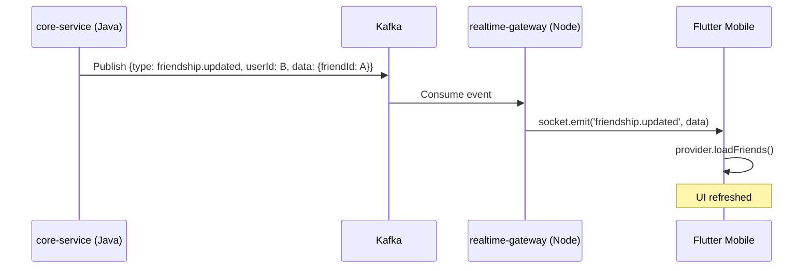

# MODULE SPEC REALTIME SYNC

> [!IMPORTANT]
> Module owner: message-service chat.gateway + Flutter SocketService.
> Last audited: 2026-04-22. All rules derived from code-first scan of chat.gateway.ts unless marked `[SPEC_ONLY]`.

---

## Outcomes

- Every connected device of a user receives chat events in real-time.
- Presence state accurately reflects whether a user has at least one active connection.
- Read receipts, typing indicators, and group membership events are synchronized instantly across all platforms.
- Clients that are offline or join late can recover state via REST pull (no event replay).

---

## Scope

### In Scope

- Multi-device delivery rules (mobile + web).
- Presence (online/offline) detection and broadcast.
- Per-event broadcast strategy (room vs. per-user socket vs. sender-only).
- Platform access control (`clientPlatform`, `restrictedWebMode`).
- Offline fallback for call signaling (Redis CALL_OFFLINE).
- Real-time Friendship and Contact synchronization (Kafka-to-Socket bridge).
- New `group.disbanded` event delivery.

### Out of Scope

- Push notification delivery (FCM / APNs) — downstream of CALL_OFFLINE.
- Message store-and-forward for non-call events.
- /realtime gateway namespace (presence federation — separate concern).

---

## 1. Connection Model

### 1.1 Multi-Device Socket Map

The gateway maintains an in-memory map:

```
userSockets: Map<userId, Set<socketId>>
```

- Each time a user opens the app (mobile) or opens the web tab, a new socket is added to their set.
- A single user can have **N sockets** simultaneously (phone + tablet + web).
- Events targeting a user are delivered to **all sockets** in their set via `emitToUser()`.

```
emitToUser(userId, event, data):
  for socketId in userSockets[userId]:
    server.to(socketId).emit(event, data)
```

### 1.2 Conversation Rooms

Each conversation has a Socket.IO room: `conversation:{conversationId}`.

- A socket joins a room by emitting `conversation.join`.
- A socket must join **each** conversation room it needs to receive messages from.
- Room membership is per-socket, not per-user. If a user has 2 sockets, each socket must independently join the room.

> [!IMPORTANT]
> **Implication for clients**: On reconnect, clients must re-emit `conversation.join` for all active conversations. The server does NOT auto-rejoin sockets to rooms on reconnect.

### 1.3 Client Platform Identity

At connection, the JWT payload is parsed:

| Field | Source | Default |
|---|---|---|
| `clientPlatform` | JWT claim `clientPlatform` | `'WEB'` |
| `restrictedWebMode` | **Hardcoded to `false`** (D-008) | `false` |
| `loginAtEpochSec` | JWT claim `iat` | token issuance time |
| `deviceId` | JWT claim `deviceId` | `null` |

> [!WARNING]
> `restrictedWebMode` is currently forced to `false` regardless of JWT content (D-008). Web session restrictions are only enforced in service-level guards, not at the gateway connection layer.

---

## 2. Presence Rules

### 2.1 Online Detection

A user is considered **online** if and only if `userSockets[userId].size > 0`.

### 2.2 Presence Broadcast on Connect

```
handleConnection → userSockets[userId].add(socketId)
                 → server.emit('presence.changed', { userId, status: 'online' })
```

> [!WARNING]
> `server.emit()` is a **global broadcast** — sent to every connected socket across all users. This is an over-broadcast anti-pattern (known issue in Task Breakdown). For large deployments, this should be scoped to mutual contacts only.

### 2.3 Presence Broadcast on Disconnect

```
handleDisconnect → userSockets[userId].delete(socketId)
                 → if userSockets[userId].size === 0:
                     server.emit('presence.changed', { userId, status: 'offline' })
```

**Rule**: `presence.changed { status: 'offline' }` is only emitted when the user's **last socket** disconnects. If a user has web + mobile connected and closes the web tab, they remain online.

### 2.4 Cross-Device Presence Sync

| Scenario | Result |
|---|---|
| User opens app on phone → already on web | `presence.changed: online` broadcast (redundant but harmless) |
| User closes phone → web still connected | No `offline` broadcast. Status stays `online`. |
| User closes both phone and web | `offline` broadcast sent once, after last socket gone. |
| User force-kills app (no graceful disconnect) | Socket.IO heartbeat timeout triggers `handleDisconnect`. ~30s delay. |

### 2.5 Presence Payload

```json
{
  "userId": "uuid",
  "status": "online" | "offline"
}
```

> [!NOTE]
> `/realtime` namespace emits an extended presence object with `{ userId, status, lastSeen }`. The `/chat` namespace is simplified and does not include `lastSeen`.

---

## 3. Message Delivery

### 3.1 Dual Delivery Strategy

When a message is sent via `message.send`, the gateway performs **two parallel delivery paths**:

**Path A — Room broadcast** (for clients currently in the chat screen):
```
server.to('conversation:{id}').emit('message.received', message)
```
Reaches all sockets that have joined the room (i.e., the chat is open).

**Path B — Per-user direct emit** (for inbox update on clients NOT in the chat):
```
for member in conversation.members:
  emitToUser(member.userId, 'message.received', message)
```
Reaches all sockets of each member regardless of room membership.

> **Result**: A `message.received` event may be received **twice** by a client that is both in the room and has message delivery via Path B. Clients must deduplicate by `message.id` or `clientMessageId`.

**Sender confirmation** (separate from above):
```
client.emit('message.sent', message)   // sent only to the emitting socket
```

### 3.2 Multi-Device Message Delivery

| User state | Delivery |
|---|---|
| User has mobile + web, both in chat room | Both sockets receive `message.received` via Path A |
| User has mobile (in chat) + web (not in room) | Mobile via Path A; Web via Path B `emitToUser` |
| User offline (no sockets) | Message persists in DB. Delivered on next `conversation.join` via REST pull. No store-and-forward for `message.received`. |

### 3.3 Idempotency

Clients must deduplicate `message.received` events using:
- `message.id` (server UUID), or
- `clientMessageId` (client-generated UUID, per sender+client only)

---

## 4. Read Receipts

### 4.1 Emit Strategy

`message.read` uses `client.to(room)` — **excludes sender's emitting socket**.

```json
{
  "userId": "uuid",
  "conversationId": "uuid",
  "lastReadSeq": 123
}
```

### 4.2 Multi-Device Read Sync

> [!IMPORTANT]
> **Known gap**: If a user reads a conversation on their phone, their other connected devices (tablet, web) do NOT receive a `message.read` event for their own userId. The event is only sent to other *members* of the conversation, not to the reader's own other sockets.
>
> **Impact**: Badge count and unread indicator on secondary devices will not update in real-time. Secondary devices must poll inbox REST endpoint or reconnect to sync.
>
> **Proposed fix** `[SPEC_ONLY]`: After writing `markAsRead`, emit `message.read` via `emitToUser(userId, ...)` targeting own other sockets in addition to room broadcast.

### 4.3 Read Receipt Propagation



---

## 5. Typing Indicators

### 5.1 Emit Strategy

Uses `client.to(room)` — **excludes the typing user's emitting socket only**.

```json
{
  "userId": "uuid",
  "conversationId": "uuid",
  "isTyping": true | false
}
```

### 5.2 Multi-Device Typing

- If user types on mobile, their web session will see their own typing indicator (because `client.to(room)` only excludes the emitting socketId, not all sockets for that userId).
- This is expected behaviour: subtle but not a bug. Other members see it correctly.

---

## 6. Recall, Pin, Unpin

All three use `server.to(room)` — **includes all room members including sender's all devices**.

| Event | Strategy | Includes Sender? |
|---|---|---|
| `message.recalled` | `server.to(room)` | ✅ All sender devices in room |
| `message.pinned` | `server.to(room)` | ✅ All sender devices in room |
| `message.unpinned` | `server.to(room)` | ✅ All sender devices in room |

Multi-device implication: if user recalls a message on phone, their web tab receives `message.recalled` and updates the UI automatically, **only if** the web tab has joined the room.

---

## 7. Group Membership Events

> [!IMPORTANT]
> `[SPEC_ONLY]` — Group membership events are not currently emitted by chat.gateway. The following is the target spec.

| Event Name | Trigger | Broadcast Target |
|---|---|---|
| `group.member_added` | Member added to group | `server.to(room)` |
| `group.member_removed` | Member kicked | `server.to(room)` |
| `group.member_left` | Member self-leaves (regular) | `server.to(room)` |
| `group.admin_transferred` | Admin role transferred | `server.to(room)` |
| `group.updated` | Name/avatar/description changed | `server.to(room)` |
| `group.disbanded` | Group disbanded | `server.to(room)` then invalidate room |

### 7.1 group.disbanded Delivery

```
1. server.to('conversation:{id}').emit('group.disbanded', {
     conversationId: string,
     disbandedAt: ISO8601
   })
2. All hard deletes execute.
3. Clients receiving group.disbanded must:
   - Remove conversation from local SQLite cache immediately.
   - Navigate away from the chat screen if currently open.
   - Remove conversation from in-memory inbox state.
```

> Clients offline at the time of disband will NOT receive the event. On next launch, REST `GET /conversations` will no longer return the disbanded group. Clients must handle 404 on stale conversationId gracefully.

---

## 8. Call Signaling — Multi-Device Behaviour

### 8.1 Call Signal Delivery

All call signals (`call.offer`, `call.answer`, `call.ice-candidate`, `call.end`) are delivered via `emitToUser()`:

```
emitToUser(targetUserId, 'call.offer', payload)
  → all sockets of target receive the offer
```

**Multi-device implication**: If user has phone + web connected, **both** receive `call.offer`. Clients must handle this; typically only the first device to `call.answer` completes the handshake.

### 8.2 Offline Fallback

When `call.offer` targets a user with no active sockets:

```
Redis PUBLISH 'CALL_OFFLINE' {
  channel: 'CALL_OFFLINE',
  targetUserId: string,
  event: 'call.offer',
  payload: { conversationId, callId, senderUserId, sdp, audioOnly },
  createdAt: ISO8601
}
```

> [!WARNING]
> No consumer for `CALL_OFFLINE` exists in this repository. FCM push notification delivery is not yet wired. Call offers to offline users are currently silently lost after Redis publish.

---

## 9. Friendship and Contact Synchronization

**Source**: `core-service` (Java) publishes to Kafka topic `vnalo.realtime.events`.
**Bridge**: `realtime-gateway` (Node) consumes Kafka and emits to Socket.IO.

| Kafka Event | Socket Event | Logic |
|---|---|---|
| `friend.request.received` | `friend.request.received` | Delivered via `emitToUser(targetUserId)` |
| `friendship.updated` | `friendship.updated` | Delivered via `emitToUser(targetUserId)` |

### 9.1 Mobile Refresh Flow

1. Flutter `SocketService` listens for `friend.request.received` and `friendship.updated`.
2. On receipt, `ContactProvider` is notified to call `loadFriends()` and `loadFriendRequests()` via REST.
3. UI updates instantly without user pull-to-refresh.



---

## 10. Platform Access Control (restrictedWebMode)

| Platform | `clientPlatform` value | `restrictedWebMode` (current) | `restrictedWebMode` (target) |
|---|---|---|---|
| Flutter mobile app | `'MOBILE'` | `false` (always) | `false` |
| Web browser (QR login) | `'WEB'` | `false` (D-008 override) | Should enforce from JWT |
| Web browser (password login) | `'WEB'` | `false` (D-008 override) | `false` |

### 9.1 restrictedWebMode Restrictions (when enforced)

Service-level guards check `access.restrictedWebMode` for:

| Operation | Restricted |
|---|---|
| `sendMessage` | ❌ Blocked |
| `getMessages` (before login time) | ❌ Blocked unless `forceSync=true` |
| `searchMessages` (non-document) | ❌ Blocked |
| `getMessages` (after login time) | ✅ Allowed |
| `searchMessages` (documents only) | ✅ Allowed |

---

## 11. Event Delivery Matrix (Complete)

| Event | Direction | Broadcast Strategy | Sender Receives? | Offline Delivery |
|---|---|---|---|---|
| `message.received` | S→C | Room + per-user direct | ✅ (both paths) | ❌ REST pull on reconnect |
| `message.sent` | S→C | Sender socket only | ✅ | ❌ |
| `message.recalled` | S→C | `server.to(room)` | ✅ | ❌ |
| `message.typing` | S→C | `client.to(room)` (excl. emitter) | Partially (own other sockets may receive) | ❌ |
| `message.read` | S→C | `client.to(room)` (excl. emitter) | ❌ (own devices not notified) | ❌ |
| `message.pinned` | S→C | `server.to(room)` | ✅ | ❌ |
| `message.unpinned` | S→C | `server.to(room)` | ✅ | ❌ |
| `presence.changed` | S→C | `server.emit` (global) | ✅ | ❌ |
| `call.offer` | S→C | `emitToUser(target)` | ❌ (target only) | Redis CALL_OFFLINE |
| `call.answer` | S→C | `emitToUser(target)` | ❌ (target only) | ❌ |
| `call.ice-candidate` | S→C | `emitToUser(target)` | ❌ (target only) | ❌ |
| `call.end` | S→C | `emitToUser(target)` | ❌ (target only) | ❌ |
| `group.disbanded` | S→C | `server.to(room)` | ✅ | ❌ clients must handle 404 |
| `group.member_added` | S→C | `server.to(room)` `[SPEC_ONLY]` | ✅ | ❌ |
| `group.member_removed` | S→C | `server.to(room)` `[SPEC_ONLY]` | ✅ | ❌ |
| `group.member_left` | S→C | `server.to(room)` `[SPEC_ONLY]` | ✅ | ❌ |
| `group.admin_transferred` | S→C | `server.to(room)` | ✅ | ❌ |
| `group.updated` | S→C | `server.to(room)` | ✅ | ❌ |
| `friend.request.received` | S→C | `emitToUser(target)` | ❌ | ❌ |
| `friendship.updated` | S→C | `emitToUser(target)` | ❌ | ❌ |

---

## 12. Client Reconnection Protocol

On every reconnect (socket re-established after disconnect):

```
1. Emit `conversation.join` for each active conversation.
2. Pull missed messages via REST GET /messages?before=<lastKnownSeq>.
3. Pull inbox via REST GET /inbox to refresh unread counts.
4. Pull presence for contacts via /realtime `presence.get`.
```

> There is no server-side event replay. All catch-up is REST-based.

---

## 13. Decisions

1. Dual delivery (room + per-user) for `message.received` is intentional — ensures inbox refresh even when chat view is not open. Client deduplication by `message.id` is required.
2. `presence.changed` global broadcast is a known performance risk for large user counts (see D-008 area). Scoping to contact graph is the target improvement.
3. Own-device read sync is a known gap; fix is `[SPEC_ONLY]` pending implementation.
4. Offline message delivery (non-call) is deliberately not supported — pull on reconnect is the spec.

---

## 14. Task Breakdown

| Task | Status | Priority | Notes |
|---|---|---|---|
| Implement `group.disbanded` emit in chat.gateway | Done | P0 | Verified |
| Implement Kafka-to-Socket friendship bridge | Done | P0 | core-service -> gateway |
| Add own-socket read sync via `emitToUser(reader)` | Open | P1 | Cross-device unread badge accuracy |
| Scope `presence.changed` to contact graph | Open | P2 | Performance — current global emit |
| Implement `group.member_added/removed/left` events | Open | P1 | `[SPEC_ONLY]` |
| Implement `group.admin_transferred` event | Open | P1 | `[SPEC_ONLY]` |
| Implement `group.updated` event | Open | P1 | `[SPEC_ONLY]` |
| Wire CALL_OFFLINE Redis consumer to FCM push | Open | P1 | Offline call delivery |
| Re-enable `restrictedWebMode` enforcement at gateway | Open | P2 | D-008 debt |
| Flutter: deduplicate `message.received` by `message.id` | Open | P1 | Required due to dual delivery |
| Flutter: re-join rooms on reconnect | Done | — | socket_service reconnect flow |

---

## 14. Evidence

- backend/node-services/apps/message-service/src/gateway/chat.gateway.ts
- backend/node-services/apps/realtime-gateway/src/gateway/realtime.gateway.ts
- frontend/mobile/lib/services/socket_service.dart
- frontend/mobile/lib/features/call/services/webrtc_call_service.dart
- docs/sdd/layer-0/DECISION_LOG.md D-003, D-004, D-007, D-008
