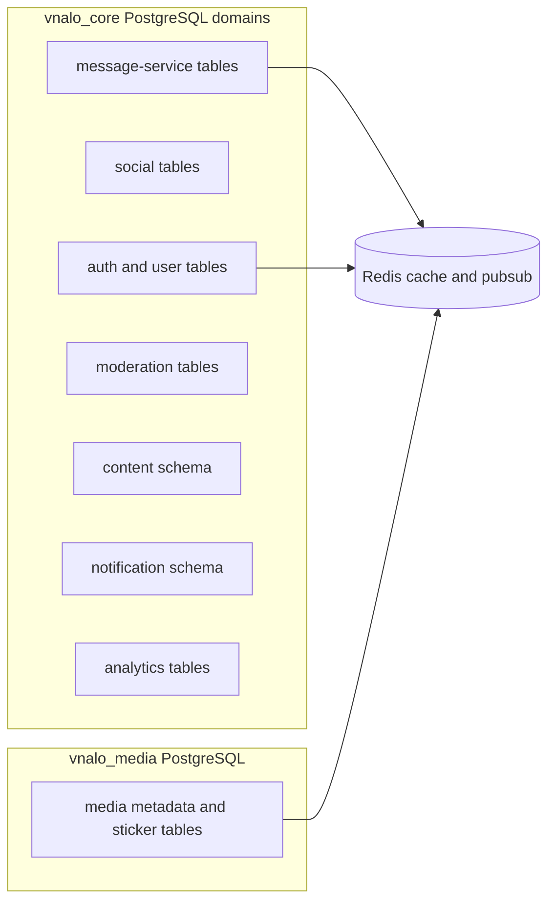

# GLOBAL DATABASE ERD

> [!IMPORTANT]
> This ERD models active runtime persistence in PostgreSQL plus Redis side stores.

## Storage Topology

## Entity Relationship Diagram

```mermaid
erDiagram
    AUTH_ACCOUNT {
      uuid id PK
      string phone UK
      string email UK
      string status
      string password_hash
    }
    AUTH_REFRESH_TOKEN {
      uuid token_id PK
      uuid account_id
      string token_hash UK
      string device_id
      timestamp expires_at
      timestamp revoked_at
    }
    AUTH_OTP {
      uuid otp_id PK
      string target
      string purpose
      string otp_hash
      timestamp expires_at
      int attempts
    }
    AUTH_QR_LOGIN_SESSION {
      uuid session_id PK
      string qr_token UK
      string status
      uuid approved_by_account_id
      timestamp expires_at
    }
    AUTH_SESSION_AUDIT {
      uuid audit_id PK
      uuid account_id
      uuid token_id
      string event_type
      string platform
      timestamp created_at
    }
    USER_PROFILE {
      uuid id PK
      string display_name
      string avatar_url
      boolean is_verified
    }
    USER_SETTING {
      uuid user_id PK
      string language
      string theme
      boolean sync_enabled
      boolean web_restricted_mode
    }
    USER_PRIVACY_SETTING {
      uuid user_id PK
      boolean allow_friend_request_by_phone
      boolean allow_search_by_phone
      boolean allow_messaging
      string allow_calling
    }
    FRIEND_REQUEST {
      uuid request_id PK
      uuid user_id_from
      uuid user_id_to
      string status
      timestamp created_at
    }
    FRIENDSHIP {
      uuid friendship_id PK
      uuid user_id_from
      uuid user_id_to
      string source
      timestamp created_at
    }
    BLOCK_LIST {
      uuid block_id PK
      uuid blocker_id
      uuid blocked_id
      boolean block_messages
      boolean block_calls
      boolean block_and_hide_logs
    }
    CONTACT_SYNC {
      uuid sync_id PK
      uuid user_id
      string phone_number
      uuid matched_user_id
      timestamp synced_at
    }

    CONVERSATION {
      uuid conversation_id PK
      string type
      string title
      uuid created_by
      string status
      string join_mode
      boolean only_admin_can_post
      boolean allow_member_invite
      boolean allow_member_pin
      boolean allow_member_edit_info
    }
    CONVERSATION_MEMBER {
      uuid conversation_id PK
      uuid user_id PK
      string role
      timestamp joined_at
      timestamp left_at
      bigint last_read_seq
    }
    CONVERSATION_DIRECT_MAP {
      uuid user_id_1 PK
      uuid user_id_2 PK
      uuid conversation_id
      timestamp created_at
    }
    CONVERSATION_JOIN_REQUEST {
      uuid conversation_id PK
      uuid user_id PK
      uuid requested_by
      timestamp requested_at
    }
    CONVERSATION_INBOX {
      uuid user_id PK
      uuid conversation_id PK
      bigint last_message_seq
      int unread_count
      boolean is_pinned
      boolean is_muted
    }
    MESSAGE {
      uuid message_id PK
      uuid conversation_id
      bigint server_seq
      uuid sender_id "Nullable for SYSTEM messages"
      string message_type
      string status
      uuid reply_to_message_id
    }
    MESSAGE_REACTION {
      uuid reaction_id PK
      uuid message_id
      uuid user_id
      string emoji
    }
    MESSAGE_RECEIPT {
      uuid conversation_id PK
      uuid message_id PK
      uuid user_id PK
      bigint server_seq
      timestamp seen_at
    }
    PINNED_MESSAGE {
      uuid pin_id PK
      uuid conversation_id
      uuid message_id
      uuid pinned_by
      timestamp pinned_at
    }

    CONTENT_POST {
      uuid post_id PK
      uuid author_id
      string visibility
      string status
      int like_count
      int comment_count
    }
    CONTENT_COMMENT {
      uuid comment_id PK
      uuid post_id
      uuid author_id
      uuid parent_comment_id
      string status
    }
    CONTENT_POST_LIKE {
      uuid post_like_id PK
      uuid post_id
      uuid user_id
      timestamp created_at
    }
    CONTENT_STORY {
      uuid story_id PK
      uuid author_id
      string status
      timestamp expires_at
    }
    CONTENT_STORY_VIEW {
      uuid view_id PK
      uuid story_id
      uuid viewer_id
      timestamp viewed_at
    }

    MODERATION_REPORT {
      uuid report_id PK
      uuid reporter_user_id
      string target_type
      uuid target_id
      string reason_code
      string status
    }
    MODERATION_CASE {
      uuid case_id PK
      uuid report_id UK
      uuid assigned_moderator_id
      string status
      string decision
    }
    MODERATION_ACTION {
      uuid action_id PK
      uuid case_id
      string action_type
      uuid created_by
    }
    MODERATION_APPEAL {
      uuid appeal_id PK
      uuid case_id
      uuid user_id
      string status
    }
    MODERATION_ADMIN_USER {
      uuid user_id PK
      string role
      boolean is_active
      timestamp created_at
    }
    MODERATION_AUDIT_LOG {
      uuid audit_log_id PK
      uuid report_id
      uuid case_id
      string action
      uuid performed_by
      timestamp created_at
    }
    MODERATION_REPORT_EVIDENCE {
      uuid evidence_id PK
      uuid report_id
      timestamp created_at
    }

    NOTIFICATION_DEVICE {
      uuid id PK
      uuid user_id
      string device_id
      string fcm_token
      boolean is_active
    }
    NOTIFICATION {
      uuid notification_id PK
      uuid event_id UK
      uuid user_id
      string type
      boolean is_read
    }

    ANALYTICS_EVENT {
      uuid event_id PK
      string event_type
      uuid actor_user_id
      string source_service
      timestamp occurred_at
    }
    ANALYTICS_DAILY_METRIC {
      uuid metric_id PK
      date metric_date
      string metric_key
      string dimension_key
      long metric_value
    }
    ANALYTICS_BACKFILL_JOB {
      uuid job_id PK
      date from_date
      date to_date
      string status
      int processed_days
    }

    MEDIA_METADATA {
      uuid media_id PK
      uuid owner_user_id
      string media_category
      string status
      string object_key
    }
    MEDIA_VARIANT {
      uuid media_variant_id PK
      uuid media_id
      string variant_type
      string status
    }
    MEDIA_ACCESS_SCOPE {
      uuid media_id PK
      string scope_type PK
      uuid scope_id PK
      timestamp created_at
    }
    MEDIA_JOB {
      uuid media_job_id PK
      uuid media_id
      string job_type
      string status
    }
    UPLOAD_REQUEST {
      uuid upload_request_id PK
      uuid owner_user_id
      string status
      uuid confirmed_media_id
    }
    STICKER_PACK {
      uuid sticker_pack_id PK
      uuid owner_user_id
      uuid cover_media_id
      string status
      int sticker_count
    }
    STICKER {
      uuid sticker_id PK
      uuid pack_id
      uuid media_id
      string status
    }
    STICKER_USAGE {
      uuid user_id PK
      uuid sticker_id PK
      int usage_count
    }
    USER_STICKER_PACK {
      uuid user_id PK
      uuid pack_id PK
      timestamp installed_at
    }
    USER_MEDIA_LIBRARY_ITEM {
      uuid user_media_lib_id PK
      uuid user_id
      uuid media_id
      string source_type
      timestamp saved_at
    }
    AI_STICKER {
      uuid ai_sticker_id PK
      uuid user_id
      uuid media_id
      string status
      timestamp created_at
    }

    AUTH_ACCOUNT ||--o{ AUTH_REFRESH_TOKEN : has
    AUTH_ACCOUNT ||--o{ AUTH_OTP : verifies
    AUTH_ACCOUNT ||--o{ AUTH_QR_LOGIN_SESSION : approves
    AUTH_ACCOUNT ||--o{ AUTH_SESSION_AUDIT : audits
    AUTH_ACCOUNT ||--|| USER_PROFILE : owns
    USER_PROFILE ||--|| USER_SETTING : config
    USER_PROFILE ||--|| USER_PRIVACY_SETTING : privacy

    USER_PROFILE ||--o{ FRIEND_REQUEST : sender
    USER_PROFILE ||--o{ FRIEND_REQUEST : recipient
    USER_PROFILE ||--o{ FRIENDSHIP : user
    USER_PROFILE ||--o{ BLOCK_LIST : blocker
    USER_PROFILE ||--o{ BLOCK_LIST : blocked
    USER_PROFILE ||--o{ CONTACT_SYNC : sync_owner

    CONVERSATION ||--o{ CONVERSATION_MEMBER : contains
    CONVERSATION ||--o{ MESSAGE : has
    CONVERSATION ||--o{ CONVERSATION_JOIN_REQUEST : join_requests
    CONVERSATION ||--o{ CONVERSATION_INBOX : inbox_rows
    CONVERSATION ||--o{ PINNED_MESSAGE : pins
    MESSAGE ||--o{ MESSAGE_REACTION : reactions
    MESSAGE ||--o{ MESSAGE_RECEIPT : receipts
    MESSAGE ||--o{ PINNED_MESSAGE : pinned

    CONTENT_POST ||--o{ CONTENT_COMMENT : has
    CONTENT_POST ||--o{ CONTENT_POST_LIKE : has
    CONTENT_STORY ||--o{ CONTENT_STORY_VIEW : viewed_by

    MODERATION_REPORT ||--|| MODERATION_CASE : escalates_to
    MODERATION_CASE ||--o{ MODERATION_ACTION : actions
    MODERATION_CASE ||--o{ MODERATION_APPEAL : appeals
    MODERATION_REPORT ||--o{ MODERATION_REPORT_EVIDENCE : evidences
    MODERATION_REPORT ||--o{ MODERATION_AUDIT_LOG : audit_entries
    MODERATION_CASE ||--o{ MODERATION_AUDIT_LOG : audit_entries
    MODERATION_ADMIN_USER ||--o{ MODERATION_CASE : assignee
    MODERATION_ADMIN_USER ||--o{ MODERATION_ACTION : actor
    MODERATION_ADMIN_USER ||--o{ MODERATION_AUDIT_LOG : actor

    USER_PROFILE ||--o{ NOTIFICATION_DEVICE : owns
    USER_PROFILE ||--o{ NOTIFICATION : receives

    USER_PROFILE ||--o{ ANALYTICS_EVENT : actor

    MEDIA_METADATA ||--o{ MEDIA_VARIANT : has
    MEDIA_METADATA ||--o{ MEDIA_ACCESS_SCOPE : scoped_to
    MEDIA_METADATA ||--o{ MEDIA_JOB : processed_by
    MEDIA_METADATA ||--o{ STICKER : material
    MEDIA_METADATA ||--o{ USER_MEDIA_LIBRARY_ITEM : saved
    MEDIA_METADATA ||--o{ AI_STICKER : ai_output
    STICKER_PACK ||--o{ STICKER : contains
    STICKER ||--o{ STICKER_USAGE : usage
    STICKER_PACK ||--o{ USER_STICKER_PACK : library
    USER_PROFILE ||--o{ USER_MEDIA_LIBRARY_ITEM : library_owner
    USER_PROFILE ||--o{ AI_STICKER : ai_creator
```

## Redis Data Roles

- Message sequence generation using INCR per conversation.
- Socket presence cache and heartbeat state.
- CALL_OFFLINE pubsub fallback channel for call offers.

## Pending Schema Changes

> [!IMPORTANT]
> The following changes are SPEC_ONLY — documented but not yet applied to code or DB migrations.

| Change | Decision | Priority |
|---|---|---|
| Rename `MemberRole.OWNER → ADMIN`, `ADMIN → DEPUTY` in enum | D-011 | Done |
| Add `only_admin_can_post` to CONVERSATION | Business audit 2026-04-22 | P1 |
| Add `allow_member_invite / pin / edit_info` to CONVERSATION | Business audit 2026-04-22 | P1 |
| Add `block_and_hide_logs` to BLOCK_LIST | Business audit 2026-04-22 | P1 |
| Hard delete cascade on group disband (no soft-delete) | D-012 | P0 |

---

## Notes on FK Semantics

> [!NOTE]
> Many cross-service IDs are modeled as UUID references without DB-level foreign keys. Referential integrity is enforced at service layer and event workflows.

## Evidence

- backend/node-services/apps/message-service/src/entities
- backend/java-services/services/core-service/src/main/java/iuh/cnm/vnalo/core_service/model/entity
- backend/java-services/services/content-service/src/main/java/iuh/cnm/vnalo/content_service/model/entity
- backend/java-services/services/moderation-service/src/main/java/iuh/cnm/vnalo/moderation_service/model/entity
- backend/java-services/services/notification-service/src/main/java/iuh/cnm/vnalo/notification_service/model/entity
- backend/java-services/services/analytics-service/src/main/java/iuh/cnm/vnalo/analytics_service/model/entity
- backend/java-services/services/media-service/src/main/java/iuh/cnm/vnalo/mediaservice/domain/model
